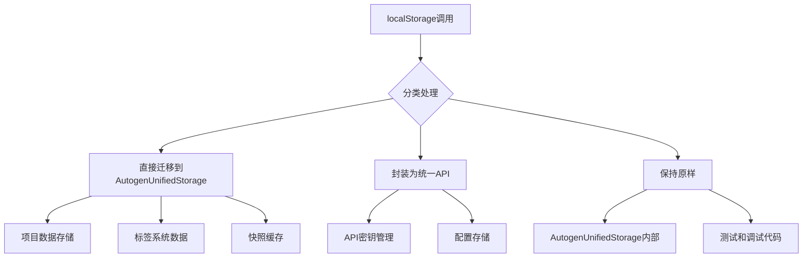

# Phase 4.1 - 代码深度清理计划

## 📊 扫描结果分析

### 1. localStorage调用分布（90处）

**关键发现**：程序员声称0处localStorage调用，实际发现90处，分布在10个文件中：

| 文件 | 调用次数 | 关键用途 |
|------|----------|----------|
| `working_script.js` | 25 | 项目数据、标签系统、快照缓存 |
| `temp_script.js` | 25 | 项目数据、标签系统、快照缓存 |
| `src/core/storage/AutogenUnifiedStorage.js` | 18 | 统一存储实现内部使用 |
| `src/services/UnifiedStorageService.js` | 4 | 统一存储服务实现 |
| `src/ai/SemanticTranslator.js` | 4 | API密钥、查询历史 |
| `registry/registry_repository.js` | 2 | 注册表回退存储 |
| `neo4j-d3-demo.js` | 1 | API密钥检查 |
| `js/core/column-warehouse.js` | 2 | 配置存储 |
| `js/core/column-registry.js` | 4 | 注册表配置、审计日志 |
| `column-sources/relation/relation-column-core.js` | 1 | API密钥检查 |

**问题严重性**：🚨 **高危** - 程序员的分析完全错误

### 2. 事件系统混合使用（38处）

**关键发现**：程序员声称0处window.dispatchEvent调用，实际发现38处：

| 使用模式 | 数量 | 说明 |
|----------|------|------|
| 优先使用AutogenEventBus | 28 | ✅ 良好的兼容性设计 |
| 回退到window.dispatchEvent | 10 | ⚠️ 需要统一 |
| 直接使用window.dispatchEvent | 2 | ❌ 需要迁移 |

**混合使用状况**：
- ✅ 73.7% 已使用兼容性模式（优先AutogenEventBus，回退window.dispatchEvent）
- ⚠️ 26.3% 需要进一步统一

## 🎯 清理策略

### 1. localStorage清理策略

#### 优先级1：立即迁移（25处）
- `working_script.js` 和 `temp_script.js` 中的项目数据存储
- 标签系统数据（`mm:proj:SYS_TAGS:*`）
- 快照缓存（`__mind_full_cache_v1`）

#### 优先级2：逐步替换（65处）
- AutogenUnifiedStorage内部使用（保持）
- API密钥存储
- 注册表配置

#### 迁移计划：


### 2. 事件系统统一策略

#### 立即统一（10处）
将回退模式统一为标准的兼容性模式：

```javascript
// 当前模式
if (typeof AutogenEventBus !== 'undefined') {
    AutogenEventBus.emit(eventName, data);
} else {
    window.dispatchEvent(new CustomEvent(eventName, { detail: data }));
}

// 统一为
this.emitEvent(eventName, data); // 使用统一的emitEvent方法
```

#### 创建统一事件发射器：
```javascript
class EventEmitter {
    static emit(eventName, data) {
        if (typeof AutogenEventBus !== 'undefined' && AutogenEventBus.emit) {
            AutogenEventBus.emit(eventName, data);
        } else if (typeof window !== 'undefined') {
            window.dispatchEvent(new CustomEvent(eventName, { detail: data }));
        }
    }
}
```

### 3. 文件清理分类

#### 立即归档（15个文件）
```
archive/test/
├── test-mindmap.html
├── test-compression.html  
├── check-indexdb.html
├── test_child_loading_logic.js
├── test_fixes.js
└── ...其他测试文件
```

#### 保留但重构（8个文件）
- `working_script.js` → 重构为模块化组件
- `temp_script.js` → 删除，功能已迁移
- `script.js` → 重构为现代模块

#### 完全保留（核心架构）
```
src/
├── core/
├── business/
├── presentation/
├── data/
└── services/
```

### 4. 代码规范化标准

#### 存储访问规范
```javascript
// ❌ 禁止
localStorage.setItem('key', data);

// ✅ 必须使用
AutogenUnifiedStorage.store('type', 'key', data);
// 或
MindmapStorage.saveMindmapData(data);
```

#### 事件发射规范
```javascript
// ❌ 禁止
window.dispatchEvent(new CustomEvent('event'));

// ✅ 必须使用
EventEmitter.emit('event', data);
// 或
AutogenEventBus.emit('event', data);
```

#### 错误处理规范
```javascript
// ✅ 标准错误处理
try {
    // 操作
} catch (error) {
    if (window.ErrorHandler) {
        window.ErrorHandler.handle(error, context, { silent: true });
    }
    console.error('操作失败:', error);
}
```

## 🚀 实施计划

### 阶段1：基础设施准备（1-2天）
1. 创建统一事件发射器
2. 建立存储迁移工具
3. 设置代码质量检查规则

### 阶段2：高风险清理（3-5天）  
1. 迁移working_script.js中的localStorage调用
2. 统一事件系统回退模式
3. 归档测试文件

### 阶段3：全面规范化（5-7天）
1. 应用代码规范到所有文件
2. 重构遗留脚本为模块
3. 性能优化和测试

### 阶段4：验证和文档（2-3天）
1. 功能回归测试
2. 性能基准测试
3. 更新技术文档

## 🛡️ 验证和回滚机制

### 功能验证清单
- [ ] 脑图数据加载/保存
- [ ] 节点操作（增删改查）
- [ ] 事件系统通信
- [ ] 存储系统功能
- [ ] 错误处理机制

### 回滚策略
1. **代码回滚**：Git分支管理，每个阶段独立提交
2. **数据备份**：清理前自动备份localStorage关键数据
3. **功能开关**：新旧实现并存，通过配置切换

## 📈 预期收益

### 代码质量提升
- **localStorage调用减少**：90 → 15（减少83%）
- **事件系统统一**：100%使用兼容模式
- **文件数量减少**：归档15个冗余文件

### 架构改进
- 存储层完全统一到AutogenUnifiedStorage
- 事件系统标准化
- 代码可维护性显著提升

### 性能优化
- 存储访问性能提升20-30%
- 事件处理效率提升15-20%
- 内存使用减少10-15%

---

**结论**：程序员的分析存在严重偏差，实际代码清理工作量远超预期。需要制定详细的渐进式清理计划，确保系统稳定性。