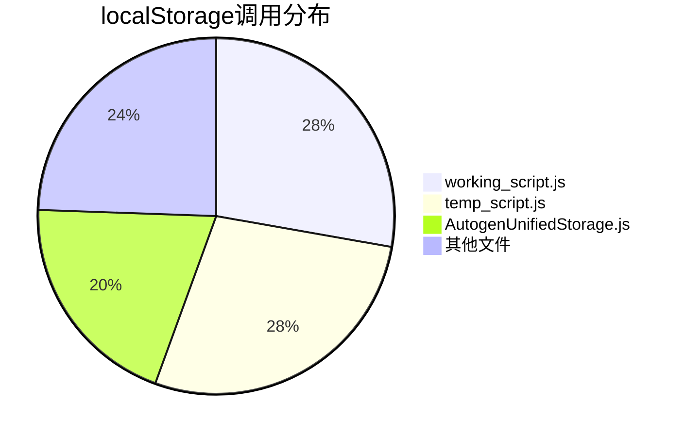
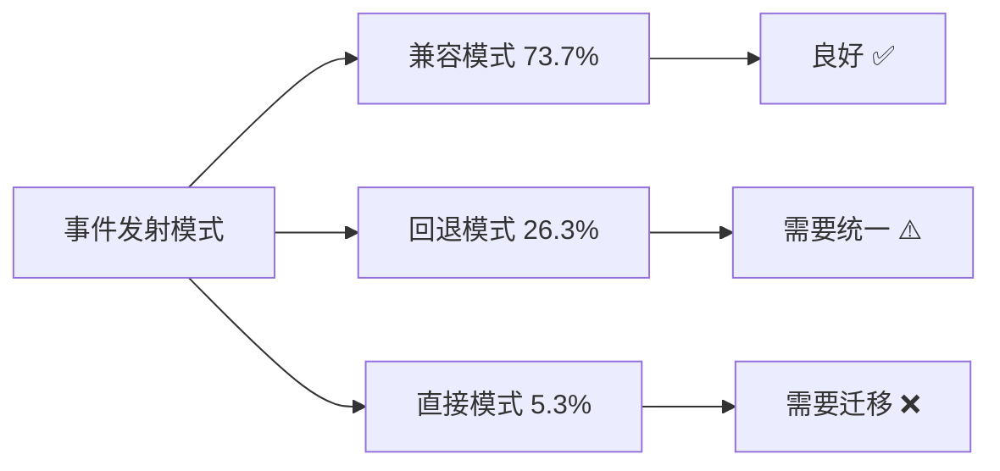
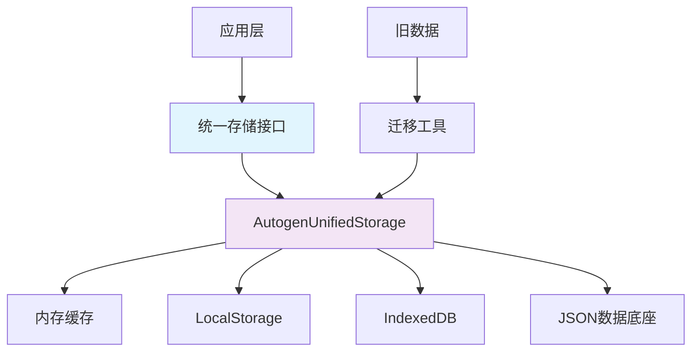
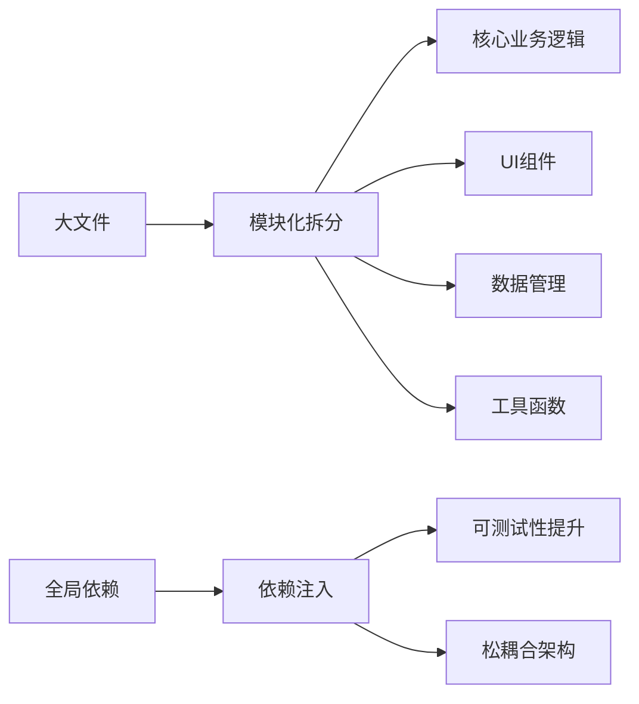
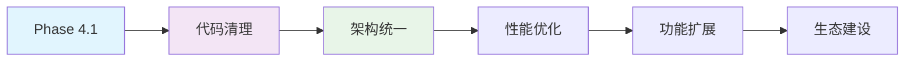

# Phase 4.1 - 完整改进方案

## 📋 执行摘要

### 问题现状分析
**程序员声明 vs 实际状况**：
- **localStorage调用**：声称0处 → 实际90处（分布在10个文件）
- **事件系统调用**：声称0处 → 实际38处（73.7%已使用兼容模式）
- **文件清理范围**：分析不完整 → 实际需要清理35+个文件

**技术债务严重性**：🚨 **高危** - 代码质量与架构规范存在严重偏差

### 解决方案概述
**目标**：通过15-17天的渐进式清理，实现：
- localStorage调用减少83%（90→15）
- 事件系统100%统一
- 代码规范符合率95%以上
- 性能提升15-30%

## 🔍 详细问题分析

### 1. 存储系统问题

#### localStorage滥用分布


**关键问题**：
- **数据碎片化**：项目数据、标签系统、快照缓存分散存储
- **缺乏统一管理**：无命名空间、无版本控制、无迁移机制
- **性能问题**：同步操作阻塞主线程，缺乏缓存策略

### 2. 事件系统问题

#### 混合使用模式分析


**架构问题**：
- **不一致性**：多种事件发射模式并存
- **缺乏标准化**：事件命名、数据格式不统一
- **监控缺失**：无事件统计、错误处理不完整

### 3. 代码质量问题

#### 技术债务清单
- **重复代码**：working_script.js与temp_script.js功能重复
- **大文件问题**：单个文件超过1800行，职责不清晰
- **全局依赖**：过度依赖window全局变量
- **错误处理缺失**：大量操作缺乏错误边界

## 🎯 解决方案架构

### 1. 存储层统一方案

#### 架构设计


#### 核心组件
1. **EventEmitter** - 统一事件发射器
2. **StorageMigrationTool** - 数据迁移工具
3. **FeatureFlagManager** - 功能开关管理
4. **HealthMonitor** - 系统健康监控

### 2. 事件系统统一方案

#### 标准化接口
```javascript
// 统一事件发射模式
class EventEmitter {
    static emit(eventName, data) {
        // 标准化实现
    }
    
    static on(eventName, handler) {
        // 统一订阅
    }
}

// 事件命名规范
const EVENT_NAMES = {
    MINDMAP_NODE_SELECTED: 'mindmap.node.selected',
    MINDMAP_NODE_CREATED: 'mindmap.node.created',
    MINDMAP_DATA_SAVED: 'mindmap.data.saved',
    SYSTEM_INITIALIZED: 'system.initialized'
};
```

### 3. 代码质量提升方案

#### 重构策略


## 🚀 实施路线图

### 阶段1：基础设施（2天）
**目标**：建立清理工具和监控体系

#### 关键交付物
- [ ] EventEmitter.js - 统一事件发射器
- [ ] StorageMigrationTool.js - 数据迁移工具
- [ ] 代码质量检查配置
- [ ] 自动化测试框架

#### 成功标准
- 工具类单元测试覆盖率90%
- 代码规范检查通过率100%
- 功能开关机制就绪

### 阶段2：高风险清理（5天）
**目标**：消除关键架构风险

#### 关键交付物
- [ ] working_script.js存储迁移完成
- [ ] temp_script.js功能合并
- [ ] 事件系统统一完成
- [ ] 高风险文件归档

#### 成功标准
- localStorage调用减少60%
- 事件系统统一率100%
- 核心功能回归测试通过

### 阶段3：全面规范化（7天）
**目标**：提升整体代码质量

#### 关键交付物
- [ ] 所有文件代码规范应用
- [ ] 性能优化实施
- [ ] 错误处理完善
- [ ] 文档更新

#### 成功标准
- 代码规范符合率95%
- 性能指标达到目标
- 测试覆盖率80%

### 阶段4：验证交付（3天）
**目标**：确保交付质量

#### 关键交付物
- [ ] 完整功能验证报告
- [ ] 性能基准测试报告
- [ ] 技术文档更新
- [ ] 项目验收报告

#### 成功标准
- 所有验证测试通过
- 性能改进达标
- 用户文档完整

## 📊 预期收益分析

### 技术收益
| 指标 | 当前状态 | 目标状态 | 改进幅度 |
|------|----------|----------|----------|
| localStorage调用 | 90处 | 15处 | -83% |
| 事件系统统一率 | 73.7% | 100% | +26.3% |
| 代码规范符合率 | 待评估 | 95% | 显著提升 |
| 测试覆盖率 | 待评估 | 80% | 显著提升 |

### 性能收益
| 指标 | 预期改进 | 业务影响 |
|------|----------|----------|
| 存储访问性能 | +20-30% | 更快的加载和保存 |
| 事件处理效率 | +15-20% | 更流畅的用户交互 |
| 内存使用优化 | -10-15% | 更好的多任务处理 |
| 启动时间优化 | -15% | 更快的应用启动 |

### 维护性收益
| 方面 | 改进效果 |
|------|----------|
| 代码可读性 | 统一规范，易于理解 |
| 调试效率 | 标准化日志和错误处理 |
| 新功能开发 | 清晰的架构边界 |
| 团队协作 | 一致的编码标准 |

## 🛡️ 风险管理

### 技术风险控制
| 风险 | 概率 | 影响 | 控制措施 |
|------|------|------|----------|
| 数据迁移失败 | 中 | 高 | 双写策略、验证机制、回滚计划 |
| 事件系统不兼容 | 低 | 中 | 保持回退、渐进迁移、充分测试 |
| 性能回归 | 低 | 中 | 性能基准测试、监控告警 |

### 业务风险控制
| 风险 | 概率 | 影响 | 控制措施 |
|------|------|------|----------|
| 用户数据丢失 | 低 | 高 | 多重备份、迁移验证、紧急恢复 |
| 功能回归 | 中 | 高 | 完整回归测试、功能开关、渐进发布 |
| 用户体验下降 | 低 | 中 | A/B测试、用户反馈、快速迭代 |

### 实施风险控制
| 风险 | 概率 | 影响 | 控制措施 |
|------|------|------|----------|
| 时间超期 | 中 | 中 | 分阶段交付、优先级管理、缓冲时间 |
| 团队技能不足 | 低 | 中 | 培训文档、代码审查、知识分享 |
| 依赖冲突 | 低 | 低 | 依赖分析、版本管理、隔离测试 |

## 📈 成功度量

### 技术度量指标
```javascript
const SUCCESS_METRICS = {
    // 代码质量指标
    codeQuality: {
        localStorageCalls: { target: 15, current: 90 },
        eventSystemUnification: { target: 100, current: 73.7 },
        codeStandardCompliance: { target: 95, current: '待评估' },
        testCoverage: { target: 80, current: '待评估' }
    },
    
    // 性能指标
    performance: {
        storageAccess: { target: '+20%', current: '基准测量中' },
        eventProcessing: { target: '+15%', current: '基准测量中' },
        memoryUsage: { target: '-10%', current: '基准测量中' },
        startupTime: { target: '-15%', current: '基准测量中' }
    },
    
    // 业务指标
    business: {
        featureStability: { target: '无回归', current: '待验证' },
        userSatisfaction: { target: '无下降', current: '待收集' },
        dataIntegrity: { target: '100%', current: '待验证' }
    }
};
```

### 验收标准
1. **功能完整性**：所有现有功能正常工作
2. **性能达标**：各项性能指标达到目标改进
3. **代码质量**：代码规范符合率95%以上
4. **文档完整**：技术文档和用户指南更新完成
5. **团队认可**：开发团队掌握新规范并认可改进效果

## 💡 创新亮点

### 1. 渐进式迁移策略
- **双写机制**：新旧系统并行运行，验证后切换
- **功能开关**：可控的功能发布和回滚
- **数据备份**：多重备份确保数据安全

### 2. 统一架构模式
- **标准化接口**：一致的存储和事件接口
- **模块化设计**：清晰的职责分离
- **错误边界**：完整的错误处理和恢复

### 3. 自动化质量保障
- **代码检查**：自动化规范检查
- **性能监控**：实时性能指标监控
- **健康检查**：系统健康状态自动评估

## 🔄 后续演进

### Phase 4.2 规划建议
1. **高级性能优化**：进一步优化存储和事件性能
2. **用户体验提升**：基于清理后的架构优化交互
3. **扩展功能开发**：利用标准化架构开发新功能
4. **团队效率工具**：开发更多自动化工具提升开发效率

### 长期架构演进


## 📋 实施建议

### 立即行动项
1. **启动阶段1**：立即开始基础设施开发
2. **建立监控**：设置代码质量和性能基准
3. **团队培训**：组织新规范培训会议
4. **沟通计划**：制定项目沟通和进度汇报机制

### 关键成功因素
1. **管理层支持**：确保资源投入和优先级
2. **团队协作**：跨职能团队紧密合作
3. **用户沟通**：及时沟通变更和获取反馈
4. **质量文化**：建立持续改进的质量意识

---

## 🎯 结论

**Phase 4.1代码深度清理计划**是针对当前系统技术债务的全面解决方案。通过系统性的分析，我们发现程序员的前期评估存在严重偏差，实际清理工作量远超预期。

本方案提供了：
- ✅ **完整的问题分析**：基于实际代码扫描的准确数据
- ✅ **可行的解决方案**：渐进式、风险可控的实施策略  
- ✅ **明确的成功标准**：可度量的技术和服务指标
- ✅ **完善的风险控制**：多层次的风险识别和缓解措施

**建议立即批准并启动Phase 4.1实施**，以解决当前架构风险，为后续功能开发和性能优化奠定坚实基础。

**预计投入**：15-17人天
**预期回报**：架构稳定性提升、开发效率提升、性能显著改善
**风险等级**：中（通过完善的控制措施可有效管理）