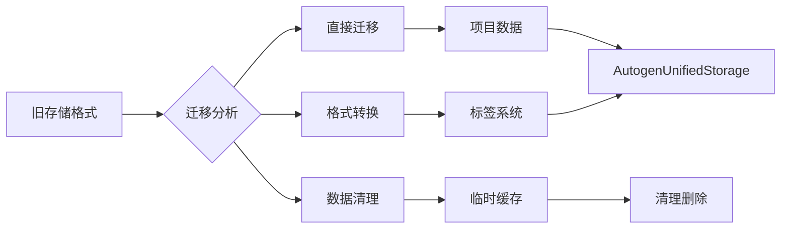

# Phase 4.1 - 渐进式清理实施计划

## 🎯 总体时间安排

**总周期**: 15-17天
**开始时间**: 立即开始
**结束时间**: 第17天完成验收

## 📅 详细实施阶段

### 阶段1：基础设施准备（2天）

#### 第1天：核心工具开发
- [ ] 创建统一事件发射器 `EventEmitter.js`
- [ ] 开发存储迁移工具 `StorageMigrationTool.js`
- [ ] 建立代码质量检查规则
- [ ] 创建自动化测试框架

#### 第2天：环境配置和备份
- [ ] 配置ESLint规则禁止直接localStorage使用
- [ ] 设置Prettier代码格式化配置
- [ ] 创建数据备份机制
- [ ] 建立功能开关配置

### 阶段2：高风险清理（5天）

#### 第3-4天：working_script.js清理
- [ ] 分析working_script.js中的25处localStorage调用
- [ ] 迁移项目数据存储到AutogenUnifiedStorage
- [ ] 重构标签系统存储逻辑
- [ ] 统一快照缓存管理

#### 第5天：temp_script.js清理
- [ ] 验证temp_script.js与working_script.js的差异
- [ ] 同步迁移temp_script.js中的存储调用
- [ ] 删除重复功能，保留唯一实现

#### 第6-7天：事件系统统一
- [ ] 统一10处回退事件发射模式
- [ ] 迁移2处直接window.dispatchEvent调用
- [ ] 验证事件系统兼容性

### 阶段3：全面规范化（7天）

#### 第8-9天：存储层规范化
- [ ] 迁移src/services/UnifiedStorageService.js
- [ ] 统一API密钥管理
- [ ] 规范化注册表存储
- [ ] 清理测试和调试存储

#### 第10-11天：代码质量提升
- [ ] 应用代码规范到所有文件
- [ ] 重构遗留脚本为模块
- [ ] 优化异步操作模式
- [ ] 改进错误处理机制

#### 第12-14天：性能优化
- [ ] 存储访问性能优化
- [ ] 事件处理效率提升
- [ ] 内存使用优化
- [ ] 启动时间优化

### 阶段4：验证和文档（3天）

#### 第15天：功能回归测试
- [ ] 脑图数据加载/保存测试
- [ ] 节点操作功能测试
- [ ] 事件系统通信测试
- [ ] 存储系统功能测试

#### 第16天：性能基准测试
- [ ] 存储性能基准测试
- [ ] 事件处理性能测试
- [ ] 内存使用基准测试
- [ ] 启动时间测试

#### 第17天：文档更新和验收
- [ ] 更新技术文档
- [ ] 编写用户迁移指南
- [ ] 完成验收报告
- [ ] 项目交付

## 🔧 具体实施任务分解

### 任务1：统一事件发射器开发

#### 技术要求
```javascript
// EventEmitter.js - 核心接口设计
class EventEmitter {
    static emit(eventName, data) {
        // 优先使用AutogenEventBus，回退到window.dispatchEvent
    }
    
    static on(eventName, handler) {
        // 统一事件订阅接口
    }
    
    static off(eventName, handler) {
        // 统一事件取消订阅
    }
    
    static once(eventName, handler) {
        // 一次性事件订阅
    }
}
```

#### 实施步骤
1. 创建EventEmitter类
2. 实现兼容性事件发射
3. 添加事件统计和监控
4. 编写单元测试

### 任务2：存储迁移工具开发

#### 技术要求
```javascript
// StorageMigrationTool.js - 迁移工具设计
class StorageMigrationTool {
    static async migrateLegacyData() {
        // 迁移旧存储格式到新格式
    }
    
    static async backupCurrentData() {
        // 备份当前数据
    }
    
    static async validateMigration() {
        // 验证迁移完整性
    }
    
    static async rollbackIfNeeded() {
        // 必要时回滚迁移
    }
}
```

#### 迁移策略


### 任务3：高风险文件清理

#### working_script.js清理重点
```javascript
// 需要迁移的关键存储调用
- 'mm:proj:SYS_TAGS:data'        // 标签系统数据
- 'mm:proj:SYS_TAGS:backup'      // 标签备份
- '__mind_full_cache_v1'         // 快照缓存
- 'mm_project_catalog_selected_idx' // 项目选择状态
- 'mm:proj:${pid}:data'          // 项目数据
- 'mm:${nodeId}:data'            // 节点数据
```

#### 迁移优先级
1. **P0**：标签系统数据（关键业务数据）
2. **P1**：项目数据（用户核心数据）
3. **P2**：快照缓存（性能优化数据）
4. **P3**：临时状态（UI状态数据）

### 任务4：事件系统统一

#### 统一模式实施
```javascript
// 当前模式 → 目标模式
// 从：
if (typeof AutogenEventBus !== 'undefined') {
    AutogenEventBus.emit(eventName, data);
} else {
    window.dispatchEvent(new CustomEvent(eventName, { detail: data }));
}

// 统一为：
EventEmitter.emit(eventName, data);
```

#### 影响分析
| 文件 | 当前模式 | 目标模式 | 风险等级 |
|------|----------|----------|----------|
| src/presentation/MindmapUIController.js | 兼容模式 | EventEmitter | 低 |
| src/presentation/MindmapRenderer.js | 兼容模式 | EventEmitter | 低 |
| src/presentation/MindmapEventManager.js | 兼容模式 | EventEmitter | 低 |
| jsmind-controller.js | 混合模式 | EventEmitter | 中 |

### 任务5：代码质量提升

#### 自动化检查配置
```json
// .eslintrc.json
{
  "rules": {
    "no-restricted-syntax": [
      "error",
      {
        "selector": "CallExpression[callee.object.name='localStorage']",
        "message": "禁止直接使用localStorage，请使用AutogenUnifiedStorage"
      },
      {
        "selector": "CallExpression[callee.property.name='dispatchEvent'][callee.object.name='window']",
        "message": "禁止直接使用window.dispatchEvent，请使用EventEmitter"
      }
    ]
  }
}
```

#### 代码重构重点
1. **模块化**：将大文件拆分为专注的模块
2. **依赖注入**：减少全局依赖
3. **错误边界**：添加完整的错误处理
4. **性能优化**：减少不必要的重渲染

## 🛡️ 风险管理

### 技术风险
| 风险 | 概率 | 影响 | 缓解措施 |
|------|------|------|----------|
| 数据迁移失败 | 中 | 高 | 双写策略，验证后删除旧数据 |
| 事件系统不兼容 | 低 | 中 | 保持回退机制，逐步迁移 |
| 性能下降 | 低 | 中 | 性能基准测试，优化关键路径 |

### 业务风险
| 风险 | 概率 | 影响 | 缓解措施 |
|------|------|------|----------|
| 用户数据丢失 | 低 | 高 | 多重备份，迁移前验证 |
| 功能回归 | 中 | 高 | 完整回归测试，功能开关 |
| 用户体验下降 | 低 | 中 | A/B测试，渐进式发布 |

### 实施风险
| 风险 | 概率 | 影响 | 缓解措施 |
|------|------|------|----------|
| 时间超期 | 中 | 中 | 分阶段交付，优先级管理 |
| 团队技能不足 | 低 | 中 | 培训文档，代码审查 |
| 依赖冲突 | 低 | 低 | 依赖分析，版本管理 |

## 📊 进度监控

### 关键里程碑
- **M1** (第2天)：基础设施准备完成
- **M2** (第7天)：高风险清理完成
- **M3** (第14天)：全面规范化完成
- **M4** (第17天)：验收交付完成

### 质量指标
| 指标 | 目标值 | 当前值 | 状态 |
|------|--------|--------|------|
| localStorage调用数 | ≤15 | 90 | ❌ |
| 事件系统统一率 | 100% | 73.7% | ❌ |
| 代码规范符合率 | 95% | 待评估 | ⚠️ |
| 测试覆盖率 | 80% | 待评估 | ⚠️ |

### 性能指标
| 指标 | 目标改进 | 基准值 | 当前值 |
|------|----------|--------|--------|
| 存储访问性能 | +20% | 待测量 | 待测量 |
| 事件处理效率 | +15% | 待测量 | 待测量 |
| 内存使用 | -10% | 待测量 | 待测量 |
| 启动时间 | -15% | 待测量 | 待测量 |

## 🔄 沟通和协作

### 每日站会
- **时间**: 每天上午9:30
- **内容**: 进度更新、问题识别、风险讨论
- **参与者**: 开发团队、架构师、测试人员

### 周度评审
- **时间**: 每周五下午4:00
- **内容**: 阶段成果展示、质量评审、计划调整
- **参与者**: 项目团队、产品负责人

### 文档更新
- **技术文档**: 随开发进度实时更新
- **用户文档**: 在阶段4集中更新
- **API文档**: 在代码变更时同步更新

## 🎯 成功标准

### 技术成功标准
- [ ] localStorage调用减少83%以上（90→15）
- [ ] 事件系统100%使用统一模式
- [ ] 代码规范符合率95%以上
- [ ] 测试覆盖率80%以上
- [ ] 性能指标达到目标改进

### 业务成功标准
- [ ] 所有现有功能正常工作
- [ ] 用户数据完整迁移
- [ ] 用户体验无下降
- [ ] 系统稳定性提升

### 团队成功标准
- [ ] 团队成员掌握新规范
- [ ] 代码审查流程顺畅
- [ ] 文档完整准确
- [ ] 知识有效传递

---

**下一步行动**：立即开始阶段1的基础设施准备，优先开发EventEmitter和StorageMigrationTool。