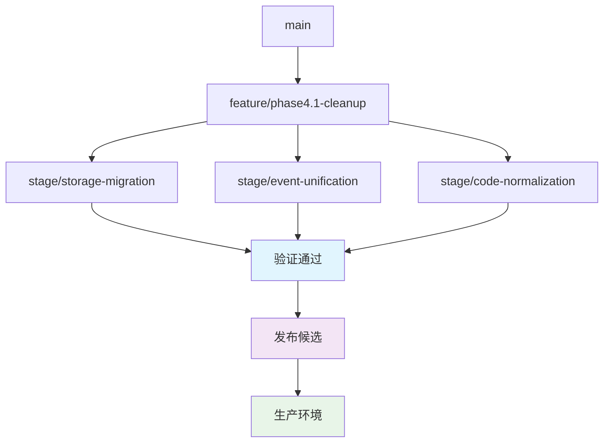

# Phase 4.1 - 验证和回滚机制

## 🎯 验证策略

### 1. 功能验证清单

#### 核心功能验证
```javascript
// 验证清单配置
const validationChecklist = {
    mindmap: {
        dataLoading: {
            description: "脑图数据加载功能",
            testCases: [
                "从IndexedDB加载现有脑图",
                "从JSON文件加载初始数据", 
                "加载失败时回退到测试数据",
                "数据完整性验证"
            ],
            successCriteria: "数据正确加载，无丢失节点"
        },
        nodeOperations: {
            description: "节点增删改查操作",
            testCases: [
                "添加子节点",
                "添加兄弟节点",
                "删除节点",
                "编辑节点标题",
                "编辑节点内容",
                "复制/剪切/粘贴节点"
            ],
            successCriteria: "所有操作响应正确，数据同步"
        },
        storagePersistence: {
            description: "数据持久化功能",
            testCases: [
                "自动保存触发",
                "手动保存功能",
                "数据压缩存储",
                "存储空间不足处理"
            ],
            successCriteria: "数据正确保存，可恢复"
        }
    },
    eventSystem: {
        eventDelivery: {
            description: "事件系统通信",
            testCases: [
                "AutogenEventBus事件发射",
                "window.dispatchEvent回退",
                "事件数据格式统一",
                "事件订阅/取消订阅"
            ],
            successCriteria: "事件正确传递，无丢失"
        },
        crossComponent: {
            description: "跨组件事件通信",
            testCases: [
                "脑图控制器与渲染器通信",
                "存储系统与业务逻辑通信",
                "错误事件处理"
            ],
            successCriteria: "组件间通信正常"
        }
    },
    storageSystem: {
        unifiedStorage: {
            description: "统一存储功能",
            testCases: [
                "多层级存储（内存→LocalStorage→IndexedDB）",
                "数据迁移功能",
                "存储统计和监控",
                "错误恢复机制"
            ],
            successCriteria: "存储操作成功，数据一致"
        },
        legacyMigration: {
            description: "旧数据迁移",
            testCases: [
                "localStorage数据自动迁移",
                "迁移失败回退机制",
                "数据格式转换验证",
                "迁移完整性检查"
            ],
            successCriteria: "旧数据正确迁移，无数据丢失"
        }
    }
};
```

### 2. 自动化测试框架

#### 单元测试配置
```javascript
// test-setup.js - 测试环境配置
class TestEnvironment {
    static setup() {
        // 模拟浏览器环境
        global.window = {
            localStorage: new Map(),
            dispatchEvent: jest.fn(),
            AutogenEventBus: {
                emit: jest.fn(),
                on: jest.fn(),
                off: jest.fn()
            }
        };
        
        // 模拟存储系统
        global.AutogenUnifiedStorage = {
            store: jest.fn(),
            retrieve: jest.fn(),
            remove: jest.fn(),
            list: jest.fn()
        };
    }
    
    static teardown() {
        // 清理测试环境
        delete global.window;
        delete global.AutogenEventBus;
        delete global.AutogenUnifiedStorage;
    }
}
```

#### 集成测试配置
```javascript
// integration-test.js - 集成测试配置
class IntegrationTestSuite {
    constructor() {
        this.testResults = new Map();
        this.benchmarks = new Map();
    }
    
    async runStorageIntegrationTest() {
        const startTime = Date.now();
        
        try {
            // 测试数据迁移
            await this.testDataMigration();
            
            // 测试存储操作
            await this.testStorageOperations();
            
            // 测试性能
            await this.testPerformance();
            
            const duration = Date.now() - startTime;
            this.benchmarks.set('storageIntegration', duration);
            
            return { success: true, duration };
        } catch (error) {
            return { success: false, error: error.message };
        }
    }
    
    async testDataMigration() {
        // 模拟旧数据
        const legacyData = {
            'mind:project1': JSON.stringify({ id: 'project1', topic: '旧项目' }),
            'reg:node1': JSON.stringify({ _meta: { type: 'node', id: 'node1' }, data: { content: '旧内容' } })
        };
        
        // 设置测试环境
        Object.keys(legacyData).forEach(key => {
            localStorage.setItem(key, legacyData[key]);
        });
        
        // 执行迁移
        await StorageMigrationTool.migrateLegacyData();
        
        // 验证迁移结果
        const migrated = await AutogenUnifiedStorage.retrieve('mindmap', 'project1');
        assert(migrated, '数据迁移失败');
        assert(migrated.topic === '旧项目', '数据内容不正确');
    }
}
```

### 3. 性能基准测试

#### 性能测试套件
```javascript
// performance-test.js - 性能基准测试
class PerformanceTestSuite {
    constructor() {
        this.baselineMetrics = this.loadBaseline();
        this.currentMetrics = new Map();
    }
    
    async runStoragePerformanceTest() {
        const testData = this.generateTestData(1000); // 1000个测试节点
        
        // 测试存储性能
        const storeStart = performance.now();
        await AutogenUnifiedStorage.batchStore(testData.operations);
        const storeTime = performance.now() - storeStart;
        
        // 测试读取性能
        const retrieveStart = performance.now();
        const results = await AutogenUnifiedStorage.batchRetrieve(testData.requests);
        const retrieveTime = performance.now() - retrieveStart;
        
        // 记录结果
        this.currentMetrics.set('storageWrite', storeTime);
        this.currentMetrics.set('storageRead', retrieveTime);
        this.currentMetrics.set('storageSuccessRate', 
            results.filter(r => r.success).length / results.length);
            
        return this.compareWithBaseline();
    }
    
    async runEventPerformanceTest() {
        const eventCount = 1000;
        const listeners = [];
        
        // 注册监听器
        for (let i = 0; i < 100; i++) {
            const listener = jest.fn();
            AutogenEventBus.on('test.event', listener);
            listeners.push(listener);
        }
        
        // 发射事件
        const startTime = performance.now();
        for (let i = 0; i < eventCount; i++) {
            AutogenEventBus.emit('test.event', { index: i });
        }
        const totalTime = performance.now() - startTime;
        
        // 清理
        listeners.forEach(listener => {
            AutogenEventBus.off('test.event', listener);
        });
        
        const eventsPerSecond = eventCount / (totalTime / 1000);
        this.currentMetrics.set('eventThroughput', eventsPerSecond);
        
        return this.compareWithBaseline();
    }
    
    compareWithBaseline() {
        const improvements = [];
        const regressions = [];
        
        for (const [metric, current] of this.currentMetrics) {
            const baseline = this.baselineMetrics.get(metric);
            if (baseline) {
                const change = ((current - baseline) / baseline) * 100;
                if (change > 5) {
                    regressions.push({ metric, change: change.toFixed(2) + '%' });
                } else if (change < -5) {
                    improvements.push({ metric, change: Math.abs(change).toFixed(2) + '%' });
                }
            }
        }
        
        return { improvements, regressions };
    }
}
```

## 🛡️ 回滚机制

### 1. 代码回滚策略

#### Git分支管理


#### 发布策略
```javascript
// release-strategy.js - 发布管理
class ReleaseStrategy {
    constructor() {
        this.featureFlags = new Map();
        this.rollbackPlan = new Map();
    }
    
    enableFeature(featureName, percentage = 100) {
        this.featureFlags.set(featureName, {
            enabled: true,
            percentage,
            enabledSince: Date.now()
        });
        
        console.log(`[Release] 启用功能: ${featureName} (${percentage}%)`);
    }
    
    disableFeature(featureName) {
        const feature = this.featureFlags.get(featureName);
        if (feature) {
            feature.enabled = false;
            console.log(`[Release] 禁用功能: ${featureName}`);
            this.executeRollback(featureName);
        }
    }
    
    isFeatureEnabled(featureName) {
        const feature = this.featureFlags.get(featureName);
        if (!feature || !feature.enabled) return false;
        
        if (feature.percentage < 100) {
            return Math.random() * 100 < feature.percentage;
        }
        
        return true;
    }
    
    executeRollback(featureName) {
        const plan = this.rollbackPlan.get(featureName);
        if (plan) {
            console.log(`[Rollback] 执行回滚: ${featureName}`);
            plan.execute();
        }
    }
}
```

### 2. 数据回滚机制

#### 数据备份策略
```javascript
// data-backup.js - 数据备份和恢复
class DataBackupManager {
    constructor() {
        this.backupInterval = 5 * 60 * 1000; // 5分钟
        this.maxBackups = 10;
        this.backups = new Map();
    }
    
    async createBackup(label = 'manual') {
        const timestamp = Date.now();
        const backupId = `backup_${timestamp}_${label}`;
        
        try {
            // 备份关键数据
            const backupData = {
                id: backupId,
                timestamp,
                label,
                data: {
                    mindmap: await this.backupMindmapData(),
                    config: await this.backupConfigData(),
                    userPrefs: await this.backupUserPreferences()
                },
                metadata: {
                    version: '1.0',
                    checksum: await this.calculateChecksum()
                }
            };
            
            // 存储备份
            await AutogenUnifiedStorage.store('system', `backup:${backupId}`, backupData);
            this.backups.set(backupId, backupData);
            
            // 清理旧备份
            await this.cleanupOldBackups();
            
            console.log(`[Backup] 创建备份: ${backupId}`);
            return backupId;
            
        } catch (error) {
            console.error('[Backup] 备份失败:', error);
            throw error;
        }
    }
    
    async restoreBackup(backupId) {
        try {
            const backup = await AutogenUnifiedStorage.retrieve('system', `backup:${backupId}`);
            if (!backup) {
                throw new Error(`备份不存在: ${backupId}`);
            }
            
            // 验证备份完整性
            await this.validateBackup(backup);
            
            // 执行恢复
            await this.restoreMindmapData(backup.data.mindmap);
            await this.restoreConfigData(backup.data.config);
            await this.restoreUserPreferences(backup.data.userPrefs);
            
            console.log(`[Backup] 恢复完成: ${backupId}`);
            return true;
            
        } catch (error) {
            console.error('[Backup] 恢复失败:', error);
            throw error;
        }
    }
    
    async validateBackup(backup) {
        // 验证数据完整性
        const currentChecksum = await this.calculateChecksum();
        if (backup.metadata.checksum !== currentChecksum) {
            console.warn('[Backup] 备份校验和不匹配，可能数据已变更');
        }
        
        // 验证数据结构
        if (!backup.data || !backup.data.mindmap) {
            throw new Error('备份数据格式无效');
        }
        
        return true;
    }
}
```

### 3. 功能开关配置

#### 功能开关管理
```javascript
// feature-flags.js - 功能开关配置
const FEATURE_FLAGS = {
    // 存储迁移功能开关
    STORAGE_MIGRATION: {
        key: 'storage_migration_v2',
        description: '启用新版存储迁移',
        defaultValue: false,
        safeToEnable: false, // 需要手动启用
        dependencies: ['AUTOGEN_STORAGE']
    },
    
    // 事件系统统一开关
    EVENT_SYSTEM_UNIFIED: {
        key: 'event_system_unified',
        description: '启用统一事件系统',
        defaultValue: true,
        safeToEnable: true,
        dependencies: []
    },
    
    // 代码规范化开关
    CODE_NORMALIZATION: {
        key: 'code_normalization',
        description: '启用代码规范检查',
        defaultValue: false,
        safeToEnable: true,
        dependencies: ['EVENT_SYSTEM_UNIFIED']
    }
};

class FeatureFlagManager {
    constructor() {
        this.flags = new Map();
        this.loadFlags();
    }
    
    loadFlags() {
        // 从配置加载功能开关
        Object.keys(FEATURE_FLAGS).forEach(key => {
            const flag = FEATURE_FLAGS[key];
            const storedValue = this.getStoredValue(flag.key);
            this.flags.set(flag.key, storedValue !== null ? storedValue : flag.defaultValue);
        });
    }
    
    isEnabled(flagKey) {
        const flagConfig = FEATURE_FLAGS[flagKey];
        if (!flagConfig) return false;
        
        // 检查依赖
        if (flagConfig.dependencies) {
            const allDepsEnabled = flagConfig.dependencies.every(dep => this.isEnabled(dep));
            if (!allDepsEnabled) return false;
        }
        
        return this.flags.get(flagConfig.key) === true;
    }
    
    enable(flagKey) {
        const flagConfig = FEATURE_FLAGS[flagKey];
        if (flagConfig && flagConfig.safeToEnable) {
            this.flags.set(flagConfig.key, true);
            this.saveFlags();
            console.log(`[FeatureFlag] 启用: ${flagKey}`);
        } else {
            console.warn(`[FeatureFlag] 无法安全启用: ${flagKey}`);
        }
    }
    
    disable(flagKey) {
        const flagConfig = FEATURE_FLAGS[flagKey];
        if (flagConfig) {
            this.flags.set(flagConfig.key, false);
            this.saveFlags();
            console.log(`[FeatureFlag] 禁用: ${flagKey}`);
        }
    }
}
```

## 📊 监控和告警

### 1. 系统健康监控

#### 健康检查配置
```javascript
// health-monitor.js - 系统健康监控
class HealthMonitor {
    constructor() {
        this.metrics = new Map();
        this.thresholds = {
            storageErrorRate: 0.05,    // 5%错误率
            eventDeliveryRate: 0.95,   // 95%送达率
            memoryUsage: 0.8,          // 80%内存使用
            responseTime: 1000         // 1秒响应时间
        };
        this.alertHandlers = [];
    }
    
    recordMetric(metricName, value) {
        if (!this.metrics.has(metricName)) {
            this.metrics.set(metricName, []);
        }
        
        const values = this.metrics.get(metricName);
        values.push({ timestamp: Date.now(), value });
        
        // 保持最近100个值
        if (values.length > 100) {
            values.shift();
        }
        
        // 检查阈值
        this.checkThreshold(metricName, value);
    }
    
    checkThreshold(metricName, value) {
        const threshold = this.thresholds[metricName];
        if (threshold && value > threshold) {
            this.triggerAlert(metricName, value, threshold);
        }
    }
    
    triggerAlert(metricName, value, threshold) {
        const alert = {
            level: 'WARNING',
            metric: metricName,
            value,
            threshold,
            timestamp: Date.now(),
            message: `指标 ${metricName} 超过阈值: ${value} > ${threshold}`
        };
        
        console.warn(`[HealthMonitor] 告警: ${alert.message}`);
        
        // 通知告警处理器
        this.alertHandlers.forEach(handler => {
            try {
                handler(alert);
            } catch (error) {
                console.error('[HealthMonitor] 告警处理器错误:', error);
            }
        });
    }
    
    getHealthStatus() {
        const status = {
            overall: 'HEALTHY',
            components: {},
            metrics: {}
        };
        
        for (const [metricName, values] of this.metrics) {
            const recentValues = values.slice(-10); // 最近10个值
            const avg = recentValues.reduce((sum, v) => sum + v.value, 0) / recentValues.length;
            
            status.metrics[metricName] = {
                current: values[values.length - 1]?.value,
                average: avg,
                trend: this.calculateTrend(values)
            };
            
            if (avg > this.thresholds[metricName]) {
                status.overall = 'DEGRADED';
                status.components[metricName] = 'UNHEALTHY';
            } else {
                status.components[metricName] = 'HEALTHY';
            }
        }
        
        return status;
    }
}
```

### 2. 回滚触发条件

#### 自动回滚条件
```javascript
// auto-rollback.js - 自动回滚条件
const AUTO_ROLLBACK_CONDITIONS = {
    // 存储系统条件
    STORAGE: {
        errorRate: 0.1,           // 10%错误率触发回滚
        performanceDrop: 0.5,     // 50%性能下降
        dataLoss: true,           // 任何数据丢失
        consecutiveFailures: 3    // 连续3次失败
    },
    
    // 事件系统条件  
    EVENT_SYSTEM: {
        deliveryFailureRate: 0.2, // 20%送达失败
        memoryLeak: true,         // 检测到内存泄漏
        responseTimeIncrease: 2.0 // 响应时间翻倍
    },
    
    // 用户体验条件
    USER_EXPERIENCE: {
        crashRate: 0.05,          // 5%崩溃率
        errorReportCount: 10,     // 10个错误报告
        performanceComplaints: 5  // 5个性能投诉
    }
};

class AutoRollbackManager {
    constructor() {
        this.conditions = new Map();
        this.rollbackActions = new Map();
        this.setupConditions();
    }
    
    setupConditions() {
        Object.keys(AUTO_ROLLBACK_CONDITIONS).forEach(system => {
            this.conditions.set(system, AUTO_ROLLBACK_CONDITIONS[system]);
        });
    }
    
    evaluateConditions(system, metrics) {
        const condition = this.conditions.get(system);
        if (!condition) return false;
        
        let shouldRollback = false;
        const triggers = [];
        
        // 检查每个条件
        for (const [metric, threshold] of Object.entries(condition)) {
            const value = metrics[metric];
            if (value !== undefined) {
                if (typeof threshold === 'number' && value >= threshold) {
                    shouldRollback = true;
                    triggers.push(`${metric}: ${value} >= ${threshold}`);
                } else if (threshold === true && value === true) {
                    shouldRollback = true;
                    triggers.push(`${metric}: ${value}`);
                }
            }
        }
        
        if (shouldRollback) {
            console.warn(`[AutoRollback] 系统 ${system} 触发回滚:`, triggers);
            this.executeRollback(system);
        }
        
        return shouldRollback;
    }
    
    executeRollback(system) {
        const action = this.rollbackActions.get(system);
        if (action) {
            console.log(`[AutoRollback] 执行回滚: ${system}`);
            action.execute();
            
            // 发送通知
            this.sendRollbackNotification(system);
        } else {
            console.error(`[AutoRollback] 未找到回滚动作: ${system}`);
        }
    }
}
```

## 📈 验证报告

### 验证报告模板
```javascript
// validation-report.js - 验证报告生成
class ValidationReport {
    constructor() {
        this.tests = new Map();
        this.metrics = new Map();
        this.issues = [];
        this.recommendations = [];
    }
    
    addTestResult(testName, result) {
        this.tests.set(testName, {
            ...result,
            timestamp: Date.now()
        });
    }
    
    addMetric(metricName, value) {
        this.metrics.set(metricName, value);
    }
    
    addIssue(issue) {
        this.issues.push({
            ...issue,
            severity: issue.severity || 'MEDIUM',
            status: 'OPEN'
        });
    }
    
    generateReport() {
        return {
            summary: this.generateSummary(),
            testResults: Array.from(this.tests.entries()),
            performanceMetrics: Array.from(this.metrics.entries()),
            issues: this.issues,
            recommendations: this.recommendations,
            timestamp: Date.now(),
            version: '1.0'
        };
    }
    
    generateSummary() {
        const totalTests = this.tests.size;
        const passedTests = Array.from(this.tests.values()).filter(t => t.success).length;
        const testSuccessRate = totalTests > 0 ? (passedTests / totalTests) * 100 : 0;
        
        const criticalIssues = this.issues.filter(i => i.severity === 'CRITICAL').length;
        const hasBlockingIssues = criticalIssues > 0;
        
        return {
            overallStatus: hasBlockingIssues ? 'FAILED' : (testSuccessRate >= 95 ? 'PASSED' : 'DEGRADED'),
            testSummary: {
                total: totalTests,
                passed: passedTests,
                successRate: testSuccessRate.toFixed(2) + '%'
            },
            issueSummary: {
                total: this.issues.length,
                critical: criticalIssues,
                blocking: hasBlockingIssues
            },
            readiness: !hasBlockingIssues && testSuccessRate >= 90 ? 'READY' : 'NOT_READY'
        };
    }
}
```

---

**实施建议**：在开始清理工作前，先建立完整的验证和回滚机制，确保在出现问题时能够快速恢复。