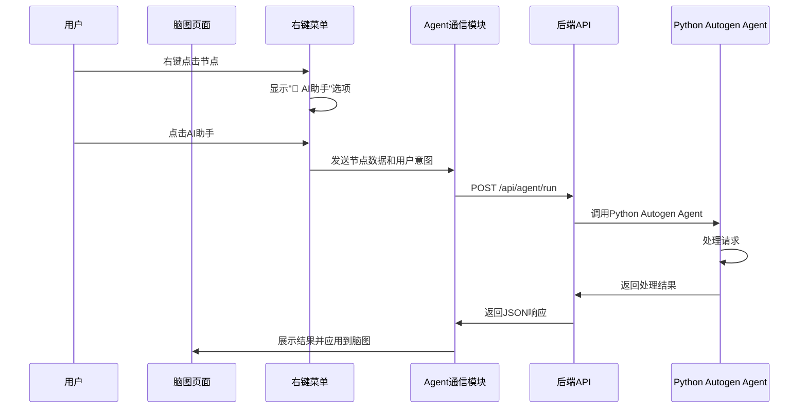

# agent**-Autogen Agent API 接口规范

## 📋 概述

本规范定义了脑图页面与Python Autogen Agent之间的通信接口，实现"脑图右键菜单 → Agent → 返回结果"的完整流程。

## 🏗️ 架构设计

### 通信流程


## 📡 API 接口规范

### 1. Agent运行接口

**端点**: `POST /api/agent/run`

**请求头**:
```http
Content-Type: application/json
X-Request-ID: {唯一请求ID}
```

**请求体**:
```json
{
  "request_id": "req_123456789",
  "node_data": {
    "id": "node_123",
    "topic": "项目管理需求",
    "content": "需要设计一个项目管理系统的脑图结构...",
    "parent_id": "root",
    "children": [],
    "metadata": {
      "created_at": "2025-10-05T10:00:00Z",
      "updated_at": "2025-10-05T10:30:00Z"
    }
  },
  "user_intent": "expand", // expand|summarize|analyze|generate|optimize
  "intent_description": "请帮我扩展这个节点，生成详细的子节点结构",
  "context": {
    "mindmap_id": "mindmap_001",
    "selected_nodes": ["node_123"],
    "mindmap_structure": {
      "total_nodes": 15,
      "depth": 3
    }
  },
  "agent_config": {
    "model": "gpt-4",
    "temperature": 0.7,
    "max_tokens": 2000,
    "timeout": 30
  },
  "options": {
    "return_format": "mindmap_nodes", // mindmap_nodes|text|markdown|json
    "auto_apply": true,
    "show_reasoning": false
  }
}
```

**响应体**:
```json
{
  "success": true,
  "request_id": "req_123456789",
  "result": {
    "type": "mindmap_nodes", // text|markdown|mindmap_nodes|command
    "content": {
      "nodes": [
        {
          "id": "generated_node_1",
          "topic": "需求分析",
          "content": "详细的需求分析文档...",
          "direction": "right",
          "children": [
            {
              "id": "generated_node_1_1",
              "topic": "用户需求",
              "content": "用户功能需求列表...",
              "direction": "right"
            }
          ]
        }
      ]
    },
    "text_output": "已为您生成了项目管理的详细脑图结构...",
    "suggested_actions": ["apply_to_mindmap", "refine", "export"]
  },
  "metadata": {
    "processing_time": 2.5,
    "model_used": "gpt-4",
    "tokens_used": 456,
    "timestamp": "2025-10-05T10:31:15Z"
  },
  "error": null
}
```

**错误响应**:
```json
{
  "success": false,
  "request_id": "req_123456789",
  "result": null,
  "metadata": {
    "processing_time": 0.1,
    "timestamp": "2025-10-05T10:31:15Z"
  },
  "error": {
    "code": "AGENT_TIMEOUT",
    "message": "Agent处理超时",
    "details": "请求在30秒内未完成",
    "suggestions": ["重试请求", "简化请求内容", "检查网络连接"]
  }
}
```

### 2. Agent状态查询接口

**端点**: `GET /api/agent/status`

**响应**:
```json
{
  "status": "ready", // ready|processing|error|offline
  "active_requests": 2,
  "queue_size": 0,
  "last_health_check": "2025-10-05T10:30:00Z",
  "capabilities": ["expand", "summarize", "analyze", "generate", "optimize"],
  "models_available": ["gpt-4", "gpt-3.5-turbo", "claude-3"]
}
```

## 🔧 用户意图类型

### 1. 扩展节点 (expand)
- **描述**: 基于当前节点内容生成子节点结构
- **输入**: 节点内容、期望的深度和广度
- **输出**: 结构化的子节点树

### 2. 总结节点 (summarize)  
- **描述**: 对节点及其子节点内容进行总结
- **输入**: 节点树结构
- **输出**: 简洁的总结文本

### 3. 分析节点 (analyze)
- **描述**: 分析节点内容的逻辑结构和关系
- **输入**: 节点内容
- **输出**: 分析报告和建议

### 4. 生成内容 (generate)
- **描述**: 基于节点主题生成相关内容
- **输入**: 节点主题、生成类型
- **输出**: 生成的内容或结构

### 5. 优化结构 (optimize)
- **描述**: 优化节点树的组织结构
- **输入**: 当前节点树
- **输出**: 优化后的节点结构

## 🛡️ 错误处理规范

### 错误代码表
| 错误代码 | 描述 | 处理建议 |
|---------|------|----------|
| `AGENT_TIMEOUT` | Agent处理超时 | 重试或简化请求 |
| `AGENT_UNAVAILABLE` | Agent服务不可用 | 检查后端服务状态 |
| `INVALID_REQUEST` | 请求格式错误 | 验证请求数据格式 |
| `MODEL_LIMIT` | 模型调用限制 | 等待或使用其他模型 |
| `CONTENT_TOO_LONG` | 内容过长 | 简化节点内容 |
| `NETWORK_ERROR` | 网络错误 | 检查网络连接 |

### 重试机制
- 首次失败：立即重试
- 第二次失败：等待2秒后重试  
- 第三次失败：等待5秒后重试
- 超过3次：显示错误提示

## 🔄 事件集成规范

### 发送事件
```javascript
// 请求开始
AutogenEventBus.emit('agent:request_start', {
  request_id: 'req_123456789',
  node_id: 'node_123',
  intent: 'expand'
});

// 请求完成
AutogenEventBus.emit('agent:request_complete', {
  request_id: 'req_123456789',
  success: true,
  processing_time: 2.5
});

// 应用结果
AutogenEventBus.emit('agent:result_applied', {
  request_id: 'req_123456789',
  nodes_added: 5,
  nodes_modified: 0
});
```

### 监听事件
```javascript
// 监听Agent状态变化
AutogenEventBus.on('agent:status_changed', (data) => {
  updateAgentStatusIndicator(data.status);
});

// 监听处理进度
AutogenEventBus.on('agent:processing_progress', (data) => {
  updateProgressBar(data.progress);
});
```

## 💾 数据存储规范

### 操作历史记录
```javascript
{
  "id": "history_001",
  "request_id": "req_123456789",
  "timestamp": "2025-10-05T10:31:15Z",
  "node_id": "node_123",
  "intent": "expand",
  "input_data": { /* 原始请求数据 */ },
  "output_data": { /* Agent返回结果 */ },
  "status": "completed",
  "processing_time": 2.5
}
```

### 存储位置
- **操作历史**: `autogen:agent_history:{timestamp}`
- **配置数据**: `autogen:agent_config:global`
- **统计信息**: `autogen:agent_stats:daily`

## 🚀 性能要求

### 响应时间
- **目标**: < 5秒
- **可接受**: 5-15秒  
- **超时**: 30秒

### 并发处理
- **最大并发请求**: 3
- **队列容量**: 10
- **优先级**: 实时请求 > 批量请求

## 📊 监控指标

### 关键指标
- 请求成功率 (> 95%)
- 平均响应时间 (< 10秒)
- 错误率 (< 5%)
- 并发使用率

### 日志记录
```javascript
{
  "level": "INFO",
  "timestamp": "2025-10-05T10:31:15Z",
  "component": "AgentAPI",
  "request_id": "req_123456789",
  "action": "request_processed",
  "duration": 2.5,
  "success": true,
  "model": "gpt-4",
  "tokens_used": 456
}
```

---

**文档版本**: 1.0  
**最后更新**: 2025-10-05  
**维护者**: 架构师团队