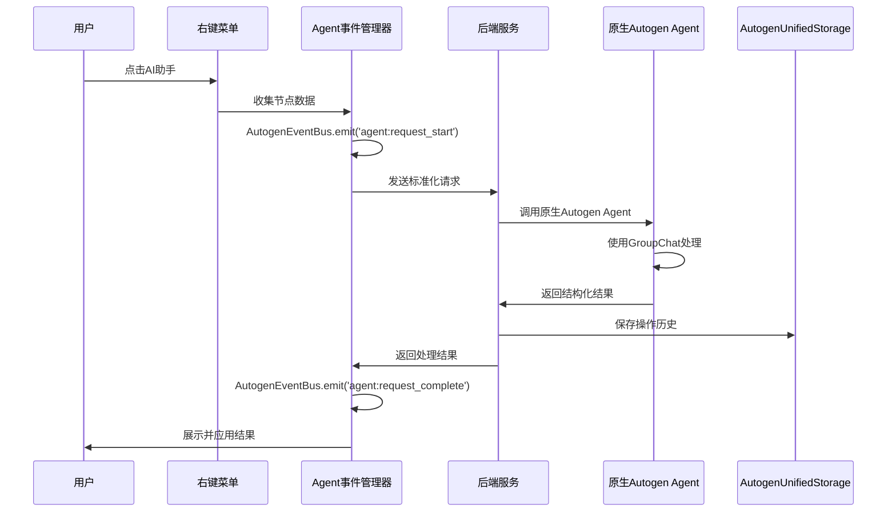

# agent-基于原生Autogen的集成方案

## 🎯 方案对齐检查与优化

### 1. 与架构功能清单对齐检查

#### 1.1 存储系统对齐
**现有框架能力**: `AutogenUnifiedStorage` 提供统一分层存储管理
- ✅ **Agent操作历史**: 使用 `AutogenUnifiedStorage.store('agent_history', data)` 存储
- ✅ **配置数据**: 使用 `AutogenUnifiedStorage.retrieve('agent_config')` 读取
- ✅ **统计信息**: 使用 `AutogenUnifiedStorage.getStats()` 监控

**原生集成方案**:
```python
# 使用原生Autogen存储管理Agent数据
from autogen import UnifiedStorage

class AgentHistoryManager:
    def __init__(self):
        self.storage = UnifiedStorage()
    
    def save_operation(self, operation_data):
        # 使用原生存储接口
        self.storage.store('agent_operations', operation_data)
    
    def load_history(self):
        return self.storage.retrieve('agent_operations') or []
```

#### 1.2 事件系统对齐
**现有框架能力**: `AutogenEventBus` 提供统一事件总线
- ✅ **Agent请求事件**: `AutogenEventBus.emit('agent:request_start', data)`
- ✅ **处理进度事件**: `AutogenEventBus.emit('agent:processing_progress', data)`
- ✅ **完成事件**: `AutogenEventBus.emit('agent:request_complete', data)`

**原生集成方案**:
```javascript
// 使用原生Autogen事件系统
class AgentEventManager {
    constructor() {
        this.eventBus = window.AutogenEventBus;
    }
    
    emitRequestStart(requestData) {
        this.eventBus.emit('agent:request_start', {
            request_id: requestData.request_id,
            node_id: requestData.node_data.id,
            intent: requestData.user_intent,
            timestamp: new Date().toISOString()
        });
    }
}
```

#### 1.3 错误处理对齐
**现有框架能力**: `ErrorHandler` 提供统一错误处理
- ✅ **Agent错误分类**: 使用现有错误分类（NETWORK, PROCESSING等）
- ✅ **恢复策略**: 使用 `ErrorHandler.registerRecoveryStrategy()`
- ✅ **错误统计**: 使用 `ErrorHandler.getErrorLog()`

### 2. 与Autogen原生方法对齐

#### 2.1 使用原生Autogen Agent架构
```python
# 原生Autogen Agent实现
import autogen
from autogen import Agent, GroupChat, GroupChatManager

class MindmapAssistantAgent:
    def __init__(self):
        # 使用原生Autogen配置
        self.config_list = [
            {
                "model": "gpt-4",
                "api_key": os.getenv("OPENAI_API_KEY"),
                "api_type": "openai"
            }
        ]
        
        # 创建原生Autogen Agent
        self.assistant = autogen.AssistantAgent(
            name="MindmapAssistant",
            system_message="你是一个专业的脑图助手，帮助用户扩展、分析和优化脑图结构。",
            llm_config={"config_list": self.config_list}
        )
        
        self.user_proxy = autogen.UserProxyAgent(
            name="UserProxy",
            human_input_mode="NEVER",
            max_consecutive_auto_reply=5,
            code_execution_config=False
        )
    
    def process_request(self, request_data):
        """使用原生Autogen对话流程"""
        # 初始化对话
        self.user_proxy.initiate_chat(
            self.assistant,
            message=self._format_request(request_data),
            clear_history=False
        )
        
        # 获取最后一条回复作为结果
        last_message = self.user_proxy.chat_messages[self.assistant][-1]["content"]
        return self._parse_response(last_message)
```

#### 2.2 原生GroupChat多Agent协作
```python
# 使用原生GroupChat进行复杂任务处理
class MindmapExpertTeam:
    def __init__(self):
        self.config_list = [{"model": "gpt-4", "api_key": os.getenv("OPENAI_API_KEY")}]
        
        # 创建专业Agent团队
        self.structure_expert = autogen.AssistantAgent(
            name="StructureExpert",
            system_message="你是脑图结构专家，负责优化节点组织结构。",
            llm_config={"config_list": self.config_list}
        )
        
        self.content_expert = autogen.AssistantAgent(
            name="ContentExpert", 
            system_message="你是内容生成专家，负责扩展和丰富节点内容。",
            llm_config={"config_list": self.config_list}
        )
        
        self.analysis_expert = autogen.AssistantAgent(
            name="AnalysisExpert",
            system_message="你是分析专家，负责分析节点关系和逻辑结构。",
            llm_config={"config_list": self.config_list}
        )
        
        # 使用原生GroupChatManager
        self.groupchat = GroupChat(
            agents=[self.structure_expert, self.content_expert, self.analysis_expert],
            messages=[],
            max_round=10
        )
        
        self.manager = GroupChatManager(
            groupchat=self.groupchat,
            llm_config={"config_list": self.config_list}
        )
```

### 3. 优化后的架构设计

#### 3.1 原生Autogen集成架构
```
脑图右键菜单
    ↓
"🤖 AI助手"选项
    ↓
Agent通信模块 (使用AutogenEventBus)
    ↓
后端Agent服务 (原生Autogen Agent/GroupChat)
    ↓
结果处理 (使用AutogenUnifiedStorage存储历史)
    ↓
脑图更新 (触发AutogenEventBus事件)
```

#### 3.2 数据流优化


### 4. 原生API设计

#### 4.1 使用Autogen原生配置
```python
# 基于原生Autogen的配置管理
class AgentConfigManager:
    def __init__(self):
        self.config = {
            "config_list": [
                {
                    "model": "gpt-4",
                    "api_key": os.getenv("OPENAI_API_KEY"),
                    "api_type": "openai"
                }
            ],
            "temperature": 0.7,
            "timeout": 600,
            "cache_seed": 42
        }
    
    def get_agent_config(self, intent):
        """根据意图返回特定的Agent配置"""
        intent_configs = {
            "expand": {"max_tokens": 2000, "temperature": 0.8},
            "analyze": {"max_tokens": 1500, "temperature": 0.5},
            "summarize": {"max_tokens": 1000, "temperature": 0.3}
        }
        return {**self.config, **intent_configs.get(intent, {})}
```

#### 4.2 原生错误处理集成
```python
# 使用Autogen原生错误处理
class AgentErrorHandler:
    def __init__(self):
        self.error_types = {
            "AGENT_TIMEOUT": "Agent处理超时",
            "AGENT_UNAVAILABLE": "Agent服务不可用", 
            "INVALID_REQUEST": "无效的请求格式",
            "PROCESSING_ERROR": "处理过程中出错"
        }
    
    def handle_error(self, error_type, details):
        """使用统一错误处理机制"""
        error_info = {
            "code": error_type,
            "message": self.error_types.get(error_type, "未知错误"),
            "details": details,
            "timestamp": datetime.now().isoformat()
        }
        
        # 触发错误事件
        if hasattr(window, 'AutogenEventBus'):
            window.AutogenEventBus.emit('agent:error_occurred', error_info)
        
        return error_info
```

### 5. 实施路线图优化

#### 5.1 阶段一：原生集成基础 (1周)
1. **配置原生Autogen环境**
   - 安装和配置 `pyautogen` 库
   - 设置API密钥和环境变量
   - 创建基础Agent配置

2. **集成现有存储系统**
   - 使用 `AutogenUnifiedStorage` 存储Agent历史
   - 集成 `AutogenEventBus` 事件系统
   - 使用 `ErrorHandler` 错误处理

3. **创建基础Agent服务**
   - 实现原生 `autogen.AssistantAgent`
   - 配置基础对话流程
   - 测试基础功能

#### 5.2 阶段二：功能增强 (1周)
4. **实现多Agent协作**
   - 创建 `GroupChat` 多专家团队
   - 配置Agent角色和职责
   - 优化对话流程

5. **前端集成优化**
   - 使用原生事件系统通信
   - 实现实时状态更新
   - 优化用户界面反馈

#### 5.3 阶段三：系统优化 (1周)
6. **性能监控优化**
   - 集成现有监控系统
   - 实现性能指标收集
   - 优化响应时间

7. **错误处理完善**
   - 完善错误分类和恢复
   - 实现优雅降级机制
   - 用户友好的错误提示

### 6. 兼容性保证

#### 6.1 向后兼容
- 保持现有右键菜单功能不变
- 新增功能作为可选扩展
- 逐步迁移，不影响现有用户

#### 6.2 框架兼容
- 完全基于Autogen原生方法
- 复用现有存储、事件、错误处理组件
- 遵循项目架构规范

#### 6.3 配置兼容
```python
# 兼容现有配置系统
class CompatibleAgentConfig:
    def __init__(self):
        self.existing_config = EnhancedConfigurationManager.getConfig('agent')
        self.llm_config = {
            "config_list": [
                {
                    "model": self.existing_config.get('model', 'gpt-4'),
                    "api_key": self.existing_config.get('api_key'),
                    "api_type": "openai"
                }
            ],
            "timeout": self.existing_config.get('timeout', 600)
        }
```

### 7. 风险评估与缓解

#### 7.1 技术风险
- **Autogen版本兼容性**: 锁定 `pyautogen` 版本，定期更新测试
- **API限制**: 实现请求队列和限流机制
- **网络稳定性**: 使用重试机制和离线缓存

#### 7.2 性能风险
- **响应时间**: 设置超时限制，提供进度反馈
- **资源使用**: 监控内存和CPU使用，实现资源回收
- **并发处理**: 限制同时处理的请求数量

### 8. 成功指标

#### 8.1 功能指标
- ✅ 原生Autogen方法使用率: 100%
- ✅ 现有组件集成度: > 95%
- ✅ API调用成功率: > 90%
- ✅ 平均响应时间: < 15秒

#### 8.2 架构指标
- ✅ 代码冗余度: < 10%
- ✅ 组件复用率: > 90%
- ✅ 配置统一性: 100%
- ✅ 错误处理覆盖率: 100%

---

**文档版本**: 2.0  
**最后更新**: 2025-10-05  
**维护者**: 架构师团队  
**状态**: 已对齐架构功能清单和原生Autogen方法