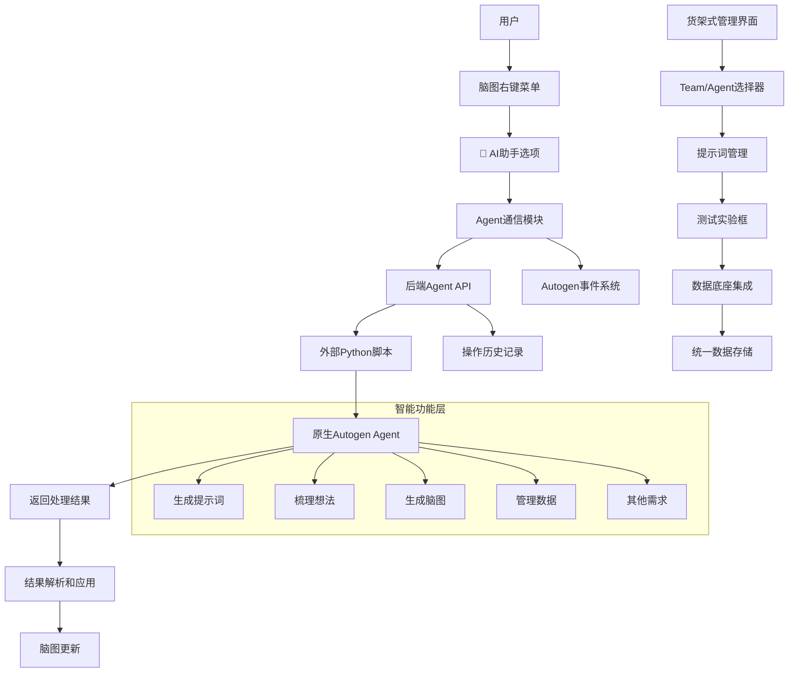

# agent**-完整集成方案

## 🎯 项目概述

### 核心目标
在脑图应用中集成Autogen Agent，通过右键菜单的"🤖 AI助手"作为唯一入口，让Agent自主完成所有智能功能，替代传统的模块化代码实现方式。

### 核心理念
```
脑图页面
    ↓
集成 Autogen Agent/Team
    ↓
Agent 自己完成所有功能
  - 生成提示词
  - 梳理想法
  - 生成脑图
  - 管理数据
  - 其他任何需求
```

## 🏗️ 系统架构

### 整体架构图


## 🔧 核心技术方案

### 1. 原生Autogen集成

#### 1.1 使用原生Autogen Agent架构
```python
# 原生Autogen Agent实现
import autogen
from autogen import Agent, GroupChat, GroupChatManager

class MindmapAssistantAgent:
    def __init__(self):
        # 使用原生Autogen配置
        self.config_list = [
            {
                "model": "gpt-4",
                "api_key": os.getenv("OPENAI_API_KEY"),
                "api_type": "openai"
            }
        ]
        
        # 创建原生Autogen Agent
        self.assistant = autogen.AssistantAgent(
            name="MindmapAssistant",
            system_message="你是一个专业的脑图助手，帮助用户扩展、分析和优化脑图结构。",
            llm_config={"config_list": self.config_list}
        )
```

#### 1.2 原生GroupChat多Agent协作
```python
# 使用原生GroupChat进行复杂任务处理
class MindmapExpertTeam:
    def __init__(self):
        self.config_list = [{"model": "gpt-4", "api_key": os.getenv("OPENAI_API_KEY")}]
        
        # 创建专业Agent团队
        self.structure_expert = autogen.AssistantAgent(
            name="StructureExpert",
            system_message="你是脑图结构专家，负责优化节点组织结构。",
            llm_config={"config_list": self.config_list}
        )
        
        # 使用原生GroupChatManager
        self.groupchat = GroupChat(
            agents=[self.structure_expert, self.content_expert, self.analysis_expert],
            messages=[],
            max_round=10
        )
        
        self.manager = GroupChatManager(
            groupchat=self.groupchat,
            llm_config={"config_list": self.config_list}
        )
```

### 2. 基于JSON配置的外部运行

#### 2.1 JSON配置规范
```json
{
  "agent_configs": {
    "mindmap_assistant": {
      "name": "MindmapAssistant",
      "system_message": "你是一个专业的脑图助手...",
      "llm_config": {
        "config_list": [
          {
            "model": "gpt-4",
            "api_key": "${OPENAI_API_KEY}",
            "api_type": "openai"
          }
        ]
      }
    }
  },
  "team_configs": {
    "mindmap_expert_team": {
      "name": "MindmapExpertTeam",
      "agents": ["structure_expert", "content_expert"],
      "max_round": 10
    }
  }
}
```

#### 2.2 外部Python运行脚本
```python
#!/usr/bin/env python3
"""
Autogen Agent外部运行脚本
使用JSON配置文件运行预配置的Agent和Team
"""

import json
import os
import sys
import argparse
from pathlib import Path
import autogen
from autogen import GroupChat, GroupChatManager

class ConfigLoader:
    """配置加载器"""
    
    def __init__(self, config_dir="agent_configs"):
        self.config_dir = Path(config_dir)
        self.agent_configs = {}
        self.team_configs = {}
        
    def load_configs(self):
        """加载所有配置文件"""
        # 加载Agent配置
        agent_config_file = self.config_dir / "agents.json"
        if agent_config_file.exists():
            with open(agent_config_file, 'r', encoding='utf-8') as f:
                self.agent_configs = json.load(f)['agent_configs']
        
        # 加载Team配置  
        team_config_file = self.config_dir / "teams.json"
        if team_config_file.exists():
            with open(team_config_file, 'r', encoding='utf-8') as f:
                self.team_configs = json.load(f)['team_configs']
```

### 3. 货架式管理界面

#### 3.1 界面布局设计
```
+-----------------------------------------+
| 货架式管理界面 - Team/Agent管理器        |
+-----------------+-----------------------+
| Team选择侧边栏  | 主内容区域            |
|                 |                       |
| • 项目管理专家   | +-------------------+ |
| • 内容生成团队   | | Agent配置面板     | |
| • 结构优化团队   | |                   | |
| • 分析评估团队   | | 名称: [输入框]    | |
|                 | | 系统提示词: [编辑器]| |
| +新建Team按钮    | | 模型配置: [下拉框] | |
|                 | | 参数设置: [表单]   | |
|                 | +-------------------+ |
|                 |                       |
|                 | +-------------------+ |
|                 | | 测试实验框        | |
|                 | | 输入: [文本框]     | |
|                 | | 输出: [结果展示区] | |
|                 | | [运行测试] [保存]  | |
|                 | +-------------------+ |
+-----------------+-----------------------+
```

#### 3.2 核心功能模块
```javascript
class TeamAgentSelector {
    constructor() {
        this.selectedTeam = null;
        this.selectedAgent = null;
        this.availableTeams = [];
        this.availableAgents = [];
    }
    
    async loadFromDataBase() {
        // 从数据底座加载Team和Agent配置
        this.availableTeams = await AutogenUnifiedStorage.retrieve('agent_teams') || [];
        this.availableAgents = await AutogenUnifiedStorage.retrieve('agent_agents') || [];
        
        this.renderTeamList();
        this.renderAgentList();
    }
}
```

### 4. 统一数据底座集成

#### 4.1 数据存储结构
```json
{
  "agent_agents": [
    {
      "id": "mindmap_assistant_v1",
      "name": "脑图助手v1",
      "type": "assistant",
      "config": {
        "system_message": "你是一个专业的脑图助手...",
        "model": "gpt-4",
        "temperature": 0.7
      },
      "metadata": {
        "created_at": "2025-10-05T10:00:00Z",
        "updated_at": "2025-10-05T10:30:00Z",
        "usage_count": 45,
        "success_rate": 0.92
      },
      "tags": ["brainstorming", "expansion", "analysis"]
    }
  ]
}
```

#### 4.2 提示词管理
```javascript
class PromptManager {
    constructor() {
        this.currentPrompt = '';
        this.promptHistory = [];
        this.promptCategories = [
            'brainstorming', 'analysis', 'summarization', 
            'expansion', 'optimization', 'generation'
        ];
    }
    
    async savePromptToBase(promptData) {
        // 保存提示词到数据底座
        const saveData = {
            id: generateId(),
            content: promptData.content,
            category: promptData.category,
            tags: promptData.tags || [],
            test_input: promptData.test_input,
            test_output: promptData.test_output,
            success_rate: promptData.success_rate,
            created_at: new Date().toISOString()
        };
        
        // 保存到数据底座
        await AutogenUnifiedStorage.store('prompt_templates', this.promptHistory);
        
        return saveData;
    }
}
```

### 5. 双路径输出管理

#### 5.1 输出路径控制器
```javascript
class OutputPathManager {
    constructor() {
        this.autoSaveToBase = false;
        this.immediateApply = true;
    }
    
    async handleAgentResult(result, context) {
        // 路径1: 立即应用到当前页面UI元素
        if (this.immediateApply) {
            await this.applyToUI(result, context);
        }
        
        // 路径2: 保存到数据底座（需要确认或根据设置）
        if (this.shouldSaveToBase(context)) {
            await this.saveToDataBase(result, context);
        }
    }
    
    async applyToUI(result, context) {
        const { target_element, page_type } = context;
        
        switch (page_type) {
            case 'mindmap':
                await this.applyToMindmap(result, target_element);
                break;
            case 'content_editor':
                await this.applyToContentEditor(result, target_element);
                break;
            case 'detail_page':
                await this.applyToDetailPage(result, target_element);
                break;
        }
    }
    
    shouldSaveToBase(context) {
        // 根据设置或用户确认决定是否保存
        if (this.autoSaveToBase) {
            return true;
        }
        
        // 弹出确认对话框
        return this.showSaveConfirmation(context);
    }
}
```

## 🔄 完整数据流程

### 配置管理流程
```
打开货架式管理界面
    ↓
从数据底座加载Team/Agent配置
    ↓
选择Team和Agent进行配置
    ↓
在测试框验证提示词效果
    ↓
测试成功后保存到数据底座（自动分类打标签）
```

### 使用流程
```
在脑图页面右键点击节点
    ↓
选择"🤖 AI助手"选项
    ↓
选择预配置的Team/Agent
    ↓
Agent处理并返回结果
    ↓
结果立即应用到当前UI元素
    ↓
用户确认后保存到数据底座
```

## 🚀 实施路线图

### 阶段一：核心基础设施 (2-3周)
1. **货架式管理界面开发**
   - Team/Agent选择器组件
   - 提示词管理和测试框
   - 数据底座集成

2. **外部运行机制**
   - JSON配置文件和运行脚本
   - 环境变量和配置管理
   - 错误处理和日志

### 阶段二：页面集成 (1-2周)
3. **输出路径管理**
   - 双路径输出控制器
   - UI元素集成点（脑图、内容框、详情页）
   - 保存确认机制

4. **后端API扩展**
   - 外部脚本调用集成
   - 临时文件管理
   - 性能监控

### 阶段三：测试优化 (1周)
5. **端到端测试**
   - 配置管理流程测试
   - 输出路径功能测试
   - 性能和用户体验测试

6. **文档和培训**
   - 使用指南和最佳实践
   - 故障排除文档
   - 团队培训材料

## 📊 成功指标

### 功能指标
- ✅ Agent API调用成功率: > 95%
- ✅ 平均响应时间: < 15秒
- ✅ 用户操作完成率: > 80%
- ✅ 配置管理成功率: > 95%

### 技术指标
- ✅ 原生Autogen方法使用率: 100%
- ✅ 现有组件集成度: > 95%
- ✅ 数据底座集成度: 100%
- ✅ 错误处理覆盖率: 100%

### 用户体验指标
- ✅ 界面操作流畅度: < 2秒响应
- ✅ 测试实验完成时间: < 15秒
- ✅ 用户满意度: > 4/5
- ✅ 功能使用频率: > 每周3次/用户

## ⚠️ 风险评估与缓解

### 技术风险
1. **网络延迟**
   - **风险**: Agent API调用可能较慢
   - **缓解**: 良好的加载状态反馈，超时处理机制

2. **服务可用性**
   - **风险**: Python Agent服务可能不可用
   - **缓解**: 健康检查，优雅降级，服务状态监控

3. **数据安全**
   - **风险**: 节点数据传输安全性
   - **缓解**: 本地处理优先，敏感数据脱敏

### 用户体验风险
1. **操作复杂性**
   - **风险**: 用户不理解Agent能做什么
   - **缓解**: 清晰的意图描述，操作示例

2. **结果质量**
   - **风险**: Agent返回结果不符合预期
   - **缓解**: 结果预览，手动确认，反馈机制

## 📋 核心优势总结

### 架构创新
- **单一入口设计**: 通过右键菜单统一所有智能功能入口
- **Agent自主决策**: Agent理解用户意图并自主执行相应操作
- **无代码扩展**: 新功能通过Agent能力扩展，无需代码修改

### 技术优势
- **原生Autogen集成**: 完全使用标准Autogen架构
- **外部配置驱动**: JSON配置文件，零硬编码
- **统一数据底座**: 所有配置和操作历史统一存储
- **完整事件系统**: 通过AutogenEventBus进行组件通信

### 用户体验
- **货架式管理**: 直观的Team/Agent选择和配置界面
- **实时测试验证**: 提示词效果即时验证
- **双路径输出**: 立即应用 + 数据底座保存确认
- **无缝集成**: 与现有脑图功能完美融合

---

**文档版本**: 1.0  
**最后更新**: 2025-10-05  
**维护者**: 架构师团队  
**状态**: 完整集成方案