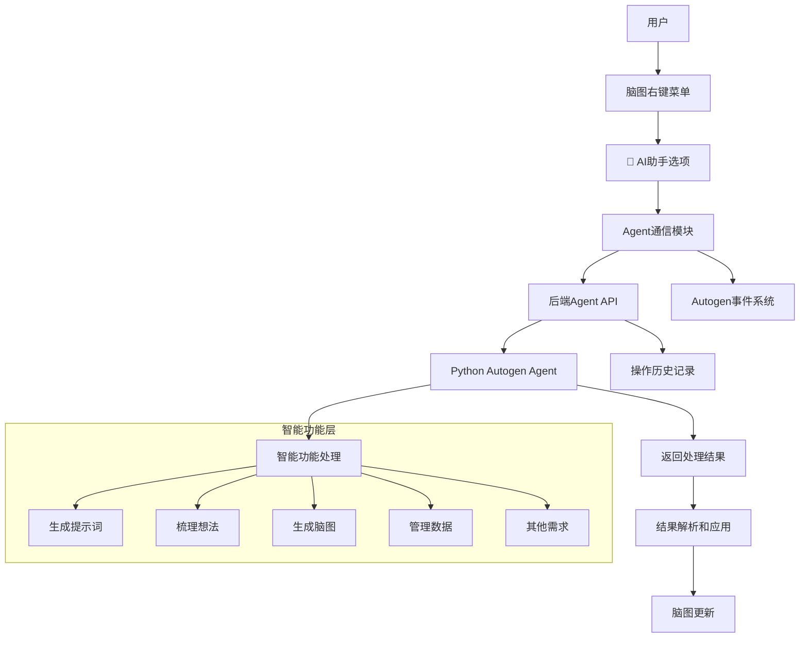
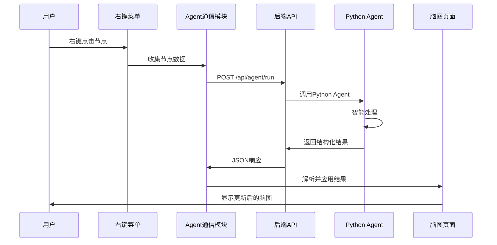

# agent-整体设计方案

## 🎯 项目概述

### 核心目标
在脑图应用中集成Autogen Agent，通过右键菜单的"🤖 AI助手"作为唯一入口，让Agent自主完成所有智能功能，替代传统的模块化代码实现方式。

### 核心理念
```
脑图页面
    ↓
集成 Autogen Agent/Team
    ↓
Agent 自己完成所有功能
  - 生成提示词
  - 梳理想法
  - 生成脑图
  - 管理数据
  - 其他任何需求
```

## 🏗️ 系统架构

### 整体架构图


### 核心架构设计
```
脑图右键菜单
    ↓
"🤖 AI助手" (唯一入口)
    ↓
发送节点内容 + 用户意图
    ↓
Autogen Agent/Team
    ↓
Agent 理解需求并执行
    ↓
返回结果 (文本/脑图数据/命令)
    ↓
脑图页面展示/应用结果
```

## 📋 组件设计

### 1. 前端集成层
- **右键菜单扩展**: 在现有context-menu-manager.js中添加AI助手选项
- **Agent通信模块**: 封装与后端Agent API的通信逻辑
- **结果展示界面**: 模态框或侧边栏展示Agent处理结果
- **加载状态管理**: 处理网络延迟和用户反馈

### 2. 后端API层
- **增强的Agent运行端点**: `/api/agent/run` - 处理Agent请求
- **状态查询端点**: `/api/agent/status` - 获取Agent服务状态
- **历史记录端点**: `/api/agent/history` - 操作历史管理
- **错误处理机制**: 统一的错误分类和处理

### 3. Python Agent服务层
- **独立进程**: 在8082端口运行的Python Autogen Agent服务
- **多意图支持**: expand, summarize, analyze, generate, optimize
- **模型管理**: 支持多种LLM模型（GPT-4, GPT-3.5-turbo等）
- **结果格式化**: 返回标准化的脑图节点数据

### 4. 系统集成层
- **事件系统集成**: 通过AutogenEventBus发送操作事件
- **存储系统集成**: 使用AutogenUnifiedStorage保存操作历史
- **错误处理集成**: 统一的错误处理机制
- **日志系统集成**: 完整的操作日志记录

## 🔄 数据流程设计

### 请求流程


### 数据格式规范
#### 请求数据格式
```json
{
  "node_data": {
    "id": "node_123",
    "topic": "项目管理需求",
    "content": "需要设计一个项目管理系统的脑图结构...",
    "parent_id": "root",
    "children": []
  },
  "user_intent": "expand",
  "intent_description": "请帮我扩展这个节点",
  "context": {
    "mindmap_id": "mindmap_001",
    "selected_nodes": ["node_123"]
  }
}
```

#### 响应数据格式
```json
{
  "success": true,
  "result": {
    "type": "mindmap_nodes",
    "content": {
      "nodes": [
        {
          "id": "generated_node_1",
          "topic": "需求分析",
          "content": "详细的需求分析文档...",
          "direction": "right"
        }
      ]
    },
    "text_output": "已为您生成了详细结构...",
    "suggested_actions": ["apply_to_mindmap", "refine"]
  },
  "metadata": {
    "processing_time": 2.5,
    "model_used": "gpt-4",
    "tokens_used": 456
  }
}
```

## 🛠️ 技术实现方案

### 1. 前端实现要点
- **向后兼容**: 不破坏现有右键菜单功能
- **渐进增强**: 先实现基础功能，再添加高级特性
- **用户体验**: 良好的加载状态和错误反馈
- **事件驱动**: 通过事件系统通知其他组件

### 2. 后端实现要点
- **请求验证**: 严格的输入数据验证
- **错误分类**: 详细的错误代码和用户建议
- **性能监控**: 处理时间和资源使用监控
- **队列管理**: 并发请求管理和优先级处理

### 3. Python Agent实现要点
- **模块化设计**: 可扩展的意图处理模块
- **配置管理**: 灵活的模型和参数配置
- **结果标准化**: 统一的输出格式规范
- **错误恢复**: 优雅的错误处理和降级方案

## 🚀 实施路线图

### 阶段一：核心功能 (1-2周)
1. **后端API增强** - 扩展registry_server.py中的Agent端点
2. **Python Agent服务** - 创建独立的Autogen Agent进程
3. **基础通信框架** - 实现前后端基本通信

### 阶段二：前端集成 (1周)
4. **右键菜单集成** - 添加AI助手菜单项
5. **结果解析逻辑** - 处理Agent返回的各种操作类型
6. **基础界面** - 简单的结果展示和确认

### 阶段三：系统优化 (1周)
7. **事件系统集成** - 完整的操作事件流
8. **历史记录功能** - 操作历史管理和回溯
9. **性能优化** - 响应时间和用户体验优化

### 阶段四：高级功能 (后续)
10. **意图选择界面** - 用户指定处理意图
11. **批量处理** - 多节点同时处理
12. **自定义配置** - 用户自定义Agent参数

## ⚠️ 风险评估与缓解

### 技术风险
1. **网络延迟**
   - **风险**: Agent API调用可能较慢
   - **缓解**: 良好的加载状态反馈，超时处理机制

2. **服务可用性**
   - **风险**: Python Agent服务可能不可用
   - **缓解**: 健康检查，优雅降级，服务状态监控

3. **数据安全**
   - **风险**: 节点数据传输安全性
   - **缓解**: 本地处理优先，敏感数据脱敏

### 用户体验风险
1. **操作复杂性**
   - **风险**: 用户不理解Agent能做什么
   - **缓解**: 清晰的意图描述，操作示例

2. **结果质量**
   - **风险**: Agent返回结果不符合预期
   - **缓解**: 结果预览，手动确认，反馈机制

## 📊 成功指标

### 功能指标
- ✅ Agent API调用成功率 > 95%
- ✅ 平均响应时间 < 10秒
- ✅ 用户操作完成率 > 80%
- ✅ 错误恢复成功率 > 90%

### 用户体验指标
- ✅ 用户满意度评分 > 4/5
- ✅ 功能使用频率 > 每周3次/用户
- ✅ 操作成功率 > 85%
- ✅ 学习曲线 < 2次使用

## 🔗 相关文档

1. **[agent-Autogen Agent API 接口规范.md](docs/Agent-API-接口规范.md)** - 详细的API接口规范
2. **[agent-后端Agent API扩展设计.md](docs/后端Agent-API扩展设计.md)** - 后端实现方案
3. **[agent-脑图右键菜单集成AI助手设计文档.md](docs/脑图右键菜单集成AI助手设计.md)** - 前端集成方案

## 💡 创新亮点

### 架构创新
- **单一入口设计**: 通过右键菜单统一所有智能功能入口
- **Agent自主决策**: Agent理解用户意图并自主执行相应操作
- **无代码扩展**: 新功能通过Agent能力扩展，无需代码修改

### 技术优势
- **统一事件系统**: 完整的操作事件追踪
- **标准化接口**: 统一的请求/响应数据格式
- **模块化服务**: 独立的Python Agent服务，便于维护和扩展

### 用户体验
- **无缝集成**: 与现有脑图功能完美融合
- **智能感知**: Agent根据节点内容自动推荐处理方式
- **渐进学习**: 系统会学习用户偏好，提供个性化服务

---

**文档版本**: 1.0  
**最后更新**: 2025-10-05  
**维护者**: 架构师团队