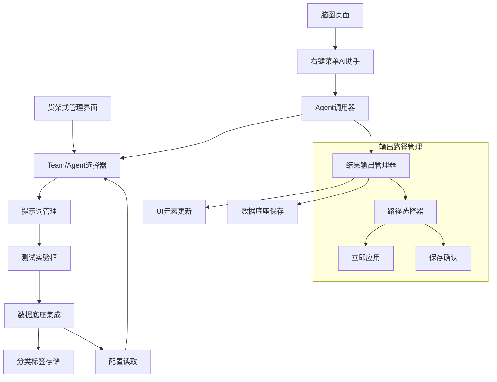
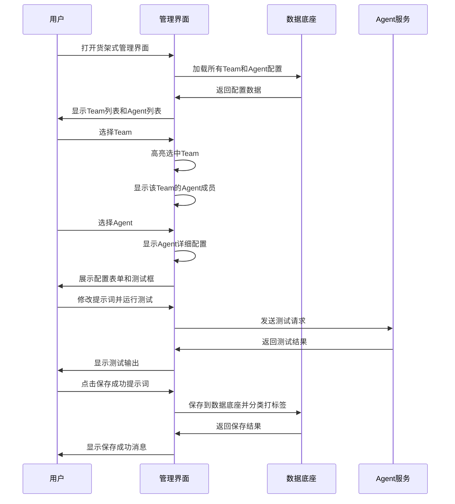

# agent-货架式管理界面设计

## 🎯 功能概述

### 核心功能
基于补充要求，设计一个完整的Agent和Team货架式管理界面，实现统一数据底座集成、配置管理、提示词实验和结果输出管理。

## 🏗️ 系统架构扩展

### 扩展后的整体架构


## 📋 货架式管理界面设计

### 1. 界面布局设计
```
+-----------------------------------------+
| 货架式管理界面 - Team/Agent管理器        |
+-----------------+-----------------------+
| Team选择侧边栏  | 主内容区域            |
|                 |                       |
| • 项目管理专家   | +-------------------+ |
| • 内容生成团队   | | Agent配置面板     | |
| • 结构优化团队   | |                   | |
| • 分析评估团队   | | 名称: [输入框]    | |
|                 | | 系统提示词: [编辑器]| |
| +新建Team按钮    | | 模型配置: [下拉框] | |
|                 | | 参数设置: [表单]   | |
|                 | +-------------------+ |
|                 |                       |
|                 | +-------------------+ |
|                 | | 测试实验框        | |
|                 | | 输入: [文本框]     | |
|                 | | 输出: [结果展示区] | |
|                 | | [运行测试] [保存]  | |
|                 | +-------------------+ |
+-----------------+-----------------------+
```

### 2. 核心功能模块

#### 2.1 Team/Agent选择器
```javascript
class TeamAgentSelector {
    constructor() {
        this.selectedTeam = null;
        this.selectedAgent = null;
        this.availableTeams = [];
        this.availableAgents = [];
    }
    
    async loadFromDataBase() {
        // 从数据底座加载Team和Agent配置
        this.availableTeams = await AutogenUnifiedStorage.retrieve('agent_teams') || [];
        this.availableAgents = await AutogenUnifiedStorage.retrieve('agent_agents') || [];
        
        this.renderTeamList();
        this.renderAgentList();
    }
    
    renderTeamList() {
        // 渲染Team选择侧边栏
        const teamList = document.getElementById('team-list');
        teamList.innerHTML = this.availableTeams.map(team => `
            <div class="team-item ${team.id === this.selectedTeam?.id ? 'selected' : ''}" 
                 onclick="selector.selectTeam('${team.id}')">
                <div class="team-name">${team.name}</div>
                <div class="team-description">${team.description}</div>
                <div class="team-agents-count">${team.agents.length}个Agent</div>
            </div>
        `).join('');
    }
    
    selectTeam(teamId) {
        this.selectedTeam = this.availableTeams.find(t => t.id === teamId);
        this.selectedAgent = null;
        this.renderAgentList();
        this.loadTeamConfig();
    }
    
    selectAgent(agentId) {
        this.selectedAgent = this.availableAgents.find(a => a.id === agentId);
        this.loadAgentConfig();
    }
}
```

#### 2.2 提示词管理系统
```javascript
class PromptManager {
    constructor() {
        this.currentPrompt = '';
        this.promptHistory = [];
        this.promptCategories = [
            'brainstorming', 'analysis', 'summarization', 
            'expansion', 'optimization', 'generation'
        ];
    }
    
    async loadPromptTemplates() {
        // 从数据底座加载提示词模板
        const templates = await AutogenUnifiedStorage.retrieve('prompt_templates') || [];
        this.promptHistory = templates;
        this.renderPromptHistory();
    }
    
    async savePromptToBase(promptData) {
        // 保存提示词到数据底座
        const saveData = {
            id: generateId(),
            content: promptData.content,
            category: promptData.category,
            tags: promptData.tags || [],
            test_input: promptData.test_input,
            test_output: promptData.test_output,
            success_rate: promptData.success_rate,
            created_at: new Date().toISOString(),
            updated_at: new Date().toISOString()
        };
        
        // 添加到历史记录
        this.promptHistory.unshift(saveData);
        
        // 保存到数据底座
        await AutogenUnifiedStorage.store('prompt_templates', this.promptHistory);
        
        // 触发保存成功事件
        AutogenEventBus.emit('prompt:saved', saveData);
        
        return saveData;
    }
    
    categorizePrompt(content, testResults) {
        // 自动分类提示词
        // 基于内容分析和测试结果自动打标签
        const categories = this.detectCategories(content);
        const tags = this.generateTags(testResults);
        
        return {
            categories,
            tags,
            confidence: this.calculateConfidence(testResults)
        };
    }
}
```

#### 2.3 测试实验框
```javascript
class TestExperimentBox {
    constructor() {
        this.testInput = '';
        this.testOutput = '';
        this.isTesting = false;
    }
    
    async runTest() {
        if (this.isTesting) return;
        
        this.isTesting = true;
        this.updateUIState('testing');
        
        try {
            // 使用当前选中的Agent配置运行测试
            const testConfig = {
                agent_config: this.getCurrentAgentConfig(),
                input: this.testInput,
                test_mode: true
            };
            
            const result = await this.callAgentAPI(testConfig);
            this.testOutput = result.content;
            
            this.renderTestOutput();
            this.updateUIState('completed');
            
            // 记录测试结果
            this.recordTestResult(testConfig, result);
            
        } catch (error) {
            this.testOutput = `测试失败: ${error.message}`;
            this.renderTestOutput();
            this.updateUIState('error');
        } finally {
            this.isTesting = false;
        }
    }
    
    async saveSuccessfulTest() {
        if (!this.testOutput || this.testOutput.includes('测试失败')) {
            alert('请先运行成功的测试再保存');
            return;
        }
        
        // 自动分类和打标签
        const categorization = promptManager.categorizePrompt(
            this.getCurrentPrompt(), 
            { input: this.testInput, output: this.testOutput }
        );
        
        const promptData = {
            content: this.getCurrentPrompt(),
            category: categorization.categories[0],
            tags: categorization.tags,
            test_input: this.testInput,
            test_output: this.testOutput,
            success_rate: categorization.confidence
        };
        
        const savedPrompt = await promptManager.savePromptToBase(promptData);
        
        // 显示保存成功消息
        this.showSaveSuccess(savedPrompt);
    }
}
```

## 🔄 数据底座集成设计

### 1. 统一数据存储结构

#### 1.1 Agent配置存储
```json
{
  "agent_agents": [
    {
      "id": "mindmap_assistant_v1",
      "name": "脑图助手v1",
      "type": "assistant",
      "config": {
        "system_message": "你是一个专业的脑图助手...",
        "model": "gpt-4",
        "temperature": 0.7,
        "max_tokens": 2000
      },
      "metadata": {
        "created_at": "2025-10-05T10:00:00Z",
        "updated_at": "2025-10-05T10:30:00Z",
        "usage_count": 45,
        "success_rate": 0.92
      },
      "tags": ["brainstorming", "expansion", "analysis"]
    }
  ]
}
```

#### 1.2 Team配置存储
```json
{
  "agent_teams": [
    {
      "id": "project_management_team",
      "name": "项目管理专家团队",
      "description": "专门处理项目管理相关的脑图任务",
      "agents": ["structure_expert", "content_expert", "analysis_expert"],
      "workflow": {
        "first_agent": "analysis_expert",
        "fallback_agent": "content_expert"
      },
      "metadata": {
        "created_at": "2025-10-05T10:00:00Z",
        "updated_at": "2025-10-05T10:30:00Z",
        "average_processing_time": 12.5
      },
      "tags": ["project_management", "complex_tasks"]
    }
  ]
}
```

#### 1.3 提示词模板存储
```json
{
  "prompt_templates": [
    {
      "id": "prompt_expand_node_001",
      "content": "请基于以下节点内容，生成详细的子节点结构...",
      "category": "expansion",
      "tags": ["node_expansion", "structure_generation"],
      "test_results": [
        {
          "input": "项目管理需求",
          "output": "生成的需求分析结构...",
          "success": true,
          "timestamp": "2025-10-05T10:15:00Z"
        }
      ],
      "success_rate": 0.95,
      "usage_count": 23,
      "metadata": {
        "created_by": "user_123",
        "created_at": "2025-10-05T10:00:00Z",
        "last_used": "2025-10-05T10:30:00Z"
      }
    }
  ]
}
```

### 2. 数据底座API集成

#### 2.1 配置读取接口
```javascript
class DataBaseIntegration {
    constructor() {
        this.storage = window.AutogenUnifiedStorage;
    }
    
    async loadAgentConfig(agentId) {
        const agents = await this.storage.retrieve('agent_agents') || [];
        return agents.find(agent => agent.id === agentId);
    }
    
    async loadTeamConfig(teamId) {
        const teams = await this.storage.retrieve('agent_teams') || [];
        return teams.find(team => team.id === teamId);
    }
    
    async loadAllTeams() {
        return await this.storage.retrieve('agent_teams') || [];
    }
    
    async loadPromptTemplates(category = null) {
        const templates = await this.storage.retrieve('prompt_templates') || [];
        if (category) {
            return templates.filter(t => t.category === category);
        }
        return templates;
    }
    
    async saveAgentConfig(agentConfig) {
        let agents = await this.storage.retrieve('agent_agents') || [];
        
        // 更新或添加配置
        const existingIndex = agents.findIndex(a => a.id === agentConfig.id);
        if (existingIndex >= 0) {
            agents[existingIndex] = {
                ...agents[existingIndex],
                ...agentConfig,
                metadata: {
                    ...agents[existingIndex].metadata,
                    updated_at: new Date().toISOString()
                }
            };
        } else {
            agents.push({
                ...agentConfig,
                metadata: {
                    created_at: new Date().toISOString(),
                    updated_at: new Date().toISOString(),
                    usage_count: 0,
                    success_rate: 0
                }
            });
        }
        
        await this.storage.store('agent_agents', agents);
        return agentConfig;
    }
}
```

## 🎨 界面交互设计

### 1. Team/Agent选择流程


### 2. 输出路径管理设计

#### 2.1 双路径输出控制器
```javascript
class OutputPathManager {
    constructor() {
        this.autoSaveToBase = false;
        this.immediateApply = true;
    }
    
    async handleAgentResult(result, context) {
        const outputOptions = this.getOutputOptions(context);
        
        // 路径1: 立即应用到当前页面UI元素
        if (this.immediateApply) {
            await this.applyToUI(result, context);
        }
        
        // 路径2: 保存到数据底座（需要确认或根据设置）
        if (this.shouldSaveToBase(context)) {
            await this.saveToDataBase(result, context);
        }
        
        // 触发输出完成事件
        AutogenEventBus.emit('agent:output_completed', {
            result,
            context,
            applied_to_ui: this.immediateApply,
            saved_to_base: this.autoSaveToBase
        });
    }
    
    async applyToUI(result, context) {
        const { target_element, page_type } = context;
        
        switch (page_type) {
            case 'mindmap':
                await this.applyToMindmap(result, target_element);
                break;
            case 'content_editor':
                await this.applyToContentEditor(result, target_element);
                break;
            case 'detail_page':
                await this.applyToDetailPage(result, target_element);
                break;
            default:
                console.warn('未知的页面类型:', page_type);
        }
    }
    
    async saveToDataBase(result, context) {
        const saveData = {
            id: generateId(),
            result_data: result,
            context: context,
            timestamp: new Date().toISOString(),
            agent_used: context.agent_config,
            tags: this.generateSaveTags(result, context)
        };
        
        // 保存到操作历史
        await this.saveToOperationHistory(saveData);
        
        // 如果结果包含新的提示词模板，也保存到提示词库
        if (result.prompt_template) {
            await promptManager.savePromptToBase(result.prompt_template);
        }
    }
    
    shouldSaveToBase(context) {
        // 根据设置或用户确认决定是否保存
        if (this.autoSaveToBase) {
            return true;
        }
        
        // 弹出确认对话框
        return this.showSaveConfirmation(context);
    }
    
    showSaveConfirmation(context) {
        // 显示保存确认对话框
        return new Promise((resolve) => {
            const confirmed = confirm(
                `是否将此次操作结果保存到数据底座？\n\n` +
                `操作类型: ${context.operation_type}\n` +
                `目标元素: ${context.target_element}\n` +
                `使用Agent: ${context.agent_config.name}`
            );
            resolve(confirmed);
        });
    }
}
```

#### 2.2 UI元素集成点
```javascript
class UIElementIntegrator {
    // 脑图节点集成
    async applyToMindmap(result, nodeElement) {
        if (result.type === 'mindmap_nodes') {
            // 添加新的子节点
            const mindmap = window.jm;
            const parentNode = mindmap.get_node(nodeElement.data('nodeid'));
            
            result.content.nodes.forEach(nodeConfig => {
                mindmap.add_node(parentNode, nodeConfig.id, nodeConfig.topic, nodeConfig.data);
            });
            
            // 触发脑图更新事件
            AutogenEventBus.emit('mindmap:nodes_added', {
                parent_node: parentNode.id,
                new_nodes: result.content.nodes.map(n => n.id)
            });
        }
    }
    
    // 内容框集成
    async applyToContentEditor(result, editorElement) {
        if (result.type === 'text' || result.type === 'markdown') {
            const currentContent = editorElement.value;
            const newContent = result.content;
            
            // 提供合并选项
            const mergeOption = this.getMergeOption();
            
            let finalContent = '';
            switch (mergeOption) {
                case 'replace':
                    finalContent = newContent;
                    break;
                case 'append':
                    finalContent = currentContent + '\n\n' + newContent;
                    break;
                case 'prepend':
                    finalContent = newContent + '\n\n' + currentContent;
                    break;
            }
            
            editorElement.value = finalContent;
            
            // 触发内容更新事件
            AutogenEventBus.emit('content:updated', {
                element: editorElement.id,
                old_content: currentContent,
                new_content: finalContent
            });
        }
    }
    
    // 详情页集成
    async applyToDetailPage(result, detailContainer) {
        // 在详情页的特定区域显示Agent处理结果
        const resultPanel = detailContainer.querySelector('.agent-result-panel');
        if (!resultPanel) {
            this.createResultPanel(detailContainer, result);
        } else {
            this.updateResultPanel(resultPanel, result);
        }
    }
}
```

## 🚀 实施计划

### 阶段一：管理界面开发 (1-2周)
1. **货架式界面框架**
   - Team/Agent选择侧边栏
   - 配置管理主面板
   - 测试实验框组件

2. **数据底座集成**
   - 配置读取和保存
   - 提示词分类存储
   - 操作历史记录

### 阶段二：输出路径管理 (1周)
3. **双路径输出控制器**
   - UI元素集成点
   - 保存确认机制
   - 实时应用功能

4. **页面集成点开发**
   - 脑图节点更新
   - 内容框集成
   - 详情页展示

### 阶段三：测试优化 (1周)
5. **端到端测试**
   - 配置管理流程测试
   - 输出路径测试
   - 性能和安全测试

6. **用户体验优化**
   - 界面交互优化
   - 错误处理完善
   - 文档和帮助

## 📊 成功指标

### 功能指标
- ✅ 配置管理成功率: > 95%
- ✅ 测试实验运行成功率: > 90%
- ✅ 数据底座存储可靠性: 100%
- ✅ 输出路径正确率: > 95%

### 用户体验指标
- ✅ 界面操作流畅度: < 2秒响应
- ✅ 测试实验完成时间: < 15秒
- ✅ 配置保存成功率: > 98%
- ✅ 用户满意度: > 4/5

### 技术指标
- ✅ 数据底座集成度: 100%
- ✅ 现有组件复用率: > 90%
- ✅ 错误处理覆盖率: 100%
- ✅ 性能影响: < 5% 额外开销

---

**文档版本**: 1.0  
**最后更新**: 2025-10-05  
**维护者**: 架构师团队  
**状态**: 完整补充要求实现方案