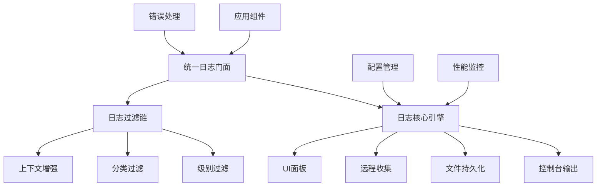

# 项目管理应用日志系统审查报告

## 审查概述

- **审查对象**: 日志系统核心组件
- **审查时间**: 2025-10-07
- **审查人**: 架构师团队
- **业务背景**: 基于Autogen框架的脑图管理应用日志系统

## 审查结果

- **总体评分**: 6.5/10
- **合规状态**: 有条件通过
- **日志功能影响**: 存在功能重复、集成不完善、性能隐患等问题

## 详细分析

### 当前日志系统架构组成

| 组件 | 主要功能 | 状态 | 问题 |
|------|----------|------|------|
| [`UnifiedLogger`](src/core/UnifiedLogger.js:1) | 统一日志记录、分级、缓冲、统计 | 已实现 | 与其他组件功能重叠 |
| [`ErrorHandler`](src/core/ErrorHandler.js:1) | 错误处理、恢复策略、日志集成 | 已实现 | 与ErrorProcessingPipeline重复 |
| [`ErrorProcessingPipeline`](src/core/ErrorProcessingPipeline.js:1) | 错误分类、处理管道、恢复机制 | 已实现 | 功能重叠，集成不完善 |
| [`LogCollector`](src/utils/LogCollector.js:1) | 控制台拦截、日志采集 | 已实现 | 与UnifiedLogger重复 |
| [`LogPanel`](src/components/LogPanel.js:1) | UI日志显示、控制台重定向 | 已实现 | 重复实现，内联脚本冲突 |

### 核心架构问题

#### 1. 功能重复和代码冗余

**问题描述**:
- 多个组件实现相似的日志功能
- [`LogCollector`](src/utils/LogCollector.js:22) 和 [`UnifiedLogger`](src/core/UnifiedLogger.js:392) 都拦截控制台输出
- [`ErrorHandler`](src/core/ErrorHandler.js:396) 和 [`ErrorProcessingPipeline`](src/core/ErrorProcessingPipeline.js:1) 都处理错误恢复

**影响**:
- 代码维护成本增加
- 潜在的性能开销
- 日志记录不一致

#### 2. 集成不完善

**问题描述**:
- [`ErrorHandler`](src/core/ErrorHandler.js:396) 中的 `_integrateUnifiedLogger` 方法依赖全局变量查找
- [`ErrorProcessingPipeline`](src/core/ErrorProcessingPipeline.js:179) 没有使用统一日志系统
- 组件间缺乏明确的依赖关系

**代码示例**:
```javascript
// ErrorHandler.js 第396-421行
_integrateUnifiedLogger() {
    const possibleLoggers = [
        global.UnifiedLogger,
        window.UnifiedLogger,
        this.dependencies?.UnifiedLogger
    ];
    // 依赖全局变量，集成不可靠
}
```

#### 3. 性能隐患

**问题描述**:
- [`UnifiedLogger`](src/core/UnifiedLogger.js:44) 缓冲区默认2000条，可能占用过多内存
- 多个组件同时拦截控制台，增加函数调用开销
- 缺乏日志输出限流机制

#### 4. 架构耦合度过高

**问题描述**:
- [`LogPanel`](src/components/LogPanel.js:101) 直接修改全局console对象
- [`index.html`](index.html:70) 中包含内联的日志面板代码，与组件化架构冲突
- 缺乏清晰的日志流设计

### 功能完整性检查

#### 已实现的功能 ✅

- [x] 日志分级（FATAL, ERROR, WARN, INFO, DEBUG, TRACE）
- [x] 日志分类（SYSTEM, BUSINESS, UI, DATA等）
- [x] 控制台输出和格式化
- [x] 日志缓冲和统计
- [x] 错误处理和恢复策略
- [x] UI日志面板显示

#### 缺失的关键功能 ❌

- [ ] **日志持久化**: 日志仅存在于内存，页面刷新后丢失
- [ ] **统一配置管理**: 缺乏全局日志级别和分类配置
- [ ] **日志查询和分析**: 缺乏高级过滤和搜索功能
- [ ] **性能监控**: 没有日志系统自身的性能监控
- [ ] **安全日志**: 缺乏敏感信息过滤和审计日志
- [ ] **测试支持**: 没有专门的测试日志模式

### 潜在遗漏分析

#### 1. 业务上下文缺失

当前日志系统缺乏业务相关的上下文信息：
- 用户操作轨迹
- 业务事务ID
- 性能指标记录
- 脑图操作特定日志

#### 2. 运维支持不足

- 没有日志轮转机制
- 缺乏日志压缩和归档
- 缺少远程日志收集
- 无实时监控和告警

#### 3. 开发体验问题

- 缺乏日志级别动态调整
- 没有开发环境专用配置
- 调试日志过于冗长或不足

## 改进建议

### 短期改进（1-2周）

#### 1. 整合重复组件

**行动项**:
- 将 [`LogCollector`](src/utils/LogCollector.js:1) 功能合并到 [`UnifiedLogger`](src/core/UnifiedLogger.js:1)
- 移除 [`index.html`](index.html:70) 中的内联日志代码，统一使用 [`LogPanel`](src/components/LogPanel.js:1) 组件
- 重构 [`ErrorHandler`](src/core/ErrorHandler.js:1) 和 [`ErrorProcessingPipeline`](src/core/ErrorProcessingPipeline.js:1) 的集成

**代码修改示例**:
```javascript
// 在UnifiedLogger中添加LogCollector功能
class EnhancedUnifiedLogger {
    constructor() {
        // 保留现有功能
        // 添加LogCollector的监听器机制
        this.listeners = [];
    }
    
    addListener(callback) {
        this.listeners.push(callback);
    }
}
```

#### 2. 增强配置管理

**行动项**:
- 在 [`EnhancedConfigurationManager`](src/core/EnhancedConfigurationManager.js:1) 中添加日志配置
- 支持环境相关的日志级别设置
- 提供运行时配置更新

**配置结构**:
```javascript
const logConfig = {
    level: 'INFO', // 默认级别
    enabledCategories: ['system', 'business', 'error'],
    bufferSize: 1000,
    persistence: {
        enabled: true,
        maxAge: 24 * 60 * 60 * 1000 // 24小时
    }
};
```

#### 3. 实现基础持久化

**行动项**:
- 使用 [`AutogenUnifiedStorage`](src/core/storage/AutogenUnifiedStorage.js:1) 存储重要日志
- 实现日志自动保存机制
- 添加日志清理策略

### 中期改进（3-4周）

#### 1. 性能优化

**行动项**:
- 实现日志输出限流
- 添加异步日志处理
- 优化缓冲区管理

#### 2. 增强监控

**行动项**:
- 添加日志系统健康监控
- 实现错误率告警
- 集成到架构健康检查

#### 3. 标准化日志格式

**行动项**:
- 定义统一的日志schema
- 添加业务上下文自动捕获
- 实现结构化日志

### 长期改进（1-2月）

#### 1. 高级功能

**行动项**:
- 实现日志分析仪表板
- 添加机器学习异常检测
- 支持远程日志收集

#### 2. 安全增强

**行动项**:
- 添加敏感信息过滤
- 实现审计日志
- 支持日志加密

## 架构优化方案

### 目标架构图



### 核心接口设计

```javascript
// 统一的日志接口
class LoggingSystem {
    // 配置管理
    setConfig(config) {}
    getConfig() {}
    
    // 日志记录
    log(level, category, message, context) {}
    // 便捷方法
    error(category, message, context) {}
    warn(category, message, context) {}
    info(category, message, context) {}
    
    // 查询和分析
    query(filters) {}
    getStats() {}
    
    // 维护操作
    clear() {}
    export(format) {}
}
```

## 实施优先级

### 高优先级（立即执行）
1. 移除重复的控制台拦截
2. 统一错误处理集成
3. 添加基础持久化

### 中优先级（本周内）
1. 实现配置管理
2. 优化性能参数
3. 标准化日志格式

### 低优先级（本月内）
1. 高级查询功能
2. 监控告警
3. 安全增强

## 风险评估

### 技术风险
- **集成复杂度**: 中等 - 需要谨慎处理现有组件的依赖关系
- **性能影响**: 低 - 优化后性能应该提升
- **兼容性**: 中等 - 需要保持向后兼容

### 业务风险
- **开发中断**: 低 - 可以分阶段实施
- **用户体验**: 低 - 日志系统对用户透明

## 结论

当前日志系统在基础功能上实现较为完整，但在架构设计上存在明显的功能重复和集成问题。通过整合组件、增强配置和实现持久化，可以显著提升系统的可维护性和可靠性。

**建议立即开始短期改进项**，特别是消除重复组件和增强错误处理集成，这将为后续优化奠定良好基础。

---
**文档版本**: 1.0  
**审查日期**: 2025-10-07  
**下次审查**: 2025-11-07  
**维护团队**: 架构师团队