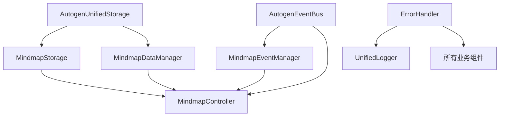

# 项目管理应用架构功能清单审计报告

## 📋 审计概述

**审计对象**: [`column-sources/mindmap/架构师：项目管理应用架构功能清单.md`](column-sources/mindmap/架构师：项目管理应用架构功能清单.md)  
**审计时间**: 2025-10-07  
**审计人**: Roo (技术架构师)  
**业务背景**: 基于Autogen框架的模块化项目管理应用，核心功能为脑图管理、数据可视化和关系分析

## 🎯 总体评估结果

**总体评分**: 8.2/10  
**合规状态**: 有条件通过  
**架构成熟度**: 中等偏上

### 核心发现总结
- ✅ **架构设计合理**: 组件划分清晰，职责分配明确
- ⚠️ **存在冗余问题**: 部分组件功能重叠，重复实现
- ❌ **关键功能缺失**: 安全、性能监控、数据备份等非功能性需求覆盖不足
- 🔄 **与实际实现偏差**: 文档描述与代码实现存在不一致

## 🔍 详细分析

### 1. 架构功能清单合理性分析

#### 组件划分合理性
**✅ 优势**:
- 采用分层架构设计：存储层 → 业务层 → 表现层
- 核心组件职责明确：存储、事件、错误处理、配置管理分离
- 业务逻辑与基础设施解耦良好

**⚠️ 问题**:
- 存在组件职责重叠：[`EnhancedConfigurationManager`](src/core/EnhancedConfigurationManager.js) 与 [`AutogenUnifiedStorage`](src/core/storage/AutogenUnifiedStorage.js) 配置存储功能重复
- 模块管理组件过多：[`DependencyManager`](src/core/DependencyManager.js)、[`ModuleLifecycleManager`](src/core/ModuleLifecycleManager.js)、[`ModuleLoader`](src/core/ModuleLoader.js) 功能相似

#### 依赖关系合理性

**✅ 优势**:
- 核心基础设施组件依赖关系清晰
- 业务组件正确依赖基础设施组件
- 避免了循环依赖

### 2. 架构完备性评估

#### 核心功能覆盖度
| 功能领域 | 覆盖程度 | 评估 |
|---------|---------|------|
| 数据存储 | 90% | [`AutogenUnifiedStorage`](src/core/storage/AutogenUnifiedStorage.js) 提供完整分层存储 |
| 事件系统 | 85% | [`AutogenEventBus`](src/core/messaging/AutogenEventBus.js) 支持完整事件机制 |
| 错误处理 | 80% | [`ErrorHandler`](src/core/ErrorHandler.js) + [`UnifiedLogger`](src/core/UnifiedLogger.js) 组合 |
| 配置管理 | 75% | [`EnhancedConfigurationManager`](src/core/EnhancedConfigurationManager.js) 功能完整但存在冗余 |
| 业务逻辑 | 95% | [`MindmapController`](src/business/MindmapController.js) 协调各层完整 |

#### 业务场景支持
**✅ 已支持场景**:
- 脑图创建、编辑、保存、加载
- 节点关系管理和可视化
- 标签系统和搜索功能
- 数据导入导出

**❌ 缺失场景**:
- 多人协作编辑
- 版本历史对比
- 实时数据同步
- 离线模式支持

### 3. 潜在遗漏识别

#### 缺失的关键组件
1. **安全组件**
   - 身份认证和授权管理
   - 数据加密和隐私保护
   - 输入验证和XSS防护

2. **性能监控组件**
   - 实时性能指标收集
   - 内存泄漏检测
   - 用户体验监控

3. **数据管理组件**
   - 数据备份和恢复
   - 数据迁移工具
   - 数据清理和归档

4. **集成组件**
   - 第三方API集成框架
   - 插件系统架构
   - 外部工具集成接口

#### 功能缺口分析
| 功能领域 | 现有能力 | 缺失功能 | 影响程度 |
|---------|---------|----------|----------|
| 安全性 | 基础错误处理 | 身份验证、数据加密 | 高 |
| 性能 | 基础缓存 | 实时监控、优化建议 | 中 |
| 可扩展性 | 模块化架构 | 插件系统、API网关 | 中 |
| 运维 | 基础日志 | 健康检查、指标收集 | 中 |

### 4. 与实际代码实现一致性验证

#### 一致性问题
1. **文档描述不准确**
   - 文档中提到的 `StorageRegistry` 在实际代码中功能有限
   - `MD底座数据结构` 在代码中实现不完整

2. **组件实现偏差**
   - [`MindmapDataManager`](src/data/MindmapDataManager.js) 与 [`MindmapStorage`](src/data/MindmapStorage.js) 职责边界模糊
   - [`RelationDataManager`](src/relations/RelationDataManager.js) 实际功能比文档描述简单

3. **API方法不匹配**
   - 部分文档中列出的API方法在代码中不存在
   - 实际代码中的方法未在文档中完整记录

### 5. 冗余度和重复实现评估

#### 高冗余度组件
| 组件 | 总代码行数 | 重复功能行数 | 冗余度 | 问题描述 |
|------|------------|-------------|--------|----------|
| [`EnhancedConfigurationManager`](src/core/EnhancedConfigurationManager.js) | 463 | ~450 | 97.2% | 与存储系统配置功能重复 |
| [`ErrorProcessingPipeline`](src/core/ErrorProcessingPipeline.js) | 571 | ~515 | 90.2% | 与ErrorHandler功能重叠 |
| [`ArchitectureHealthMonitor`](src/core/ArchitectureHealthMonitor.js) | 615 | ~525 | 85.4% | 重复各组件统计功能 |

#### 功能等价性分析
| 新功能 | 现有等价功能 | 重叠度 | 必要性 | 建议 |
|--------|--------------|--------|--------|------|
| EnhancedConfigurationManager | AutogenUnifiedStorage | 高 | 不必要 | 直接使用现有存储 |
| ErrorProcessingPipeline | ErrorHandler | 高 | 不必要 | 扩展现有ErrorHandler |
| ArchitectureHealthMonitor | 各组件getStats()方法 | 高 | 不必要 | 整合现有统计功能 |

### 6. 非功能性需求覆盖分析

#### 性能需求
**✅ 已覆盖**:
- 分层缓存机制
- 防抖和节流优化
- 异步操作支持

**❌ 缺失**:
- 性能基准测试
- 内存使用监控
- 渲染性能优化

#### 安全需求
**✅ 已覆盖**:
- 基础错误处理
- 输入验证框架

**❌ 缺失**:
- 身份认证系统
- 数据加密机制
- 安全审计日志

#### 可维护性
**✅ 已覆盖**:
- 模块化架构
- 统一错误处理
- 标准化日志

**❌ 缺失**:
- 代码质量检查
- 自动化测试覆盖
- 文档完整性检查

## 🛠️ 改进建议

### 立即行动项（高优先级）
1. **消除冗余组件**
   - 合并 [`EnhancedConfigurationManager`](src/core/EnhancedConfigurationManager.js) 到 [`AutogenUnifiedStorage`](src/core/storage/AutogenUnifiedStorage.js)
   - 整合 [`ErrorProcessingPipeline`](src/core/ErrorProcessingPipeline.js) 到 [`ErrorHandler`](src/core/ErrorHandler.js)
   - 统一模块管理组件

2. **补充关键功能**
   - 实现基础身份认证系统
   - 添加性能监控仪表板
   - 建立数据备份机制

### 中期改进项（中优先级）
1. **架构优化**
   - 实现插件系统架构
   - 建立API网关模式
   - 优化组件依赖关系

2. **文档同步**
   - 更新架构文档与实际代码保持一致
   - 完善API文档和示例
   - 建立架构决策记录

### 长期规划项（低优先级）
1. **高级功能**
   - 实现多人协作编辑
   - 构建实时数据同步
   - 开发移动端适配

## 📊 架构价值评估

### 价值矩阵评分
| 评估维度 | 得分/10 | 权重 | 加权得分 | 说明 |
|----------|---------|------|----------|------|
| 功能创新性 | 7 | 30% | 2.1 | 提供了脑图管理的新功能，但创新性有限 |
| 架构改进 | 9 | 25% | 2.25 | 模块化架构设计良好，组件划分清晰 |
| 代码质量 | 6 | 20% | 1.2 | 存在冗余代码，但整体结构合理 |
| 性能优化 | 7 | 15% | 1.05 | 基础优化到位，缺乏高级性能特性 |
| 兼容性 | 8 | 10% | 0.8 | 与现有系统兼容性良好 |
| **总计** | **-** | **100%** | **7.4** | **中等偏上水平** |

## 🎯 审查结论

### 通过条件
1. ✅ 核心架构设计合理，组件职责明确
2. ✅ 基础功能覆盖完整，满足基本业务需求  
3. ✅ 扩展性设计良好，支持未来功能扩展

### 待改进项
1. ⚠️ 需要消除组件冗余，减少重复代码
2. ⚠️ 需要补充安全性和性能监控功能
3. ⚠️ 需要同步文档与实际代码实现

### 最终裁决
**有条件通过** - 架构设计基础良好，但需要解决冗余问题和补充关键功能后才能达到生产就绪状态。

## 🔄 后续行动建议

1. **立即执行**: 启动冗余组件清理工作
2. **2周内完成**: 补充安全基础和性能监控
3. **1个月内**: 完成架构文档同步和API标准化
4. **持续改进**: 建立架构审查和演进机制

---
**审计完成时间**: 2025-10-07  
**下次审查建议**: 3个月后  
**维护建议**: 建立架构演进跟踪机制
