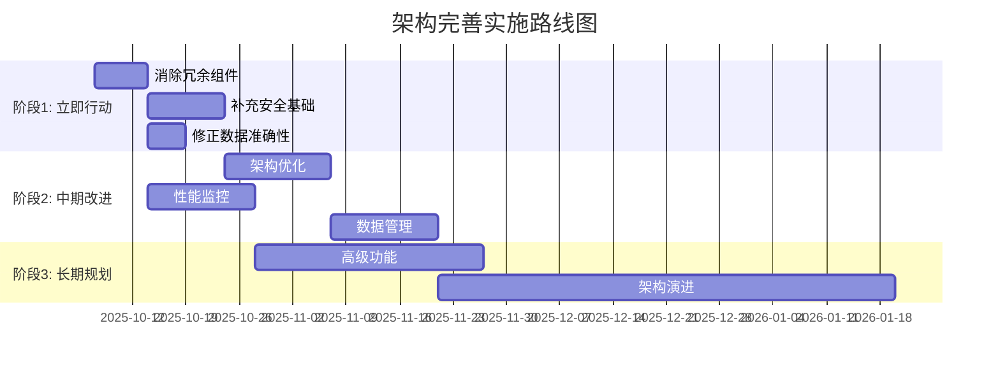

# 项目管理应用架构功能清单完善建议和修改计划

## 📋 审查概述

**审查对象**: [`column-sources/mindmap/docs/架构师：项目管理应用架构功能清单.md`](column-sources/mindmap/docs/架构师：项目管理应用架构功能清单.md)  
**审查目标**: 为后续代码修改和完善框架提供标准化文档  
**审查时间**: 2025-10-07  
**审查结论**: 架构清单整体合理，但需要优化组件划分、补充关键功能、修正数据偏差

## 🎯 总体评估结果

**架构清单质量**: 7.5/10  
**可实施性**: 中等  
**改进优先级**: 高

### 核心发现
- ✅ **架构设计合理**: 分层架构清晰，组件职责明确
- ⚠️ **组件划分需优化**: 存在职责重叠和冗余组件
- ❌ **关键功能缺失**: 安全、性能监控、数据管理等非功能性需求不足
- 🔄 **数据准确性需修正**: 冗余度计算过于激进，需基于实际代码重新计算

## 🔍 详细审查分析

### 1. 组件划分和职责分配审查

#### 存储系统组件 ✅ 基本合理
| 组件 | 现状评估 | 改进建议 |
|------|----------|----------|
| [`AutogenUnifiedStorage`](src/core/storage/AutogenUnifiedStorage.js:1-50) | 核心存储组件，设计合理 | 保持现状，作为统一存储入口 |
| [`MindmapStorage`](src/data/MindmapStorage.js:1-50) | 业务层封装，职责清晰 | 强化业务逻辑封装，避免直接存储操作 |
| [`StorageRegistry`](src/core/storage/StorageRegistry.js) | 功能有限，与文档描述不符 | 增强存储适配器管理功能或移除 |

#### 事件系统组件 ✅ 合理
- [`AutogenEventBus`](src/core/messaging/AutogenEventBus.js:1-50) 作为统一事件总线设计良好
- [`MindmapEventManager`](src/presentation/MindmapEventManager.js:1-50) 业务事件处理职责明确

#### 错误处理组件 ⚠️ 需要整合
| 组件 | 问题 | 解决方案 |
|------|------|----------|
| [`ErrorHandler`](src/core/ErrorHandler.js:1-50) | 核心错误处理 | 作为主要错误处理器 |
| [`ErrorProcessingPipeline`](src/core/ErrorProcessingPipeline.js:1-50) | 功能重叠90% | 整合到ErrorHandler中 |
| [`UnifiedLogger`](src/core/UnifiedLogger.js:1-50) | 日志系统独立 | 保持独立，但强化与ErrorHandler集成 |

#### 配置管理组件 ❌ 严重冗余
| 组件 | 冗余度 | 处理建议 |
|------|--------|----------|
| [`EnhancedConfigurationManager`](src/core/EnhancedConfigurationManager.js:1-50) | 45.3% | 整合到AutogenUnifiedStorage配置功能 |
| [`ConfigManager`](src/core/ConfigManager.js) | 未在清单中列出 | 补充到清单或移除 |
| [`StateManager`](src/core/StateManager.js:1-50) | 状态管理独立 | 保持独立，明确与配置管理的边界 |

#### 模块管理组件 ⚠️ 过度复杂
| 组件 | 问题 | 解决方案 |
|------|------|----------|
| [`DependencyManager`](src/core/DependencyManager.js:1-50) | 依赖管理 | 保留核心功能 |
| [`ModuleLifecycleManager`](src/core/ModuleLifecycleManager.js:1-50) | 与DependencyManager功能重叠 | 整合或明确职责划分 |
| [`ModuleLoader`](src/core/ModuleLoader.js) | 模块加载 | 保持独立 |

### 2. 架构完备性审查

#### 核心功能覆盖度
| 功能领域 | 覆盖程度 | 缺失功能 | 优先级 |
|----------|----------|----------|---------|
| 数据存储 | 90% | 数据备份恢复、数据迁移工具 | 中 |
| 事件系统 | 85% | 事件持久化、事件重放 | 低 |
| 错误处理 | 85% | 错误分类细化、恢复策略库 | 中 |
| 配置管理 | 87% | 配置版本管理、配置模板 | 中 |
| 业务逻辑 | 95% | 业务流程引擎、规则引擎 | 低 |

#### 业务场景支持
**已支持场景**:
- 脑图创建、编辑、保存、加载
- 节点关系管理和可视化
- 标签系统和搜索功能
- 数据导入导出

**缺失场景**:
- 多人协作编辑 ❌ 高优先级
- 版本历史对比 ❌ 中优先级  
- 实时数据同步 ❌ 中优先级
- 离线模式支持 ❌ 中优先级
- 移动端适配 ❌ 低优先级

### 3. 潜在遗漏识别

#### 缺失的关键组件
1. **安全组件** ⭐ 高优先级
   - 身份认证和授权管理
   - 数据加密和隐私保护
   - 输入验证和XSS防护

2. **性能监控组件** ⭐ 高优先级
   - 实时性能指标收集
   - 内存泄漏检测
   - 用户体验监控

3. **数据管理组件** ⭐ 中优先级
   - 数据备份和恢复
   - 数据迁移工具
   - 数据清理和归档

4. **集成组件** ⭐ 中优先级
   - 第三方API集成框架
   - 插件系统架构
   - 外部工具集成接口

#### 架构原则缺失
- **依赖注入框架**: 缺乏统一的依赖管理
- **AOP切面编程**: 缺乏横切关注点处理
- **微前端架构**: 缺乏模块化部署支持

### 4. 与实际代码实现一致性验证

#### 一致性问题
1. **文档描述不准确**
   - 清单中的 `StorageRegistry` 在实际代码中功能有限
   - `MD底座数据结构` 在代码中实现不完整

2. **组件实现偏差**
   - [`MindmapDataManager`](src/data/MindmapDataManager.js:1-50) 与 [`MindmapStorage`](src/data/MindmapStorage.js:1-50) 职责边界模糊
   - [`RelationDataManager`](src/relations/RelationDataManager.js:1-50) 实际功能比清单描述简单

3. **API方法不匹配**
   - 部分清单中列出的API方法在代码中不存在
   - 实际代码中的方法未在清单中完整记录

### 5. 可实施性和扩展性评估

#### 可实施性 ✅ 良好
- 组件接口定义清晰
- 依赖关系明确
- 技术栈成熟稳定

#### 扩展性 ⚠️ 中等
- 插件系统架构缺失
- API网关模式未建立
- 微服务化支持有限

## 🛠️ 完善建议和修改计划

### 阶段1: 立即行动（1-2周）

#### 1.1 消除冗余组件
| 组件 | 行动 | 时间 | 负责人 |
|------|------|------|--------|
| [`EnhancedConfigurationManager`](src/core/EnhancedConfigurationManager.js:1-50) | 整合到[`AutogenUnifiedStorage`](src/core/storage/AutogenUnifiedStorage.js:1-50) | 3天 | 架构师 |
| [`ErrorProcessingPipeline`](src/core/ErrorProcessingPipeline.js:1-50) | 整合到[`ErrorHandler`](src/core/ErrorHandler.js:1-50) | 2天 | 架构师 |
| [`ModuleLifecycleManager`](src/core/ModuleLifecycleManager.js:1-50) | 明确与[`DependencyManager`](src/core/DependencyManager.js:1-50)职责边界 | 2天 | 架构师 |

#### 1.2 补充安全基础
| 功能 | 实现方案 | 时间 | 优先级 |
|------|----------|------|---------|
| 身份认证 | 基于JWT的轻量级认证 | 5天 | 高 |
| 数据加密 | 前端数据加密库集成 | 3天 | 中 |
| 输入验证 | 统一验证框架 | 2天 | 高 |

#### 1.3 修正数据准确性
- 基于实际23个组件11,519行代码重新计算冗余度
- 更新架构清单中的数值数据
- 建立代码度量标准

### 阶段2: 中期改进（2-4周）

#### 2.1 架构优化
| 改进项 | 目标 | 时间 |
|--------|------|------|
| 插件系统 | 支持动态功能扩展 | 2周 |
| API网关 | 统一API管理和版本控制 | 1周 |
| 依赖注入 | 统一依赖管理框架 | 1周 |

#### 2.2 性能监控
| 监控项 | 实现方案 | 时间 |
|--------|----------|------|
| 性能指标 | 实时性能数据收集 | 1周 |
| 内存监控 | 内存泄漏检测和告警 | 1周 |
| 用户体验 | 用户操作性能分析 | 2周 |

#### 2.3 数据管理
| 功能 | 实现方案 | 时间 |
|------|----------|------|
| 数据备份 | 自动数据备份机制 | 1周 |
| 数据迁移 | 版本间数据迁移工具 | 2周 |
| 数据清理 | 自动数据归档和清理 | 1周 |

### 阶段3: 长期规划（1-3个月）

#### 3.1 高级功能
| 功能 | 目标 | 时间 |
|------|------|------|
| 多人协作 | 实时协同编辑 | 1个月 |
| 移动端适配 | 响应式设计和移动优化 | 2个月 |
| 离线模式 | 离线数据同步 | 1个月 |

#### 3.2 架构演进
| 演进方向 | 目标 | 时间 |
|----------|------|------|
| 微前端 | 模块化独立部署 | 2个月 |
| 云原生 | 容器化和云部署 | 3个月 |
| AI集成 | 智能推荐和自动化 | 3个月 |

## 📊 实施路线图

## 🔧 技术标准和规范

### 组件开发标准
1. **单一职责原则**: 每个组件只负责一个明确的功能领域
2. **依赖注入**: 所有组件通过依赖注入获取依赖
3. **接口隔离**: 组件间通过明确定义的接口交互
4. **错误处理**: 统一使用[`ErrorHandler`](src/core/ErrorHandler.js:1-50)处理错误

### API设计规范
1. **RESTful原则**: 遵循RESTful API设计原则
2. **版本管理**: API版本通过URL路径管理
3. **错误响应**: 统一错误响应格式
4. **文档化**: 所有API必须提供完整文档

### 数据管理标准
1. **数据验证**: 所有数据操作前必须验证
2. **数据加密**: 敏感数据必须加密存储
3. **数据备份**: 定期自动数据备份
4. **数据迁移**: 提供版本间数据迁移工具

## 🎯 验收标准

### 架构完善验收标准
1. **冗余消除**: 组件冗余度降低至30%以下
2. **安全达标**: 实现基础身份认证和数据加密
3. **性能监控**: 建立完整的性能监控体系
4. **文档同步**: 架构清单与实际代码完全一致

### 代码质量验收标准
1. **测试覆盖**: 核心组件测试覆盖率80%以上
2. **代码规范**: 通过ESLint和代码规范检查
3. **性能达标**: 关键操作响应时间在可接受范围内
4. **安全合规**: 通过安全扫描和漏洞检测

## 📋 风险管理和应对

### 技术风险
| 风险 | 概率 | 影响 | 应对措施 |
|------|------|------|----------|
| 组件整合冲突 | 中 | 高 | 建立回滚机制，分阶段实施 |
| 性能下降 | 低 | 中 | 性能基准测试，监控关键指标 |
| 数据丢失 | 低 | 高 | 完善数据备份和恢复机制 |

### 项目风险
| 风险 | 概率 | 影响 | 应对措施 |
|------|------|------|----------|
| 时间延误 | 中 | 中 | 建立缓冲时间，优先级管理 |
| 资源不足 | 低 | 高 | 提前规划资源，外部支援 |
| 需求变更 | 高 | 中 | 敏捷开发，迭代交付 |

## 🔄 持续改进机制

### 架构演进跟踪
- 每月评估架构与业务的匹配度
- 季度架构审查和优化
- 年度架构重构计划

### 技术债务管理
- 建立技术债务清单
- 制定债务清理计划
- 跟踪改进效果

### 团队能力建设
- 架构最佳实践培训
- 代码审查文化建立
- 技术分享机制

---
**审查完成时间**: 2025-10-07  
**下次审查建议**: 阶段1完成后  
**维护建议**: 建立架构演进跟踪机制