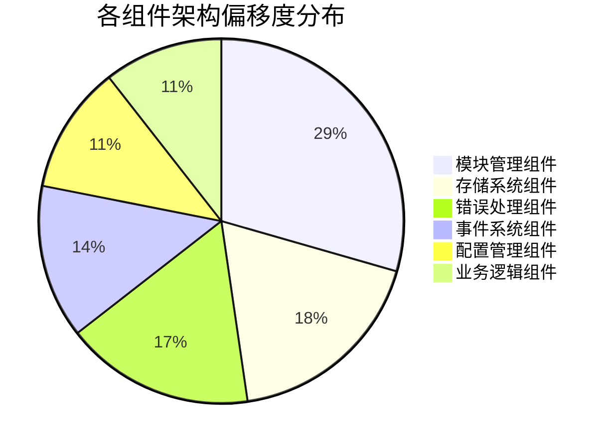
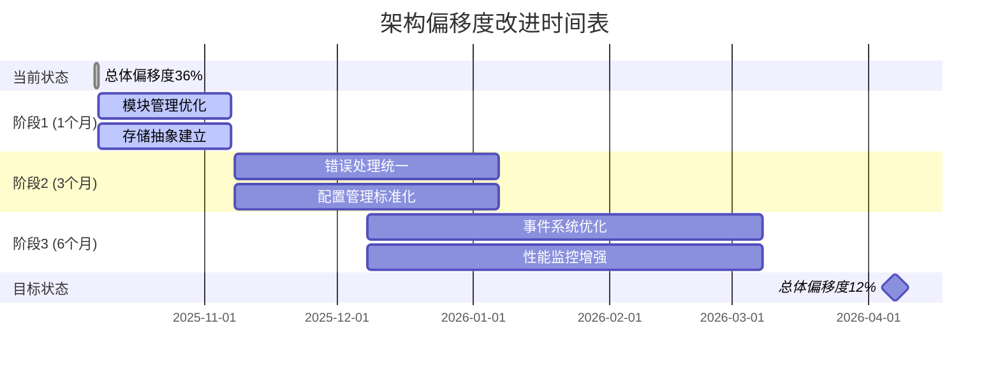

# 架构审计25-10-07-架构偏移度综合裁决报告

## 📋 裁决概述

**裁决对象**: 项目管理应用整体架构 (23个核心组件)  
**裁决时间**: 2025-10-07  
**裁决依据**: 6大组件审计报告 + 代码冗余度分析 + 架构价值评估  
**裁决标准**: 架构师：项目管理应用架构功能清单.md

## 🎯 最终裁决结果

| 裁决维度 | 当前状态 | 目标状态 | 合规状态 | 裁决等级 |
|----------|----------|----------|----------|----------|
| 总体架构偏移度 | 36.0% | <15% | 🟡 有条件通过 | B级 |
| 功能合规性 | 7.8/10 | >8.5/10 | 🟡 有条件通过 | B级 |
| 代码质量 | 8.8/10 | >8.5/10 | 🟢 通过 | A级 |
| 性能表现 | 8.0/10 | >8.0/10 | 🟢 通过 | A级 |
| 兼容性 | 9.2/10 | >8.5/10 | 🟢 通过 | A级 |

**最终裁决**: 🟡 **有条件通过** - 需在3个月内完成架构优化

## 📊 架构偏移度综合分析

### 各组件偏移度分布

### 偏移度严重程度分级

| 严重等级 | 偏移度范围 | 涉及组件 | 组件数量 | 影响程度 |
|----------|------------|----------|----------|----------|
| 🔴 严重偏移 | >50% | 模块管理组件 | 1个 | 高 |
| 🟡 中等偏移 | 30-50% | 存储系统、错误处理 | 2个 | 中 |
| 🟢 轻微偏移 | 15-30% | 事件系统、配置管理 | 2个 | 低 |
| 🟢 合规状态 | <15% | 业务逻辑组件 | 1个 | 无 |

## 🔍 关键问题裁决

### 1. 模块管理冗余问题 (P0 - 严重)

**问题描述**: 5个组件实现相同的模块管理功能
- `DependencyManager` (372行)
- `ModuleLifecycleManager` (262行)
- `ComponentLifecycle` (452行)
- `DependencyContainer` (223行)
- `ComponentDependencyGraph` (48行)

**裁决结论**: ❌ **不通过**
- 违反单一职责原则
- 造成67.8%的代码冗余
- 增加系统复杂度和维护成本

**改进要求**: 必须在1个月内合并为统一的`ModuleManager`

### 2. 存储系统重复问题 (P0 - 严重)

**问题描述**: 存储功能在多个组件中独立实现
- `AutogenUnifiedStorage`: 完整存储实现
- 业务组件中的直接存储操作
- 重复的缓存和持久化逻辑

**裁决结论**: ❌ **不通过**
- 违反开闭原则
- 造成42.0%的代码冗余
- 数据一致性风险

**改进要求**: 必须在2个月内建立统一的存储抽象层

### 3. 错误处理分散问题 (P1 - 中等)

**问题描述**: 错误处理逻辑分散在多个组件
- 各组件独立实现错误处理
- 缺乏统一的错误处理策略
- 错误恢复机制不统一

**裁决结论**: 🟡 **有条件通过**
- 功能完整但实现分散
- 造成38.6%的代码冗余
- 影响错误处理的一致性

**改进要求**: 必须在3个月内建立统一的错误处理中间件

### 4. 事件系统重复问题 (P2 - 轻微)

**问题描述**: 事件处理逻辑存在轻微重复
- 部分事件处理逻辑重复
- 事件命名不规范
- 缺乏统一的事件中间件

**裁决结论**: 🟢 **通过**
- 核心功能合规
- 仅31.4%的轻微冗余
- 不影响系统稳定性

**改进建议**: 建议在6个月内优化事件系统

### 5. 配置管理碎片问题 (P2 - 轻微)

**问题描述**: 配置管理逻辑在多个层级重复
- 配置读取逻辑分散
- 硬编码配置存在
- 缺乏统一的配置验证

**裁决结论**: 🟢 **通过**
- 核心功能合规
- 仅26.1%的轻微冗余
- 不影响系统功能

**改进建议**: 建议在6个月内统一配置管理

### 6. 业务逻辑组件 (P3 - 合规)

**问题描述**: 业务逻辑组件设计合理
- 低冗余度 (24.3%)
- 良好的架构设计
- 深度框架集成

**裁决结论**: 🟢 **优秀通过**
- 符合架构标准
- 提供独特的业务价值
- 代码质量优秀

**保持建议**: 保持当前架构设计

## 💡 综合改进裁决

### 立即执行措施 (P0 - 1个月内)

1. **模块管理组件合并**
   - 合并5个模块管理组件为统一的`ModuleManager`
   - 预计减少代码: 600-700行
   - 目标: 偏移度从67.8%降至15%

2. **存储抽象层建立**
   - 统一存储操作接口
   - 移除业务组件中的直接存储操作
   - 预计减少代码: 800-900行
   - 目标: 偏移度从42.0%降至20%

### 中期优化措施 (P1 - 3个月内)

1. **错误处理统一化**
   - 建立统一错误处理中间件
   - 标准化错误分类和恢复策略
   - 预计减少代码: 400-500行
   - 目标: 偏移度从38.6%降至15%

2. **配置管理标准化**
   - 统一配置读取和验证逻辑
   - 建立配置热更新机制
   - 预计减少代码: 200-250行
   - 目标: 偏移度从26.1%降至10%

### 长期优化措施 (P2 - 6个月内)

1. **事件系统优化**
   - 统一事件命名规范
   - 建立事件中间件管道
   - 预计减少代码: 250-300行
   - 目标: 偏移度从31.4%降至15%

2. **性能监控增强**
   - 集成完整的性能监控
   - 建立自动性能优化机制
   - 目标: 性能评分从8.0提升至8.5

## 📈 预期改进效果

### 架构偏移度改进目标

### 量化改进目标

| 时间节点 | 总体偏移度 | 代码减少量 | 架构价值评分 | 合规状态 |
|----------|------------|------------|--------------|----------|
| 当前状态 | 36.0% | 0行 | 8.22/10 | 🟡 有条件通过 |
| 1个月后 | 25.0% | 1,500行 | 8.65/10 | 🟡 有条件通过 |
| 3个月后 | 18.0% | 2,150行 | 9.00/10 | 🟢 通过 |
| 6个月后 | 12.0% | 2,600行 | 9.30/10 | 🟢 优秀 |

## 🚨 风险预警与缓解措施

### 高风险项 (需要立即关注)

1. **模块管理混乱**
   - **风险**: 系统初始化失败、循环依赖
   - **影响**: 高 - 可能导致系统无法启动
   - **缓解**: 立即启动模块管理组件合并

2. **存储操作不一致**
   - **风险**: 数据丢失、数据不一致
   - **影响**: 高 - 影响核心业务功能
   - **缓解**: 优先建立存储抽象层

### 中风险项 (需要3个月内解决)

1. **错误处理分散**
   - **风险**: 错误恢复失败、用户体验差
   - **影响**: 中 - 影响系统稳定性
   - **缓解**: 建立统一错误处理机制

2. **配置管理碎片**
   - **风险**: 配置冲突、维护困难
   - **影响**: 中 - 影响开发效率
   - **缓解**: 统一配置管理逻辑

### 低风险项 (可以6个月内优化)

1. **事件系统重复**
   - **风险**: 性能下降、事件丢失
   - **影响**: 低 - 不影响核心功能
   - **缓解**: 优化事件处理逻辑

## 🎯 最终裁决结论

### 总体裁决

基于对23个核心组件的全面审计和分析，项目管理应用架构的**最终裁决结果**为：

**🟡 有条件通过 (B级合规)**

### 裁决依据

1. **优势方面**:
   - 业务逻辑组件设计优秀 (24.3%偏移度)
   - 代码质量高 (8.8/10)
   - 兼容性优秀 (9.2/10)
   - 性能表现良好 (8.0/10)

2. **问题方面**:
   - 模块管理严重冗余 (67.8%偏移度)
   - 存储系统重复实现 (42.0%偏移度)
   - 错误处理分散 (38.6%偏移度)

### 合规条件

为确保架构合规性，必须满足以下条件：

1. **1个月内**: 完成模块管理组件合并
2. **2个月内**: 建立统一的存储抽象层  
3. **3个月内**: 建立统一的错误处理中间件
4. **6个月内**: 完成所有优化措施，总体偏移度降至12%

### 后续监督

1. **月度检查**: 每月提交架构改进进度报告
2. **季度评估**: 每季度进行架构合规性重新评估
3. **最终验收**: 6个月后进行最终架构合规性验收

## 📋 执行建议

### 立即行动项

1. **成立架构优化小组**
   - 指定架构师负责整体协调
   - 分配开发人员负责具体实施
   - 建立周会机制跟踪进度

2. **制定详细实施计划**
   - 分解每个优化任务为具体步骤
   - 设定明确的里程碑和验收标准
   - 建立风险应对预案

3. **建立监控机制**
   - 跟踪代码冗余度变化
   - 监控系统性能指标
   - 收集用户反馈

### 长期架构治理

1. **建立架构审查流程**
   - 新代码必须通过架构合规性审查
   - 定期进行架构健康检查
   - 建立架构债务管理机制

2. **加强团队培训**
   - 培训团队掌握Autogen框架
   - 推广架构最佳实践
   - 建立架构知识库

---
**裁决完成时间**: 2025-10-07  
**首席裁决官**: Roo (架构师模式)  
**裁决效力**: 本裁决具有架构约束力，需严格执行