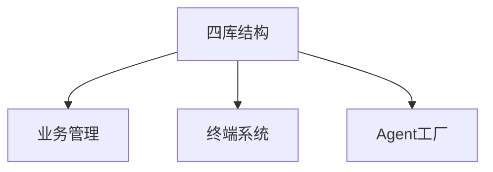
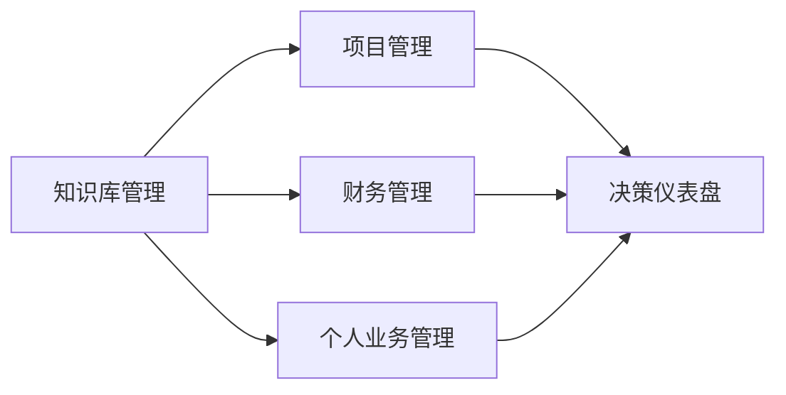
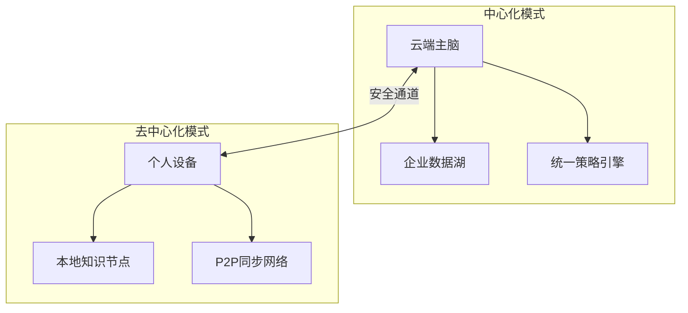

# 基于知识管理和运营的综合管理系统

## 系统架构设计


## 1. 四库结构升级（新增初级MD文档存储）
### 1.1 库结构定义
| **库名称**         | **存储内容**                 | **处理流程**                     | 技术实现                     |
|---------------------|------------------------------|----------------------------------|------------------------------|
| **原始材料库**      | MD/PDF/图片/音视频等原始文件 | 自动解析 → 元数据提取            | Tika解析器 + 文件指纹去重    |
| **加工知识库**      | 结构化知识(向量+图)          | AI梳理 → 实体关联 → 质量校验     | ChromaDB + Neo4j + 质检Agent |
| **业务运营库**      | 项目/财务/个人业务数据       | 业务流程引擎 → 自动化规则执行    | PostgreSQL + Camunda         |
| **审计追溯库**      | 操作日志/版本快照            | 变更捕获 → 区块链存证            | SQLite + IPFS                |

### 1.2 新增处理流水线
```
原始材料 → [解析服务] → 初级MD → [梳理Agent] → 结构化片段 → [质检Agent] → 加工知识库
```

## 2. 业务管理系统
### 2.1 核心模块


### 2.2 功能矩阵
| 模块           | 核心功能                                                                 |
|----------------|--------------------------------------------------------------------------|
| **知识库管理** | 多模态检索/自动关联/版本对比/权限矩阵                                    |
| **项目管理**   | 脑图式任务分解/GPT风险评估/资源动态调配                                  |
| **财务管理**   | 智能票据识别/现金流预测/合规审计链                                       |
| **个人业务**   | 专注模式/自动日程优化/技能图谱分析                                       |

## 3. 混合终端系统
### 3.1 双模架构


### 3.2 手机终端特性
| **功能**         | **中心化模式**                  | **去中心化模式**                |
|------------------|---------------------------------|---------------------------------|
| 知识问答         | 访问全量知识库                  | 本地缓存+差分同步               |
| 业务审批         | 全流程追踪                      | 区块链存证+离线签署             |
| 紧急决策         | 多Agent会商                     | 本地微模型推理                  |
| 数据主权         | 企业托管                        | 端到端加密                      |

## 4. Agent工厂系统
### 4.1 Agent生产线
```
[需求输入] → 配置生成器 → [Agent蓝图] → 测试沙盒 → 部署引擎 → [运行监控]
```

### 4.2 预制Agent模板
| **Agent类型**   | 应用场景                      | 核心能力                          |
|-----------------|-------------------------------|-----------------------------------|
| 知识梳理Agent   | 原始材料处理                  | 内容分级/关联建议/质量评分        |
| 财务哨兵Agent   | 异常交易监控                  | 模式识别/风险预测/审计追踪        |
| 项目协调Agent   | 多团队协作                    | 冲突检测/资源优化/自动周报        |
| 个人教练Agent   | 能力提升                      | 学习推荐/专注力分析/成就图谱      |

## 5. 技术栈规范
1. **存储层**
   - 原始材料库：IPFS+Filecoin
   - 知识库：ChromaDB+Neo4j
   - 业务库：PostgreSQL
2. **终端层**
   - 跨端框架：Flutter 3.0
   - 安全协议：零信任网络访问(ZTNA)
3. **Agent框架**
   - 基础：AutoGen 0.7.1
   - 扩展：LangChain工具链

## 6. 实施路线
| 阶段   | 目标                          | 交付物                         |
|--------|-------------------------------|--------------------------------|
| MVP    | 四库基础+手机问答原型         | 可运行的知识处理流水线          |
| 1.0    | 业务模块+基础Agent工厂        | 3个业务域管理+Agent可视化生成器 |
| 2.0    | 混合模式全功能                | 去中心化网络+AutoGen集群管理    |
