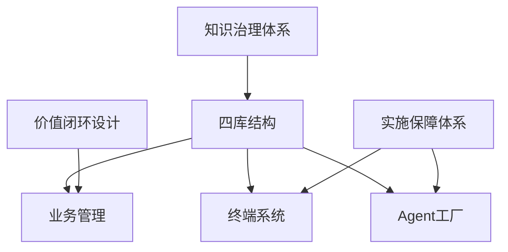
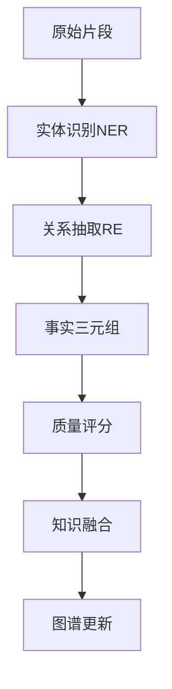
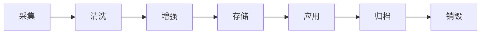
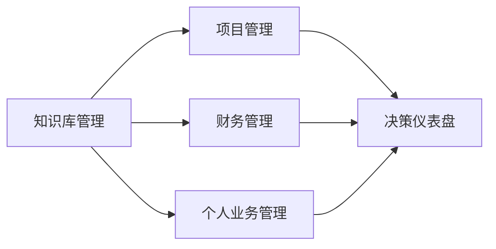
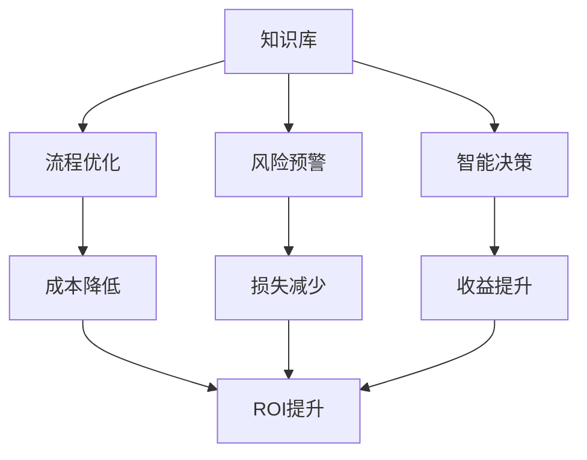
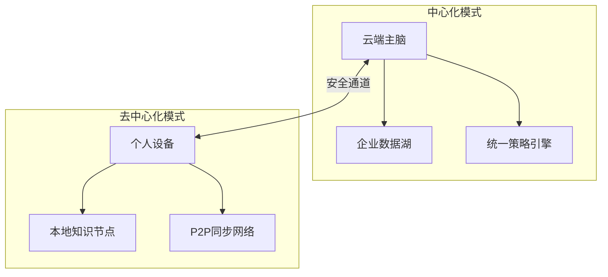
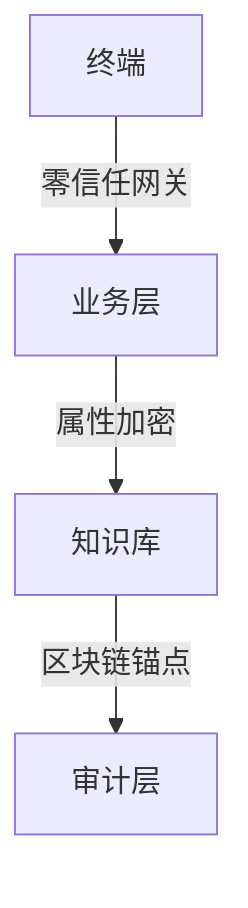
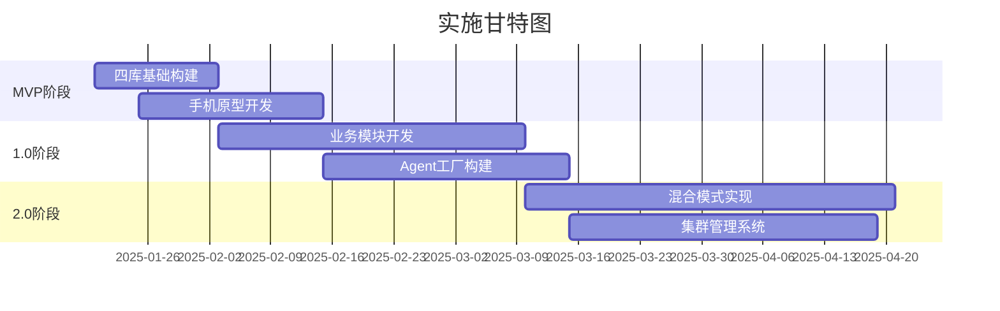

# 基于知识管理和运营的综合管理系统需求大纲（扩写版）

## 系统架构设计


## 1. 四库结构升级（新增初级MD文档存储）

### 1.1 库结构定义
| **库名称**         | **存储内容**                 | **处理流程**                     | 技术实现                     |
|---------------------|------------------------------|----------------------------------|------------------------------|
| **原始材料库**      | MD/PDF/图片/音视频等原始文件 | 自动解析 → 元数据提取            | Tika解析器 + 文件指纹去重    |
| **加工知识库**      | 结构化知识(向量+图)          | AI梳理 → 实体关联 → 质量校验     | ChromaDB + Neo4j + 质检Agent |
| **业务运营库**      | 项目/财务/个人业务数据       | 业务流程引擎 → 自动化规则执行    | PostgreSQL + Camunda         |
| **审计追溯库**      | 操作日志/版本快照            | 变更捕获 → 区块链存证            | SQLite + IPFS                |

### 1.2 原始材料库详细设计
#### 1.2.1 数据采集规范
- **支持格式清单**
  ```
  文档类：MD, PDF, DOC/DOCX, PPT/PPTX, XLS/XLSX, TXT
  媒体类：JPG, PNG, GIF, MP4, MP3, WAV
  结构化：JSON, XML, CSV, YAML
  ```
- **元数据标准**
  ```json
  {
    "file_id": "SHA-256哈希值",
    "source": "上传来源(手动/API/爬虫)",
    "uploader": "用户ID",
    "timestamp": "ISO8601时间戳",
    "sensitivity": "公开/内部/机密/绝密",
    "tags": ["自动标签", "手动标签"],
    "size": "文件大小(字节)",
    "format": "MIME类型"
  }
  ```

#### 1.2.2 预处理流水线


### 1.3 加工知识库详细设计
#### 1.3.1 知识加工层级


#### 1.3.2 质检规则体系
| **质检维度** | **检测规则**                    | **评分权重** | **处理策略**           |
|--------------|--------------------------------|--------------|------------------------|
| 准确性       | 事实验证、来源可信度           | 40%          | 低于0.7分标记待审核    |
| 完整性       | 实体属性完整度、关系密度       | 25%          | 自动补全建议           |
| 一致性       | 冲突检测、矛盾识别             | 20%          | 多源验证仲裁           |
| 时效性       | 时间戳新鲜度、过期标记         | 15%          | 定期重新验证           |

### 1.4 新增处理流水线
```
原始材料 → [解析服务] → 初级MD → [梳理Agent] → 结构化片段 → [质检Agent] → 加工知识库
```

## 2. 知识治理体系

### 2.1 全生命周期管理


#### 2.1.1 知识生命周期阶段定义
| 阶段   | 持续时间 | 主要活动                    | 自动化程度 |
|--------|----------|-----------------------------|-----------| 
| 采集   | 实时     | 多源数据接入、格式标准化    | 95%       |
| 清洗   | 1-6小时  | 去重、去噪、质量检测        | 85%       |
| 增强   | 6-24小时 | 实体抽取、关系构建、语义标注| 75%       |
| 存储   | <1小时   | 索引构建、备份、权限设置    | 98%       |
| 应用   | 持续     | 检索、推理、决策支持        | 60%       |
| 归档   | 定期     | 冷数据迁移、压缩存储        | 90%       |
| 销毁   | 合规触发 | 安全删除、审计记录          | 80%       |

### 2.2 多模态处理引擎
#### 2.2.1 处理能力矩阵
| 数据类型   | 处理方式                  | 质量指标               | 处理速度      |
|------------|---------------------------|------------------------|---------------|
| 纯文本     | NLP实体抽取+关系构建      | F1>0.85                | 1000字/秒     |
| 结构化表格 | 表格理解+语义关联         | 字段对齐率>95%         | 100行/秒      |
| 图像文档   | OCR+版面分析+对象识别     | mAP@0.5>0.78           | 10页/分钟     |
| 音视频     | ASR转写+关键帧提取        | WER<0.15               | 实时处理      |
| 代码文档   | AST解析+依赖分析          | 语法准确率>99%         | 10K行/秒      |

## 3. 业务管理系统

### 3.1 核心模块


### 3.2 功能矩阵扩展
| 模块           | 核心功能                                                                 | 智能特性                    |
|----------------|--------------------------------------------------------------------------|----------------------------|
| **知识库管理** | 多模态检索/自动关联/版本对比/权限矩阵                                    | AI驱动的知识发现与推荐      |
| **项目管理**   | 脑图式任务分解/GPT风险评估/资源动态调配                                  | 智能进度预测与风险预警      |
| **财务管理**   | 智能票据识别/现金流预测/合规审计链                                       | 异常交易检测与成本优化      |
| **个人业务**   | 专注模式/自动日程优化/技能图谱分析                                       | 个性化效能提升建议          |

### 3.3 项目管理智能特性
#### 3.3.1 风险评估模型
```python
risk_factors = {
    "进度风险": {
        "任务延期率": 0.3,
        "关键路径长度": 0.2,
        "资源冲突数": 0.25,
        "依赖复杂度": 0.25
    },
    "质量风险": {
        "需求变更频率": 0.4,
        "团队经验匹配度": 0.3,
        "测试覆盖率": 0.3
    }
}
```

## 4. 价值闭环设计

### 4.1 业务赋能矩阵


### 4.2 量化效益指标
| 业务域       | 核心KPI                  | 基线值     | 目标值     | 测量周期 |
|--------------|--------------------------|------------|------------|----------|
| 项目管理     | 任务按时完成率           | 65%        | 85%        | 月度     |
| 财务管理     | 异常交易发现时效         | 24小时     | 2小时      | 实时     |
| 个人效能     | 专注时间占比             | 30%        | 50%        | 周度     |
| 知识运维     | 问答准确率               | 75%        | 92%        | 日度     |

## 5. 混合终端系统

### 5.1 双模架构


### 5.2 手机终端特性
| **功能**         | **中心化模式**                  | **去中心化模式**                |
|------------------|---------------------------------|---------------------------------|
| 知识问答         | 访问全量知识库                  | 本地缓存+差分同步               |
| 业务审批         | 全流程追踪                      | 区块链存证+离线签署             |
| 紧急决策         | 多Agent会商                     | 本地微模型推理                  |
| 数据主权         | 企业托管                        | 端到端加密                      |

## 6. Agent工厂系统

### 6.1 Agent生产线
```
[需求输入] → 配置生成器 → [Agent蓝图] → 测试沙盒 → 部署引擎 → [运行监控]
```

### 6.2 预制Agent模板
| **Agent类型**   | 应用场景                      | 核心能力                          | 性能指标           |
|-----------------|-------------------------------|-----------------------------------|--------------------|
| 知识梳理Agent   | 原始材料处理                  | 内容分级/关联建议/质量评分        | 1000字/秒          |
| 财务哨兵Agent   | 异常交易监控                  | 模式识别/风险预测/审计追踪        | 实时流处理         |
| 项目协调Agent   | 多团队协作                    | 冲突检测/资源优化/自动周报        | 响应<1秒           |
| 个人教练Agent   | 能力提升                      | 学习推荐/专注力分析/成就图谱      | 个性化准确率>85%   |

### 6.3 Agent能力扩展
#### 6.3.1 自动工具链绑定
```python
tool_mapping = {
    "数据分析": ["PandasTool", "SQLTool", "ChartTool"],
    "文档处理": ["PDFTool", "WordTool", "ExcelTool"],
    "通信交互": ["EmailTool", "SlackTool", "WebhookTool"],
    "知识检索": ["VectorSearchTool", "GraphQueryTool"]
}
```

## 7. 实施保障体系

### 7.1 技术栈规范（增强版）
#### 7.1.1 存储层
- **原始材料库**
  - 分布式存储：IPFS+Filecoin
  - 冷热分离：Hot(SSD)/Cold(HDD)存储策略
- **知识库**
  - 向量索引：ChromaDB + Neo4j
  - 业务库：PostgreSQL

#### 7.1.2 终端层
- **跨端框架**：Flutter 3.0
- **安全协议**：零信任网络访问(ZTNA)
- **硬件级加密**：TEE可信执行环境

#### 7.1.3 Agent框架
- **基础**：AutoGen 0.7.1
- **扩展**：LangChain工具链
- **工具集市**：预集成50+常用工具

### 7.2 安全架构


## 8. 实施路线（细化版）

### 8.1 阶段规划
| 阶段   | 目标                          | 交付物                         | 验收标准                    |
|--------|-------------------------------|--------------------------------|-----------------------------|
| MVP    | 四库基础+手机问答原型         | 可运行的知识处理流水线          | 实体识别准确率>80%          |
| 1.0    | 业务模块+基础Agent工厂        | 3个业务域管理+Agent可视化生成器 | 任务延期率↓15%              |
| 2.0    | 混合模式全功能                | 去中心化网络+AutoGen集群管理    | 个人效能提升率>25%          |

### 8.2 关键里程碑


### 8.3 风险控制
| 风险类型     | 风险描述                 | 应对措施                      | 责任人     |
|--------------|--------------------------|-------------------------------|------------|
| 技术风险     | AutoGen版本兼容性        | 建立版本兼容性测试流程        | 技术负责人 |
| 数据风险     | 知识质量不达标           | 建立多层质检机制              | 数据专家   |
| 安全风险     | 隐私数据泄露             | 零信任架构+端到端加密         | 安全专家   |
| 进度风险     | 关键节点延期             | 敏捷开发+每周进度评审         | 项目经理   |

---

## 附录

### A. 术语表
- **四库结构**：原始材料库、加工知识库、业务运营库、审计追溯库
- **混合模式**：中心化与去中心化并存的系统架构
- **Agent工厂**：基于AutoGen的智能体生产与管理系统

### B. 参考文档
- AutoGen 0.7.1 官方文档
- ChromaDB 技术规范
- Neo4j 图数据库最佳实践

### C. 版本历史
- v1.0：初始需求大纲
- v2.0：扩写版（当前版本）- 增加知识治理、价值闭环、实施保障体系
