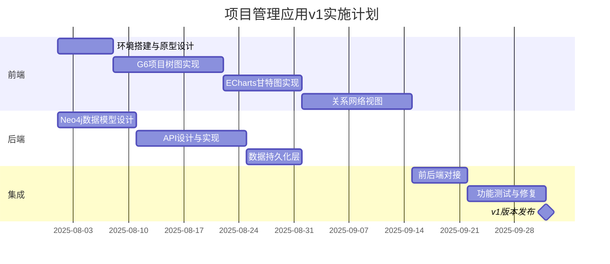

# 项目管理应用可视化方案 v1.1

## 1. 核心定位

**结构-关系-指标三位一体**的项目管理可视化平台，实现：

- **结构性规划**：树状脑图形式组织项目目标、阶段、里程碑、任务
- **全关系展示**：处理复杂任务依赖、资源分配、风险传播等多对多关系
- **指标度量**：进度跟踪、性能监控、资源使用统计

## 2. 技术架构

### 2.1 前端架构

```
[Vue3/React应用]
    |
    |-- [jsMind/MindElixir组件] 项目脑图结构
    |      |-- 树形结构视图
    |      |-- 节点自定义与拖拽
    |      |-- 编辑与交互功能
    |
    |-- [ECharts组件] 进度与指标
    |      |-- 甘特图时间视图
    |      |-- 仪表盘/统计视图
    |      |-- 进度漏斗图
    |
    |-- [关系网络组件] 依赖与资源分配
    |      |-- 网状关系视图
    |      |-- 路径高亮与筛选
    |
    |-- [UI框架] Ant Design/Element Plus
           |-- 操作面板
           |-- 表单与数据录入
           |-- 状态管理(Pinia/Redux)
```

### 2.2 后端架构

```
[API层] Node.js (Express/Koa)
    |
    |-- [图数据库] Neo4j
    |      |-- 关系网络存储
    |      |-- 依赖分析与路径算法
    |      |-- 资源分配与影响传播
    |
    |-- [文档数据库] MongoDB
           |-- 脑图层级结构存储
           |-- 项目文档与附件
           |-- 版本历史与导入导出支持
```

### 2.3 数据流架构

```
[前端 脑图组件(jsMind/MindElixir)] <---> [API层] <---> [MongoDB] (存储脑图结构)
[前端 关系网络组件] <---> [API层] <---> [Neo4j] (存储关系数据)
```

数据库职责明确划分：
- **MongoDB**: 直接存储脑图结构、项目基本信息、文档和版本历史
- **Neo4j**: 专注于关系网络、依赖分析和路径算法

## 3. v1版本功能范围

### 3.1 必备功能

- [x] **项目结构脑图**
  - 树状结构展示与编辑
  - 节点展开/折叠
  - 拖拽调整位置与层级

- [x] **关系网络图**
  - 任务依赖关系可视化
  - 资源分配关系展示
  - 关系高亮与筛选

- [x] **甘特图与进度**
  - 时间轴视图
  - 进度状态颜色区分
  - 里程碑标记

- [x] **基础数据管理**
  - 项目/任务CRUD操作
  - 关系创建与删除
  - 进度更新

- [x] **标签管理系统**
  - 固定标签（系统预设标签）
  - 动态标签（自动生成与用户创建）
  - 标签关系可视化与筛选
  - 基于标签的列表查询

### 3.2 延后功能（v2）

- [ ] AI辅助总结与预警
- [ ] 大数据量优化
- [ ] 离线编辑能力
- [ ] 复杂权限体系
- [ ] 移动端完整适配

## 4. 技术选型详情

| 组件 | 选型 | 优势 | v1实现重点 |
|------|------|------|------------|
| **前端框架** | Vue 3 | 响应式系统、组件复用 | 基础页面结构、状态管理 |
| **脑图组件** | jsMind/MindElixir | 轻量级、专注脑图、易于集成 | 项目结构可视化、交互编辑 |
| **关系网络** | ECharts Graph/Cytoscape | 关系图表达、交互控制 | 依赖关系图、资源分配图 |
| **标签管理** | G6 | 高效标签关系可视化、可交互性强 | 标签关系图、动态标签筛选 |
| **统计图表** | ECharts | 丰富图表类型、配置灵活 | 甘特图、进度统计 |
| **UI组件库** | Element Plus | 组件丰富、主题定制 | 表单、表格、交互组件 |
| **状态管理** | Pinia | 轻量、TypeScript支持 | 数据流管理、持久化 |
| **后端框架** | Express.js | 轻量、生态丰富 | RESTful API、中间件 |
| **图数据库** | Neo4j | 关系查询高效、算法支持 | 基础CRUD、关系查询 |
| **文档数据库** | MongoDB | 灵活Schema、JSON友好 | 脑图结构存储、版本控制 |

## 5. v1实施路线图



## 6. 技术风险与缓解措施

| 风险点 | 严重度 | 缓解措施 |
|--------|-------|----------|
| 脑图性能瓶颈 | 中 | 1. 限制初始显示节点数<br>2. 折叠非关键节点<br>3. 按需加载子树 |
| Neo4j学习曲线 | 高 | 1. 先实现基础查询模板<br>2. 使用OGM简化查询<br>3. 预先设计常用查询模式 |
| 数据一致性 | 高 | 1. 跨数据库ID映射表<br>2. 事务管理与补偿机制<br>3. 定期数据同步与校验 |
| 数据库协同 | 中 | 1. 清晰划分数据职责<br>2. API网关路由策略<br>3. 微服务架构考量 |

## 7. v1版本系统设计要点

### 7.1 数据模型

**MongoDB核心集合**:
- `Projects` - 项目基础信息
- `MindMaps` - 脑图结构和层级
- `MindMapVersions` - 脑图历史版本
- `Attachments` - 附件与文档

**Neo4j核心实体**:
- `Task` (任务节点)
- `Resource` (资源节点)
- `Milestone` (里程碑节点)
- `Tag` (标签节点)
  - `FixedTag` (固定标签)
  - `DynamicTag` (动态标签)

**Neo4j核心关系**:
- `DEPENDS_ON` (依赖关系)
- `ASSIGNED_TO` (分配关系)
- `IMPACTS` (影响关系)
- `REFERENCES` (引用关系)
- `TAGGED_WITH` (标签关系)
- `RELATED_TO` (标签间关系)

#### 7.1.1 内容与元数据混合策略（推荐）

为兼顾图关系能力与内容表达力，采用“Neo4j 负责元数据与关系，Markdown 负责富文本内容”的混合方案：

- 核心原则
  - **Neo4j 为单一真源（SoT）**：存储节点元数据与所有图关系，支持复杂遍历与一致性约束。
  - **Markdown 为内容载体**：节点的描述、会议记录、方案讨论等以 MD 存储，便于渲染、Git 版本化与 AI 处理。

- 存储形态（两种可选）
  1) 内嵌：`Node.content` 直接保存 Markdown 字符串（简单、读写直观，适合中小体量）。
  2) 外部：Markdown 存 MongoDB/文件对象存储，Neo4j 仅保存 `contentUrl`/`contentHash`/`contentSize`（适合大文本与版本审计）。

- 字段建议（Neo4j-Node）
  - `id, title, type, status, tags, createdAt, modifiedAt, isOriginal`
  - 内容：内嵌时 `content: string`；外部时 `contentUrl, contentHash, contentSize`

- 关系与解析（从 Markdown 中解析的关系写回 Neo4j）
  - 父子：`^parentId` → `(:Node)-[:PARENT_OF]->(:Node)`
  - 依赖：`←/→/↔/⊗ depId` → `DEPENDS_ON { kind: 'left|right|both|block' }`
  - 标签：行内 `#标签` → `tags` 属性或 `(:Node)-[:HAS_TAG]->(:Tag)`

- API 建议（最小集）
  - `GET /nodes/{id}`：返回元数据 + 内容（或内容引用）
  - `PUT /nodes/{id}`：更新元数据
  - `PUT /nodes/{id}/content`：更新 Markdown，服务端解析并同步 Neo4j 关系/标签（幂等、去重、校验失效 ID）
  - `POST /nodes/export` / `POST /nodes/import`：与 NodeMind Schema 2.0 互导

- 约束与索引
  - 节点 `id` 唯一索引；`(:Node)-[:DEPENDS_ON]->(:Node)` 复合唯一（`fromId,toId,kind`）避免重复边
  - 可选 `Tag(name)` 唯一约束，确保标签去重

以上策略与本方案现有职责划分兼容：Neo4j 继续专注关系与分析；如采用外部存储，MongoDB 负责内容与版本管理；若规模较小亦可先期采用内嵌模式，后续平滑过渡。

### 7.2 前端组件设计

**jsMind组件封装**:
```javascript
// 简化示例
const ProjectMindMap = {
  props: {
    data: Object,
    editable: Boolean,
    theme: String
  },
  methods: {
    addNode(parentId, nodeData) { /*...*/ },
    updateNode(nodeId, data) { /*...*/ },
    removeNode(nodeId) { /*...*/ },
    expandCollapse(nodeId) { /*...*/ }
  }
}
```

**ECharts甘特图**:
```javascript
// 简化示例
const GanttChart = {
  props: {
    tasks: Array,
    timeRange: Object,
    milestones: Array
  },
  methods: {
    updateProgress(taskId, progress) { /*...*/ },
    highlightCriticalPath() { /*...*/ },
    zoomTimeRange(start, end) { /*...*/ }
  }
}
```

**G6标签管理组件**:
```javascript
// 简化示例
const TagManagement = {
  props: {
    tags: Array,           // 所有标签
    entityTags: Array,    // 实体关联标签
    fixedTags: Array,     // 系统预设标签
    tagRelations: Object, // 标签间关系
    editable: Boolean     // 是否可编辑
  },
  methods: {
    addTag(entityId, tagData) { /*...*/ },
    removeTag(entityId, tagId) { /*...*/ },
    createCustomTag(tagData) { /*...*/ },
    filterByTags(tagIds) { /*...*/ },
    visualizeTagRelations() { /*...*/ },
    exportTaggedList() { /*...*/ }
  }
}
```

### 7.3 API设计

| 端点 | 方法 | 描述 |
|------|-----|------|
| `/api/projects` | GET | 获取项目列表 |
| `/api/projects/:id` | GET | 获取项目详情 |
| `/api/projects/:id/structure` | GET | 获取项目树结构 |
| `/api/projects/:id/network` | GET | 获取项目关系网络 |
| `/api/projects/:id/gantt` | GET | 获取甘特图数据 |
| `/api/tasks` | POST | 创建新任务 |
| `/api/relations` | POST | 创建新关系 |
| `/api/tags` | GET | 获取标签列表 |
| `/api/tags` | POST | 创建新标签 |
| `/api/tags/:id` | PUT | 更新标签信息 |
| `/api/tags/:id` | DELETE | 删除标签 |
| `/api/tasks/:id/tags` | GET | 获取任务的标签 |
| `/api/tasks/:id/tags` | POST | 为任务添加标签 |
| `/api/projects/:id/tags/stats` | GET | 获取项目标签统计 |
| `/api/search/bytag` | GET | 基于标签的高级搜索 |

## 8. v1版本界面设计要点

- **布局**: 左侧项目树/导航，中央可视化区域，右侧属性面板
- **交互**: 拖拽创建关系，双击编辑节点，右键菜单操作
- **视图切换**: 树视图 ↔ 网络视图 ↔ 甘特图视图
- **定制**: 支持保存个人视图偏好

## 9. 开发与部署环境

### 9.1 本地Windows环境部署

- **开发工具**: VS Code + ESLint + Prettier
- **版本控制**: Git + GitHub/GitLab
- **CI/CD**: GitHub Actions
- **数据库**:
  - Neo4j Desktop (Windows版)
  - MongoDB Community Server (Windows版)
- **后端**: Node.js + PM2/Windows服务
- **前端**: 构建静态文件 + 轻量级http-server/IIS
- **启动脚本**: 批处理脚本管理服务启停

### 9.2 服务器部署方案

- **Windows服务器**: IIS + IISNode + 应用程序池
- **Linux服务器**: Nginx + PM2 + SystemD服务
- **监控**: 基础日志 + 性能指标 + 数据同步状态

---

## 总结

v1.1版本专注于**可用性**和**核心功能**，建立起项目结构-关系-进度的三位一体可视化基础。前端采用轻量级专业脑图组件(jsMind/MindElixir)与ECharts相结合，后端以MongoDB+Neo4j为数据引擎组合，实现了最优的数据存储与分析架构。MongoDB直接连接脑图组件并专注于脑图层级结构和版本管理，Neo4j专注于复杂关系网络分析，两者优势互补，职责明确。方案优先支持Windows本地部署，同时兼顾服务器部署方案，满足不同场景需求。后续版本将逐步添加AI辅助、性能优化、移动适配等进阶功能。


---

启动您的项目管理应用（G6+ECharts+Neo4j+MongoDB）从0到1，建议采取以下专为产品经理定制、兼顾实际操作与团队协作的分步路径：

1. 列出MVP需求与成功标准
定义v1.1核心功能（脑图结构、关系网络、甘特进度、数据基本CRUD等）。

明确哪些功能为“必备”、哪些可“延后”，建立可演示的最小可行产品目标。

2. 组建合适团队与分工
前端：有Vue3（或React）+ G6/ECharts经验的开发

后端：熟悉Node.js + Neo4j + MongoDB + API设计人员

DevOps/支持：懂Docker Compose、开发运维环境部署的同事

若需私有AI，加一名熟悉大模型部署的伙伴

3. 搭建基础开发环境（由开发负责，您可推动流程）
本地开发优先用VS Code、标准Git仓库，代码管理和CI/CD（如GitHub Actions）。

Windows本地环境安装Neo4j Desktop、MongoDB社区版，创建启动脚本简化环境管理。

定期快照与自动化测试，便于平滑迭代。

4. 梳理数据结构与前后端接口
借助《项目管理应用可视化方案v1.1》中“数据模型”“API设计”章节，团队先画出MongoDB和Neo4j核心实体及关系。

确认接口文档（可以让开发用Swagger或Apifox）

您参与需求澄清与验收标准设定。

5. 快速原型与前端主流程实现
先出UI低保真原型（如Figma、Axure），聚焦“项目树—任务查看—关系图—进度”主流程，推进交互讨论。

开发用G6/ECharts Demo数据先还原Demo（保证产品逻辑体现，数据可假造）。

您持续参与评审与小步调整。

6. 后端模型&API开发
Neo4j建图和基本查询、MongoDB建表，RESTful/GraphQL API联调。

确保前端用真实API端到端跑通。

7. 演示、反馈与MVP迭代
每实现一个关键用例（如添加/编辑任务、关系可视化、进度甘特），可部署一个演示环境。

制定验收清单，逐项验证用户故事。

您主导评审会议和需求变更管理。

8. 部署上线和持续优化
支持Windows本地部署与服务器部署双模式，根据实际需求选择。

加强数据备份、日志、监控，维护长期可用性。

后续逐步引入AI、批量导入导出、性能优化等进阶需求。

实用经验与建议
强调团队“演示驱动”，每一步有可见成果，降低沟通与返工成本。

重点关注权限控制和数据一致性，哪怕MVP也不能弱化这两点。

您无需会代码，但可用Mock数据和交互原型深度参与产品内测与迭代决策。

建议提早考虑后续AI能力（如DeepSeek），但首版聚焦核心业务逻辑。

这样分工、分阶段清晰，技术难点可拆解，产品价值可快速落地。你只需抓需求、控进度、做决策，把握主线推进就行！

如需每一步详细分工、会议模板，或者调研付费团队外包开发渠道，我可进一步协助细化落地细节。

