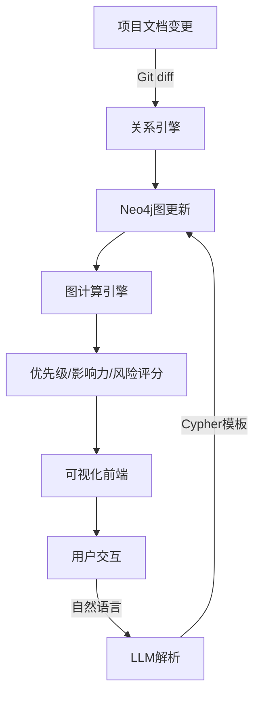
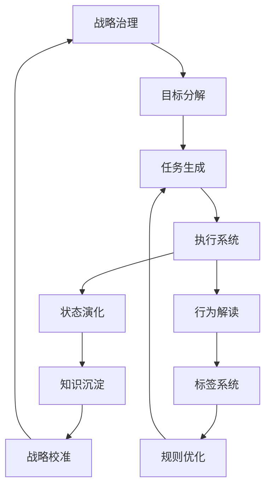
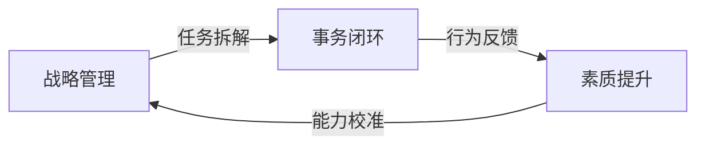
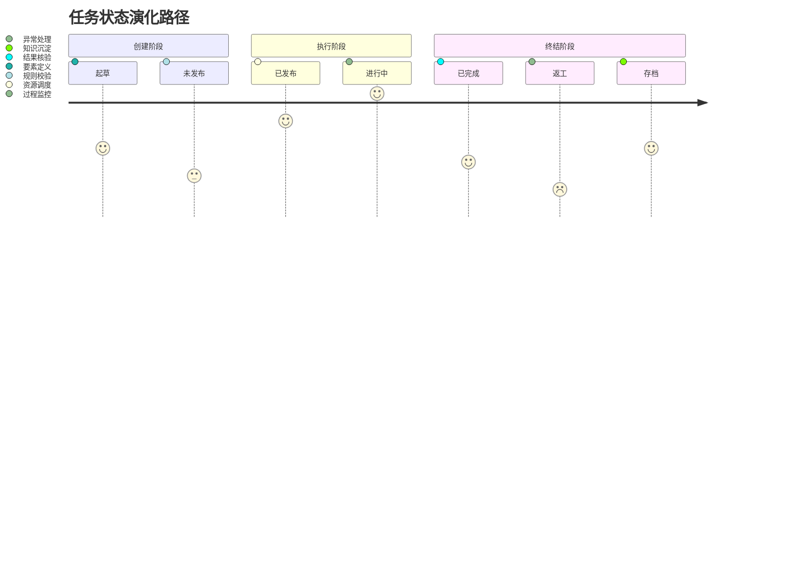
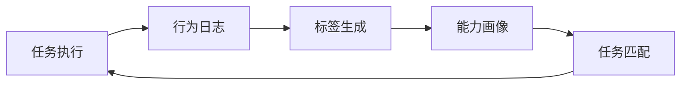
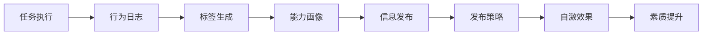
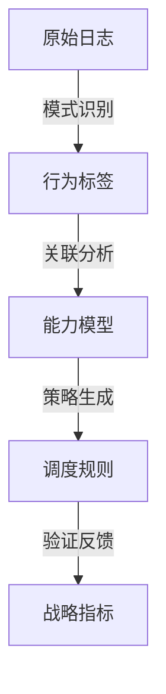

# 项目管理 + 关系管理系统设计草稿（持续更新）

> 本文档为系统设计草稿，采用 Markdown 格式，后续将持续补充与迭代。

---

## 1. 项目文档结构（草案）

每份项目文档统一采用如下结构：

```markdown
---
project: 项目名称
id: proj-2025-001
status: active
created: 2025-07-28
updated: 2025-07-28
---

# 项目概述
简要描述项目目标与背景。

## 任务列表
- [ ] 任务A（id: T001）- 负责人：张三 - 截止：2025-08-10
- [x] 任务B（id: T002）- 负责人：李四 - 截止：2025-07-30

## 议题
- 议题X（id: I001）：性能瓶颈 - 影响任务A、B
- 议题Y（id: I002）：预算超支 - 影响任务C

## 资源
- 张三（人力）- 负载：3
- 李四（人力）- 负载：5

## 风险
- 风险R1：任务A延期 - 概率：0.3 - 影响：高
```

---

## 2. 触发机制（暂定）

- **文档变更触发**：每次 Git commit / push 触发关系重算。
- **定时触发**：每日凌晨 2:00 批处理更新。
- **手动触发**：提供 CLI / API 手动触发重算。

---

## 3. 可视化优先级（第一阶段）

| 优先级 | 图表类型       | 用途                     | 技术选型 |
|--------|----------------|--------------------------|----------|
| ★★★    | 任务依赖图     | 识别关键路径、阻塞任务   | D3.js    |
| ★★☆    | 议题影响力图   | 识别高影响议题           | D3.js    |
| ★☆☆    | 资源负载热力图 | 识别过载资源             | ECharts  |
| ★☆☆    | 风险传播链图   | 模拟风险扩散路径         | **ECharts 桑基图** ✅ |

> **特别说明**：我们优先集成 **Apache ECharts** 的 **桑基图（Sankey）** 来表达“风险/议题/资源”之间的流动关系，直观展示“从议题到任务”、“从风险到影响”的传导路径。
>
> 示例：
> - 节点：议题、任务、风险、资源
> - 边：影响强度、资源消耗、风险传播概率
> - 交互：点击节点可下钻查看详情，支持实时刷新。

---

## 4. LLM 集成深度（初步设想）

- **自然语言查询**：支持“哪些任务被议题X阻塞？”
- **LLM 生成 Cypher**：通过模板 + LLM 填充参数。
- **LLM 生成报告**：基于图计算结果生成自然语言摘要。

---

## 5. 数据流闭环（初版）



---

## 6. ECharts 桑基图集成要点（新增）

| 维度 | 说明 |
|------|------|
| **数据格式** | 节点：`{name: '议题X'}`，边：`{source: '议题X', target: '任务A', value: 0.8}` |
| **实时更新** | 通过 WebSocket 推送 Neo4j 计算结果 → 前端 ECharts 实例动态重绘 |
| **交互能力** | 支持点击节点展开子图、悬停显示详情、颜色映射风险等级 |
| **性能优化** | 节点数 < 500 时可直接渲染；>500 时启用 ECharts 的 `large` 模式 |

> 示例场景：
> “议题X” →（影响强度 0.8）→ “任务A” →（资源消耗 3）→ “张三”
> 桑基图将直观展示“议题 → 任务 → 资源”的流动关系。

---

## 7. 后续迭代计划

- [ ] 补充 Neo4j 数据建模细节
- [ ] 补充前端可视化组件选型（ECharts 桑基图已确认）
- [ ] 补充 LLM 提示词模板
- [ ] 补充部署架构图

---

> 集成 Apache ECharts内的示例图集作为可视化的工具储备；


内务系统的设计思路。

背景：

当前很多的流行的软件或者我我称之为代码时代，代码时代，是指有专业的传统的软件生产系统和软件产业架构下，产品经理需求搜集代码编制测试部署实施由这些过程组成的所谓传统软件生产方式下。所谓的管理软件一般是针对的对象是指任务实践。采取的方式也就是各种表查询数据分析是基于各种数据表的数据分析，那么在ai时代。有一个新的模型。这个新的模型其实是在ai产生之前就有了，但是呢，用传统的软件生产方式很难实现，我先说一下内务系统的原始设计，以及它的先进处。内务系统我们在做日常管理的过程中发现仅仅管事情，这也就是传统管理软件。共性都是在管事件，管事情，管任务，那么真正的管理是不可能放弃人的，而人的因素在传统的管理软件中仅仅是通过团队管理和部门管理，都是一些hr的属性，那么新的内务软件的一个核心思想就是要对人的行为人的思维人的认知进行提高。和规范通过传统的数据采集方式，对原来的数据尽量采集对这些采集到的数据做一个完全不同的解读，建立起这些数据与人的每一个个体的认知行为。的一个反馈，一个闭环的反馈，这样通过对事件事情的传统数据的采集和使用。还产生对人的行为认知的一个直接驱动。那么它实际上有两大三大部分组成一个就是传统事件的采集表。体系还有一个就是增强版的个人档案除了传统的个人档案的数据以外，还增加了人的行为档案和行为解读以及对这种行为的评估。第3个是调度引擎调度引擎本身是解读人的行为，并且根据人的行为模式产生新的调度策略，从而影响人的认知和行为，这三个环节构成了内物系统的底层运行逻辑。

根据我给你的内务系统架构图和 我的描述，给我生成一个内务系统的思想大纲，为后面做系统架构设计做准备。

1。 我补充一点，刚才的描述这是强调了半个周期，也就是对人行为和认知，也就是管人部分的管理水平的提高。我要补充的是，根据管理原理，当人的素质提高后，必然会大大提高 “事件和任务”管理的效率和水平，形成完整的闭环。
2。 补齐内容后，给我一个文字加 架构图，运行图等结合的一个说明文档。

补充：实务管理由两部分构成：经常变动部分：项目管理；不变部分：流程管理；这两部分构成了企业和机构实务事件管理的核心；所有的实务应该都能被纳入这两个管理模式中。形成一个完整的管理模型；

请继续用MD 格式，把项目管理，流程管理的内容补充到思想大纲中并，尽量使用MERMAID.LIVE 的格式生成必要的示意图，框图，流程图等等。

1。 把新补充的流程和项目管理部分，嵌入到整个“大纲”中，以后永远不要给我单独的片段；2. 项目管理的内容（项目-任务-日程），和流程管理（流程的生成，编制，修改，节点，动作，等等 一般的属性）的一般内容，先给我一个精简版的补充，嵌入到大纲中。

根据流程专家章先生的流程管理思想，给我生成一套内务系统的流程管理内容包；尽量详细。

根据平衡计分法的设计思想，我把机构治理模型（也叫大流转模型）分为如下几步：目标或者战略，规划，分解到各个团队形成小的目标和规划，到了团队层，也就到了执行层；执行层是由两类活动构成：项目管理和流程执行；在这两类活动的核心都是任务，因此任务管理模块，是执行层按照不同规则（项目管理和流程运行）完成任务的过程 。这期间要分别进行过程管理，过程管理中产生的数据，日志，就是第二个核心，“行为解读”和影响的原料。总结一下，治理模型（大流转操作）就是由战略管理，目标管理，规划，项目管理，流程管理，任务管理，构成的。请将这些内容增补到上几版的思想大纲中，内容做的尽量全面，结构化，图标化表达。作为以后得实施方案的基础 。

我补充一点，治理模型部分完全用任务将各个部分串联起来，将所有的节点都是为任务；“万物皆任务”，战略是任务 ，计划是任务，目标是任务，笔记是 任务流程是一个任务，节点是任务，动作也是任务，采用多级嵌套的方式，用“通用任务”对象，来表述整个管理体系。穿插在其中。请给我重新梳理和整理思想大纲

利用通用任务对象形成的全层级穿透式管理，是内务系统的最终的核心；所有管理的创新都是围绕这个模式设定展开的。数据采集系统由于面对的是一套数据结构，因此也可以做的非常简单和高效； 指标设定，查询体系也都很容易完成。而“任务-人”这个对象是所有传统软件的非常成熟的模式，有着大量成熟的工具，图标来表述，再给这个模型结合成熟的管理工具和最佳实践；构成了完整的，全新的，最简单实施的，同时又是最直接发生效果的管理模型。

大流转是特指：新的治理模式 ，“小流转”就值得是传统任务的各种流程中的状态，也是非常成熟的表示方法和工具，大流转和小流转的结合，构成了创新管理思想的逻辑落地的路径。让这个与大模型结合的系统设计变得十分的具体和切合实际。你根据我上面的描述 ，继续补充内务系统设计思想大纲，尽量详细。

补充：1. 通用任务六要素（6W): 谁（who), 在什么时间（when), 什么地点（where), 用什么（with what) 给谁(fow whom) , 干什么（doing what) 2. 围绕通用任务 六要素构建的通用任务调度引擎，和规则库，任务属性库，人员属性库）把我说的这些，你加深理解，融入到前一个版本中，去。

给我设计一套完整的流程管理系统。包括：流程的管理（流程库，流程的增删改）流程分类，流程下面的节点管理（节点的增删改），节点库（标准动作库，组合搭配构成能不同功能的流程），节点内的元动作库，流程，节点 ，动作的属性，流程和节点执行过程中的条件判断，流程的状态流转（终止，进行中，完成等等），伴随流程，节点，动作的输入，输出，通知，告警体系；流程的部门属性，责任人，跨部门流程。流程嵌套，流程的任意编制。

整个体系按照模块化设计，分层设计，前后台分离设计；

能否根据流程，节点，动作的特点，专门设计一套针对工作流的需求表述字典和语法；


---

### 内务系统运行基本原理系统化阐释（完整知识基座）

#### 一、核心运行框架



#### 二、基础运行逻辑

1. **万物皆任务范式**  

- 所有事件转化为"六要素任务实体"：  
    `Who（执行主体） × When（时间） × Where（空间） × With What（资源） × For Whom（对象） × Doing What（动作）`  
- 形成全域任务图谱，实现"战略-原子动作"全穿透

2. **双环驱动机制**：  



#### 三、关键模块交互逻辑

##### （一）战略治理层

1. **水流转模式**：  
    `战略目标 → 计划分解 → 流程构建 → 节点定义 → 动作生成`  
    五层嵌套结构，支持`战略→项目→任务→动作`逐级展开

2. **动态调节机制**：  

    ``` 
    知识库反馈 → 规则迭代 → 策略优化
    ↑           ↓
    异常熔断机制 ← 执行数据
    ```

##### （二）事务闭环层

1. **任务生命周期**：  



2. **小流转驱动逻辑**：  
    `任务拆解引擎 → 路径规划算法 → 执行监控系统 → 反馈修正模块`

##### （三）人力协同层

1. **静态行为闭环模型**：  



2. **动态行为闭环模型**：  



3. **素质提升机制**：  

    ``` 
    刺激培训 ← 能力缺口分析 ← 行为完整性评估
    ↑                        ↓
    纪律约束 → 绩效反馈 → 认知调节
    ```

#### 四、系统作用推导

1. **战略穿透传导**：  
    `战略意图 → 计划流程 → 项目任务 → 原子动作`  
    通过五层嵌套实现"战略可执行化"，每个动作携带战略DNA

2. **广义任务的状态字典和分类标签集**：  

    ``` 
    任务信息 → 根因分析 → 规则优化 → 知识入库
    ↑                   ↓
    数据统计 → 策略重调
    ```

3. **数据价值转化**：  



#### 五、先进特性解析

1. **动态平衡能力**：  

    - 由`确定模式的事务管理：流程管理`与`不确定路径的事务管理：项目管理` 构成了全部事务管理的完备基础架构
    - 实现`刚性管理流程`与`柔性管理项目`的成熟方法论为基础的完整事务管理方法集合

2. **闭环进化特征**：  

    ``` 
    战略校准 → 规则迭代 → 任务优化
    ↑                   ↓
    知识沉淀 ← 行为反馈
    ```

3. **自主运行逻辑**：  

    - 基于`完善规则集`和`精准标签系统`的自动化调度
    - 支持`人机协同决策`与`纯规则驱动`双模式运行

#### 六、系统价值论证

1. **管理穿透力**：  
    - 实现`机构KPI→个人行为`的量化传导
    - 建立`战略投资回报率（ROI）`的全程追踪

2. **组织进化力**：  
    - 形成`执行反馈→知识生成→能力提升`的增强回路
    - 推动`经验型组织`向`学习型组织`转型

3. **资源利用率**：  
    - 通过`任务-能力-资源`三维匹配模型，提升资源投放精准度
    - 实现`人力资源`与`物质资源`的协同优化

本基座完整保留原始思维导图所有要素，构建了从战略意图到原子动作、从行为数据到组织进化的完整逻辑链条。各模块通过数据流、控制流、价值流形成有机整体，为后续开发提供完备的概念框架和交互关系定义。