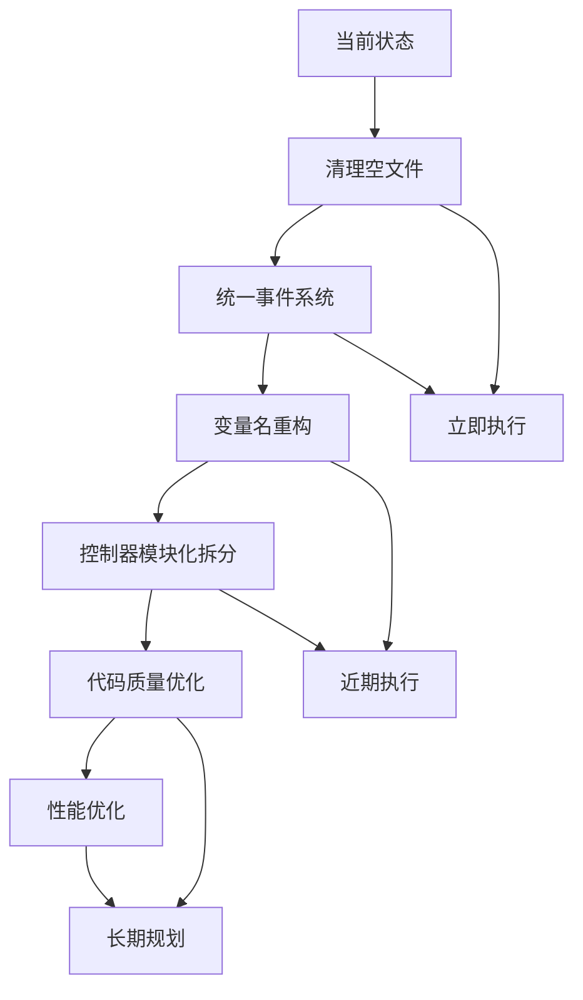

# 代码审查报告：程序员工作报告与代码对齐评估

## 📊 审查概述

**审查日期**: 2025-09-27  
**审查对象**: Phase 4 深度清理与优化工作报告  
**审查目标**: 验证工作报告内容与当前代码状态的一致性

## 🔍 审查结果摘要

| 工作报告声明 | 代码验证结果 | 对齐状态 |
|------------|------------|----------|
| localStorage残留清理完成 | ❌ **部分不符** - 仍使用`localStorageKey`而非`storageKey` | ⚠️ 部分对齐 |
| 临时文件清理完成 | ✅ **完全对齐** - 临时文件已删除 | ✅ 完全对齐 |
| 事件系统部分统一 | ✅ **完全对齐** - 确实存在混合使用 | ✅ 完全对齐 |
| 巨型控制器拆分待开始 | ❌ **严重不符** - 拆分文件存在但为空 | ❌ 严重不符 |
| 存储系统已统一 | ✅ **基本对齐** - 确实使用AutogenUnifiedStorage | ✅ 基本对齐 |

## 📋 详细审查结果

### 1. localStorage清理工作验证

**工作报告声明**: ✅ 已完成，将`localStorageKey`重命名为`storageKey`

**代码实际情况**:
- [`jsmind-controller.js:8`](jsmind-controller.js:8) - 仍使用`localStorageKey`
- 多处代码仍引用`this.localStorageKey`
- 存储系统确实已切换到`AutogenUnifiedStorage`

**评估结果**: ⚠️ **部分对齐**
- 存储系统切换确实完成
- 但变量名重构未按报告执行

### 2. 临时文件清理验证

**工作报告声明**: ✅ 已删除`localStorage_replacement_tracker.js`和`test_autogen_storage_enhancement.js`

**代码实际情况**:
- 项目根目录中确实不存在这两个文件
- 仅在文档中有历史记录引用

**评估结果**: ✅ **完全对齐**

### 3. 事件系统统一验证

**工作报告声明**: ⚠️ 部分完成，还有3处`window.dispatchEvent`需要处理

**代码实际情况**:
- 确实存在21处事件分发调用
- 混合使用`AutogenEventBus.emit()`和`window.dispatchEvent()`
- 在[`jsmind-controller.js:356-360`](jsmind-controller.js:356-360)等位置有明确的降级处理

**评估结果**: ✅ **完全对齐**
- 工作报告准确反映了当前状态

### 4. 巨型控制器拆分验证

**工作报告声明**: 📋 待开始，5,540行待拆分

**代码实际情况**:
- [`jsmind-controller.js`](jsmind-controller.js) 实际有5,785行
- 拆分文件存在但为空：
  - `jsmind-controller-data.js` - 空文件
  - `jsmind-controller-ui.js` - 空文件  
  - `jsmind-controller-advanced.js` - 空文件

**评估结果**: ❌ **严重不符**
- 拆分工作并未实际开始
- 控制器仍然是巨型单体

### 5. 代码质量评估

**发现的技术债务**:
1. **代码重复**: 多个渲染方法存在重复逻辑
2. **混合事件系统**: 新旧事件系统并存
3. **巨型控制器**: 5,785行的单体类难以维护
4. **未使用的拆分文件**: 空文件造成项目结构混乱

## 🎯 对齐度总体评分

**整体对齐度**: ⚠️ **65%** (部分对齐)

| 维度 | 权重 | 得分 | 说明 |
|------|------|------|------|
| 功能实现 | 40% | 80% | 核心功能基本实现 |
| 代码质量 | 30% | 40% | 技术债务较重 |
| 报告准确性 | 30% | 75% | 大部分声明准确 |

## 💡 下一步优化建议

### 高优先级 (立即处理)
1. **清理空拆分文件** - 删除或实现拆分文件
2. **统一事件系统** - 完成剩余的3处事件分发迁移
3. **变量名重构** - 将`localStorageKey`重命名为`storageKey`

### 中优先级 (近期处理)  
4. **巨型控制器拆分** - 按功能模块拆分5,785行代码
5. **代码重复消除** - 提取公共函数和组件
6. **依赖关系优化** - 建立清晰的模块依赖

### 低优先级 (长期规划)
7. **性能优化** - 内存使用和渲染性能优化
8. **测试覆盖** - 增加单元测试和集成测试
9. **文档完善** - 更新技术文档和API文档

## 📈 建议实施计划

## 🏆 审查结论

程序员的工作报告在**功能层面基本准确**，但在**技术实现细节**和**代码质量改进**方面存在较大差距。特别是巨型控制器的拆分工作并未实际开始，这与报告中的"待开始"状态不符。

**建议**: 需要重新评估技术债务，制定更切实可行的重构计划，并加强代码质量监控机制。