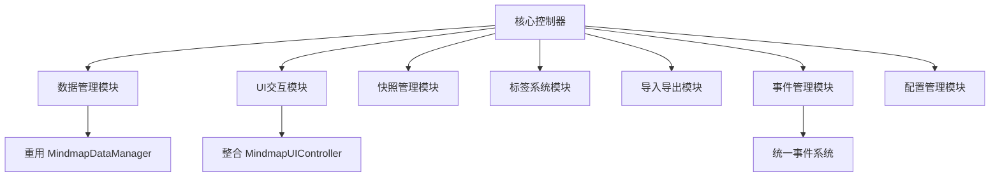

# 巨型控制器拆分方案评估报告

## 📋 评估背景

基于对 [`jsmind-controller.js`](jsmind-controller.js)（5,785行）的代码审查，评估提出的六模块拆分方案的合理性和可行性。

## 🎯 方案概述

**提出的拆分方案**：
1. **核心控制器** - 基础初始化、生命周期管理
2. **数据管理模块** - 数据转换、存储、加载  
3. **UI交互模块** - 节点操作、编辑器、工具栏
4. **快照管理模块** - 快照创建、管理、恢复
5. **标签系统模块** - 标签管理、渲染、交互
6. **导入导出模块** - 文件处理、格式转换

## ✅ 方案合理性评估

### 优点分析
1. **功能域划分清晰** ✅
   - 六个模块覆盖了控制器的主要职责范围
   - 符合单一职责原则，每个模块专注特定领域
   - 与项目现有的三层架构（presentation/business/data）理念一致

2. **高内聚低耦合设计** ✅
   - 模块间依赖关系相对清晰
   - 减少了巨型控制器的复杂度和耦合度

3. **技术债务针对性解决** ✅
   - 直接针对5,785行代码的维护难题
   - 为后续功能扩展提供更好的基础

## ⚠️ 需要优化的方面

### 1. 模块边界需要更精确界定
**问题**：某些功能职责存在重叠风险
- **数据管理模块** vs **导入导出模块**：数据序列化/反序列化职责需要明确划分
- **UI交互模块** vs **标签系统模块**：标签的UI渲染和交互逻辑归属需要清晰

**建议**：定义清晰的接口契约和职责矩阵

### 2. 缺失的关键模块
**建议补充以下模块**：
- **事件管理模块**：统一处理事件分发和监听（解决当前混合使用AutogenEventBus和window.dispatchEvent的问题）
- **配置管理模块**：集中管理控制器配置项和运行时状态

### 3. 与现有代码库的整合考虑
**现有相关模块**：
- [`src/data/MindmapDataManager.js`](src/data/MindmapDataManager.js) - 已处理部分数据逻辑
- [`src/presentation/MindmapUIController.js`](src/presentation/MindmapUIController.js) - 已有UI控制功能

**整合策略**：应重用现有模块，避免重复造轮子

## 🏗️ 优化后的拆分方案

### 模块职责细化建议

| 模块 | 核心职责 | 整合建议 |
|------|----------|----------|
| **核心控制器** | 生命周期管理、模块协调、依赖注入 | 保持轻量级，作为模块组装器 |
| **数据管理模块** | 数据转换、存储策略、缓存管理 | 与现有MindmapDataManager整合 |
| **UI交互模块** | 节点操作、编辑器、工具栏 | 拆分为子模块，明确与MindmapUIController分工 |
| **快照管理模块** | 快照创建、版本管理、恢复 | 独立模块，专注状态管理 |
| **标签系统模块** | 标签CRUD、渲染、搜索过滤 | 与业务逻辑分离，纯UI组件 |
| **导入导出模块** | 文件I/O、格式转换、批量处理 | 专注数据序列化 |
| **事件管理模块**（新增） | 事件分发、监听、生命周期管理 | 统一事件系统，解决技术债务 |
| **配置管理模块**（新增） | 配置持久化、运行时状态管理 | 集中配置处理 |

## 📊 实施风险评估

### 高风险区域
1. **回归风险**：控制器是核心组件，拆分需保证向后兼容
2. **依赖关系复杂**：现有代码中模块间调用关系需要仔细分析
3. **测试覆盖不足**：需要建立完整的测试套件防止功能回退

### 缓解策略
- 采用逐步迁移而非一次性重写
- 建立接口契约和集成测试
- 保持现有API的兼容性

## 🚀 实施优先级建议

### 第一阶段（1-2周）
1. **定义模块接口规范** - 明确各模块的公共API
2. **创建空模块框架** - 建立基本的模块结构和依赖关系
3. **事件系统统一** - 优先解决技术债务

### 第二阶段（2-3周）
4. **数据管理模块迁移** - 将数据相关逻辑从控制器抽出
5. **UI交互模块实现** - 逐步迁移UI相关功能
6. **标签系统独立** - 分离标签管理逻辑

### 第三阶段（1-2周）
7. **快照和导入导出模块** - 迁移剩余功能
8. **配置管理模块** - 集中配置处理
9. **集成测试** - 确保模块间协作正常

## 📈 预期收益

### 代码质量提升
- **可维护性**：从5,785行单体变为多个200-800行的模块
- **可测试性**：模块独立，便于单元测试和Mock测试
- **可扩展性**：新功能可以添加到相应模块，不影响其他部分

### 开发效率提升
- **并行开发**：不同开发者可以同时处理不同模块
- **问题定位**：错误更容易追溯到特定模块
- **代码复用**：模块可以在其他项目中重用

## 🏆 最终评估结论

**方案评分：85/100**

### 优点
- 功能划分合理，覆盖全面
- 架构设计符合最佳实践
- 直接解决当前技术债务

### 改进建议
1. 补充事件管理和配置管理模块
2. 明确模块边界和接口契约
3. 制定详细的迁移计划和测试策略

### 推荐决策
**批准实施，但需要先完成详细的架构设计文档和迁移计划**。建议在开始编码前进行以下准备工作：
1. 绘制详细的模块依赖图
2. 定义清晰的接口契约
3. 制定逐步迁移计划（而非一次性重写）
4. 建立自动化测试保障机制

此拆分方案将显著提升代码可维护性，但需要谨慎执行以避免破坏现有功能。