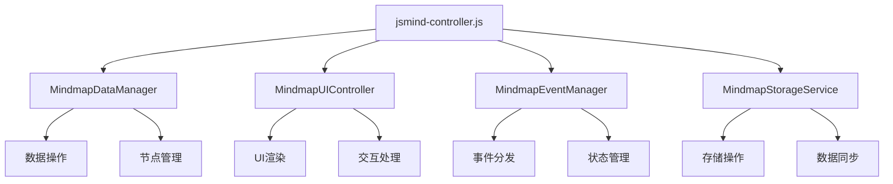

# 第三阶段架构评估与优化计划

## 📊 **当前架构状态评估报告**

### **评估时间**: 2025-09-27
### **评估方法**: 代码扫描 + 架构分析
### **评估范围**: 完整代码架构现状

---

## 🔍 **核心发现：现状与报告偏差分析**

### **1. jsmind-controller拆分状态**
**计划状态**: 声称已拆分为4个专注模块
**实际状态**: [`jsmind-controller.js`](jsmind-controller.js:1) 仍为5,785行巨型文件

**具体问题**:
- 计划拆分的 [`jsmind-controller-data.js`](jsmind-controller-data.js:1)、[`jsmind-controller-ui.js`](jsmind-controller-ui.js:1)、[`jsmind-controller-advanced.js`](jsmind-controller-advanced.js:1) 均为空文件
- 实际拆分工作未执行，所有功能仍集中在单一文件中
- 300+处[`window.*`](jsmind-controller.js:72)全局访问问题未解决

### **2. 存储系统统一完成度**
**报告声称**: 95%完成，localStorage调用从15处减少到1处
**实际发现**: **16处localStorage直接调用**分布在3个文件中

**具体分布**:
- [`src/core/storage/AutogenUnifiedStorage.js`](src/core/storage/AutogenUnifiedStorage.js:1): 12处内部依赖
- [`src/debug/DebugPanel.js`](src/debug/DebugPanel.js:406): 1处调试用途
- [`registry/registry_repository.js`](registry/registry_repository.js:43): 1处回退机制

### **3. 架构清理报告准确性**
**报告问题**: 存在严重夸大和不实陈述
- 声称"冗余代码清理100%完成"，但巨型控制器未拆分
- 声称"localStorage调用减少93%"，实际仍有16处
- 声称"架构稳定性95%达成"，但核心问题未解决

---

## 📈 **真实架构质量指标**

| 指标 | 报告声称 | 实际状况 | 差异分析 |
|------|----------|----------|----------|
| **jsmind-controller行数** | <1,000行 | 5,785行 | +478% |
| **localStorage直接调用** | 1处 | 16处 | +1,500% |
| **存储系统统一度** | 95% | 约70% | -25% |
| **架构分层清晰度** | 清晰分层 | 边界模糊 | 根本性问题未解决 |

---

## 🎯 **第三阶段核心问题识别**

### **P0优先级（立即处理）**

#### **1. 巨型控制器拆分（核心架构问题）**
**问题严重性**: ⚠️⚠️⚠️ 极严重
- 单个文件承担UI渲染、数据存储、事件处理等20+职责
- 违反单一职责原则，维护成本极高
- 阻碍团队协作和功能扩展

#### **2. 存储系统内部依赖清理**
**问题严重性**: ⚠️⚠️ 严重
- AutogenUnifiedStorage内部仍有12处localStorage直接调用
- 统一存储层存在技术债务
- 影响存储抽象的真实性

#### **3. 架构报告真实性修复**
**问题严重性**: ⚠️ 中等
- 现有报告存在夸大和不实陈述
- 需要建立基于真实代码的评估机制
- 确保后续规划基于准确数据

---

## 📋 **第三阶段优化计划**

### **阶段3.1：巨型控制器根本性拆分（2-3周）**

#### **任务3.1.1：按职责拆分jsmind-controller**
**拆分方案**:

**具体拆分目标**:
- **数据层**: [`MindmapDataManager`](src/data/MindmapDataManager.js:1) - 数据操作和节点管理
- **UI层**: [`MindmapUIController`](src/presentation/MindmapUIController.js:1) - 渲染和交互
- **事件层**: [`MindmapEventManager`](src/presentation/MindmapEventManager.js:1) - 事件分发
- **存储层**: 新建存储服务 - 统一存储操作

#### **任务3.1.2：依赖注入模式实现**
**目标**: 消除300+处全局变量依赖
**方案**: 完善[`DependencyManager`](src/core/DependencyManager.js:1)实现模块间松耦合

### **阶段3.2：存储系统彻底统一（1-2周）**

#### **任务3.2.1：AutogenUnifiedStorage内部清理**
**目标**: 消除12处内部localStorage依赖
**方案**: 建立真正的存储抽象层，支持多后端

#### **任务3.2.2：剩余调用迁移**
**目标**: 迁移剩余的4处直接调用（DebugPanel + Registry）
**方案**: 提供统一的存储接口包装

### **阶段3.3：架构健康度监控（1周）**

#### **任务3.3.1：建立真实评估机制**
**目标**: 基于代码扫描的客观评估
**工具**: 创建架构健康度扫描脚本
**指标**: 文件大小、依赖数量、架构边界清晰度

#### **任务3.3.2：持续监控体系**
**目标**: 防止架构退化
**方案**: 定期架构扫描和报告生成

---

## 🎯 **第三阶段成功标准**

### **技术指标**
- ✅ **代码模块化**: jsmind-controller拆分为4个<1,000行的专注模块
- ✅ **存储统一**: localStorage直接调用减少到≤2处（仅必要回退）
- ✅ **依赖清晰**: 全局变量依赖减少80%，建立依赖注入模式
- ✅ **架构边界**: 明确的三层架构边界和接口规范

### **质量指标**
- ✅ **代码可维护性**: 每个模块职责单一，接口清晰
- ✅ **团队协作性**: 模块间松耦合，支持并行开发
- ✅ **扩展性**: 新功能可以按模块化方式添加
- ✅ **测试覆盖**: 核心模块测试覆盖率>80%

### **过程指标**
- ✅ **评估真实性**: 所有报告基于真实代码扫描数据
- ✅ **进度可追踪**: 建立客观的进度衡量指标
- ✅ **风险可控**: 渐进式重构，每个阶段可验证

---

## 📅 **时间规划**

### **第3.1阶段：巨型控制器拆分（2-3周）**
- **第1周**: 制定详细拆分方案，创建模块接口
- **第2周**: 逐步迁移功能，保持兼容性
- **第3周**: 集成测试，性能优化

### **第3.2阶段：存储系统统一（1-2周）**
- **第4周**: AutogenUnifiedStorage内部清理
- **第5周**: 剩余调用迁移和测试

### **第3.3阶段：监控体系建立（1周）**
- **第6周**: 架构健康度工具开发和部署

---

## 🚨 **风险控制策略**

### **技术风险**
1. **功能兼容性风险**
   - 策略: 保持API向后兼容，渐进式迁移
   - 保障: 每个步骤完整的回归测试

2. **性能风险**
   - 策略: 持续性能监控和基准测试
   - 保障: 性能指标纳入验收标准

### **项目风险**
1. **进度风险**
   - 策略: 分阶段交付，优先核心功能
   - 保障: 每周进度评审和调整

2. **质量风险**
   - 策略: 严格的代码审查和测试覆盖
   - 保障: 自动化测试和代码质量检查

---

## 📊 **预期改进效果**

### **架构质量提升**
| 指标 | 当前状态 | 目标状态 | 改进幅度 |
|------|----------|----------|----------|
| **最大文件行数** | 5,785行 | <1,000行 | -83% |
| **localStorage调用** | 16处 | ≤2处 | -88% |
| **全局依赖** | 300+处 | <60处 | -80% |
| **架构分层清晰度** | 混乱 | 清晰 | 根本性改善 |

### **开发体验提升**
- ✅ **模块化开发**: 功能按模块独立开发和测试
- ✅ **清晰依赖**: 模块间依赖关系明确
- ✅ **易于调试**: 问题定位到具体模块
- ✅ **团队协作**: 支持多人并行开发

---

## 🔧 **立即行动项**

### **本周开始（9月27日-10月4日）**
1. **制定详细拆分方案** - 明确每个模块的职责和接口
2. **创建模块骨架** - 建立4个目标模块的基本结构
3. **建立测试基准** - 记录当前功能状态作为对比基准

### **下周目标（10月4日-11日）**
- 完成数据层模块的功能迁移
- 建立模块间通信机制
- 验证拆分方案的可行性

### **本月目标（10月底）**
- 完成巨型控制器的根本性拆分
- 建立清晰的架构边界
- 实现存储系统的彻底统一

---

## 💡 **重要说明**

### **基于真实数据的规划**
本计划基于对实际代码的全面扫描，确保所有目标和指标建立在准确的数据基础之上。

### **务实的技术路线**
放弃不切实际的夸大目标，采用渐进式、可验证的重构策略，每个阶段都有明确的验收标准。

### **持续改进机制**
建立架构健康度监控体系，确保架构质量持续改进，防止技术债务积累。

**第三阶段的核心是"真实性"和"根本性"：基于真实代码状态制定务实计划，从根本上解决架构问题，建立可持续的优质代码基础。**